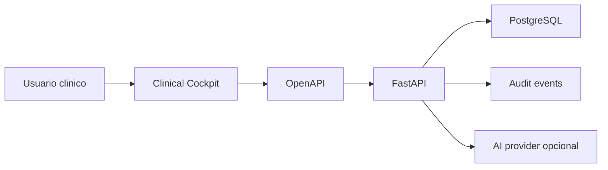

# EPIS2 Architecture

EPIS2 is now a compact full stack monolith.

## Layers

- `apps/web`: Next.js clinical cockpit with Tailwind, motion, and React Query.
- `apps/api`: FastAPI clinical API with Pydantic, SQLAlchemy, Alembic, audit, auth, and optional AI.
- `packages/contracts`: OpenAPI exported from FastAPI.
- `infra`: local PostgreSQL only.

## Data Flow

## Rules

- PostgreSQL is clinical source of truth.
- UI is a capture and review surface, not a clinical authority.
- AI can suggest but cannot sign, approve, or write final facts.
- No CICA compatibility layer or legacy route bridge.
- No module enters core without model, schema, route, screen, and test.
