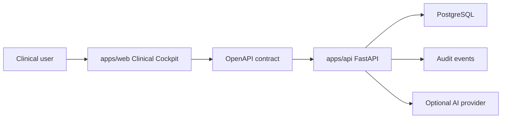

# EPIS2 Architecture

EPIS2 is a compact full stack monolith for a clinical cockpit. The reset favors
one clear runtime over compatibility layers, registries, labs, and historical
program scaffolding.

## Runtime Tree

- `apps/web`: Next.js app router, Tailwind, motion, React Query, lucide icons.
- `apps/api`: FastAPI, Pydantic, SQLAlchemy, Alembic, auth, audit, optional AI.
- `packages/contracts`: committed OpenAPI export from the FastAPI app.
- `infra`: local PostgreSQL development stack.
- `docs`: current operating rules and reset records.

There is one web app, one API, one contract package, and one dev infrastructure
stack.

## Data Flow



Rules:

- PostgreSQL is the clinical source of truth.
- Web captures, reviews, and displays state; it is not clinical authority.
- API owns validation, permissions, persistence, and audit.
- AI may suggest drafts only. It cannot sign, approve, or write final facts.

## API Surface

The API is organized around the patient record:

- health and local auth;
- patients and patient record summary;
- encounters;
- SOAP/evolution entries;
- problems, allergies, medications, vital signs;
- patient audit events;
- optional AI suggestions.

Every clinical write must create an audit event with actor context.

## Web Surface

The frontend is a workspace, not a landing page:

- `/pacientes` is the operational entry point.
- `/pacientes/[patientId]/ficha` is the longitudinal cockpit.
- SOAP may be created in a contextual drawer or focused route.
- `/print/pacientes/[patientId]/ficha` is a paper projection, not a separate truth.

Motion is allowed only when it clarifies state changes: panel enter/exit,
skeletons, drawer transitions, optimistic save feedback, and audit feedback.

## Contract Flow

`packages/contracts/openapi.json` is generated from FastAPI:

```powershell
python apps/api/scripts/export_openapi.py
```

Use the official gate instead of exporting manually before commit:

```powershell
npm run check:contract
```

That gate also validates that forbidden legacy tokens do not re-enter runtime
code.

## Infrastructure

Local PostgreSQL runs through Docker Compose:

- Compose file: `infra/docker-compose.dev.yml`
- Container: `epis2-mono-postgres`
- Volume: `epis2-mono-postgres-data`
- Port: `5443`

Alembic migrations are the only supported schema evolution path.

## Boundaries

- Do not add a second command registry, form registry, API framework, or data layer.
- Do not add labs or external services to core.
- Do not add a module without model/schema/endpoint/screen/test.
- Do not keep old EPIS2 as a folder in the new tree; use tag and reset docs.
