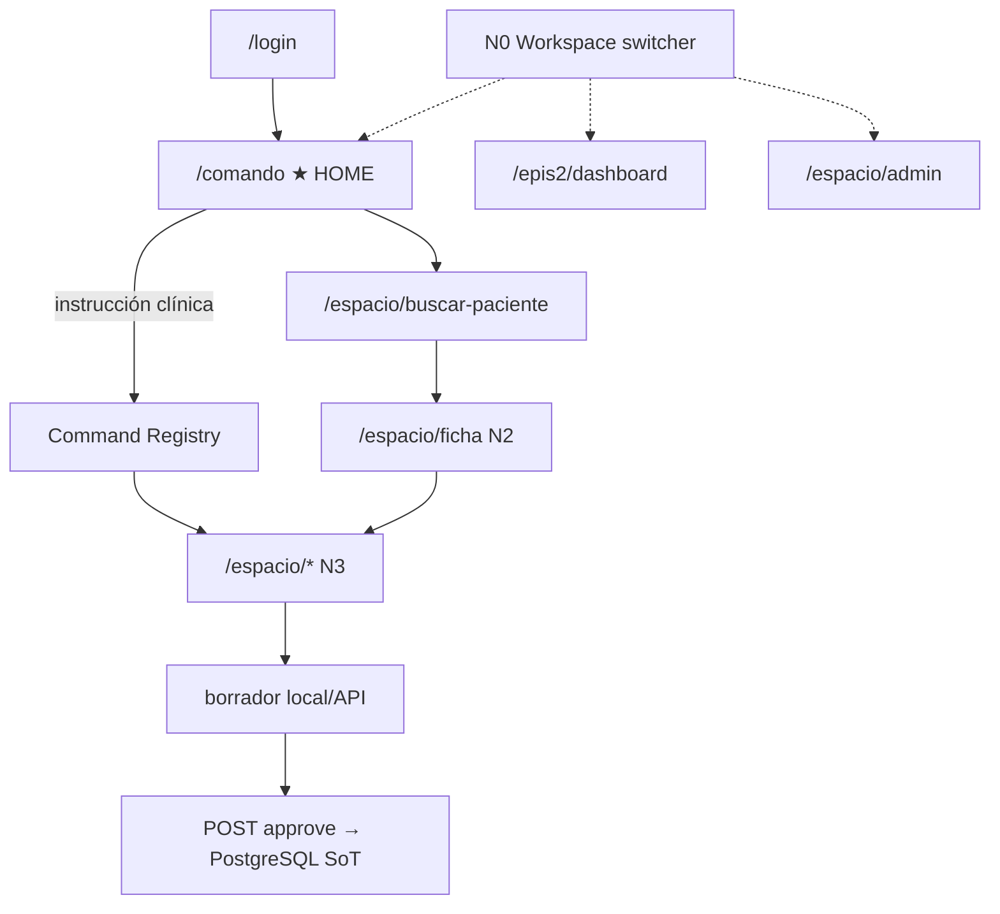

# EPIS2 — Árbol de navegación reconciliado

**Versión:** 1.0 · **Fecha:** 2026-06-04  
**Fuente de verdad código:** `apps/web/src/navigation/epis2NavigationTree.ts`  
**Canon producto:** Home = Centro de Comando · Command-first · Sin menú único de 200 ítems

> Concilia **workspaces MD3 (N0–N4)**, **rutas implementadas**, **19 blueprints**, **inventario IDC 1–200** y **registries únicos**.

---

## 1. Principio de conciliación

```text
Inventario IDC 1–200  ──►  5 Workspaces  ──►  ~33 superficies hoy  ──►  19 formularios
         │                        │                      │                      │
         └──── EPIS2_INVENTORY_WORKSPACE_MATRIX.md ──────┴── epis2NavigationTree.ts ──┘
```

| Capa | Artefacto | Ítems |
|------|-----------|-------|
| Planificación | `EPIS2_ARCHITECTURE_INVENTORY_*` | 200 IDC |
| Workspace | `clinicalWorkspaceRegistry.ts` | 5 contextos |
| Superficies | `epis2NavigationTree.ts` | ~30 nodos operativos |
| Formularios | `clinical-forms/registry.ts` | 19 blueprints |
| Comandos | `command-registry/definitions.ts` | intents → rutas |

**Regla:** un ítem IDC **no** es un ítem de menú. Es una **superficie** dentro de un workspace y nivel MD3.

---

## 2. Árbol global (5 niveles MD3)

```text
EPIS2
│
├── [Global] Auth & preferencias                    N0
│   ├── /login                          COMPLETE    IDC 1
│   ├── /sin-acceso                     PARTIAL
│   └── /preferencias-apariencia        COMPLETE
│
├── [N0] Navigation Rail — Conmutador Workspaces
│   ├── command          → /comando                 COMPLETE  ★ HOME
│   ├── ambulatory       → rail contextual          PARTIAL   ~45% IDC
│   ├── icu              → rail (disabled)          MISSING   Ola 13
│   ├── quality_iaas     → tablero calidad          PARTIAL   Ola 7–8
│   └── admin_system     → /espacio/admin           PARTIAL   Ola 8–9
│
├── [N0–N2] Modo tablero (secundario — nunca home)
│   └── /epis2/dashboard?tab=
│       ├── work        ambulatory    COMPLETE
│       ├── patient     ambulatory    PARTIAL     IDC 21
│       ├── service     quality_iaas  PARTIAL     IDC 81
│       ├── nursing     icu           PARTIAL     IDC 111
│       ├── pharmacy    ambulatory    PARTIAL     IDC 54
│       └── quality     quality_iaas  PARTIAL     IDC 71–72
│
├── [N1–N2] Ficha paciente M3
│   └── /espacio/ficha?patientId=     COMPLETE
│       ├── Tab Resumen    → /espacio/ficha, /espacio/resumen
│       ├── Tab Historia   → /espacio/ficha
│       ├── Tab Consulta   → /espacio/evolucion, /espacio/ambulatorio, /espacio/enfermeria
│       ├── Tab Exámenes   → /espacio/resultados, /espacio/laboratorio, /espacio/imagenologia
│       └── Tab Recetas    → /espacio/receta, /espacio/mar, /espacio/farmacia, /espacio/interconsulta
│
├── [N3] Formularios clínicos (Scrollspy / Two-pane) — 19 blueprints
│   └── /espacio/*  (ver §4)
│
├── [N3] Bandeja resultados
│   └── /espacio/resultados           PARTIAL     IDC 58
│
├── [N3] Borrador → aprobación humana
│   └── /espacio/borrador/:draftId    COMPLETE
│
└── [N3] Admin & estudio formularios
    └── /espacio/admin?tab=           PARTIAL     IDC 81, 91, 93
        ├── users · catalogs · audit · ops · forms
```

---

## 3. Workspaces × Rail × IDC (N0)

| Workspace | Rail contextual (N0) | IDC dominante | Estado |
|-----------|-------------------|---------------|--------|
| **command** | Agenda · Pacientes · Mensajes · Ajustes | — | COMPLETE |
| **ambulatory** | Agenda diaria · Sala espera† · Honorarios† · Pacientes | 27–40, 52–57 | PARTIAL |
| **icu** | Mapa camas† · Monitor UCI† · Entrega turno† | 41–50, 131–140 | MISSING |
| **quality_iaas** | KPI calidad · EPI† · IAAS† · Gestión camas | 71–80, 81–90 | PARTIAL |
| **admin_system** | EMR · Roles · Hardware† · HL7† · Formularios | 91–93, 181–196 | PARTIAL |

† = `disabled: true` en registry hasta su ola.

Detalle: [`EPIS2_ROLE_WORKSPACES_M3.md`](../design/EPIS2_ROLE_WORKSPACES_M3.md)

---

## 4. Formularios reconciliados (N3)

| Blueprint | Ruta | Workspace | Tab ficha | IDC | Estado |
|-----------|------|-----------|-----------|-----|--------|
| `patient_search` | `/espacio/buscar-paciente` | ambulatory | summary | 21 | COMPLETE |
| `patient_summary` | `/espacio/resumen` | ambulatory | summary | 21, 26 | PARTIAL |
| `evolution_note` | `/espacio/evolucion` | ambulatory | encounter | 37 | COMPLETE |
| `outpatient_visit` | `/espacio/ambulatorio` | ambulatory | encounter | 31–36 | PARTIAL |
| `discharge_summary` | `/espacio/epicrisis` | ambulatory | encounter | 63, 110 | COMPLETE |
| `prescription` | `/espacio/receta` | ambulatory | orders | 52 | COMPLETE |
| `lab_request` | `/espacio/laboratorio` | ambulatory | results | 55 | PARTIAL |
| `imaging_request` | `/espacio/imagenologia` | ambulatory | results | 56 | PARTIAL |
| `referral` | `/espacio/interconsulta` | ambulatory | orders | 64 | COMPLETE |
| `referral_report` | `/espacio/informe-interconsulta` | ambulatory | orders | 64 | COMPLETE |
| `nursing_note` | `/espacio/enfermeria` | icu | encounter | 111 | COMPLETE |
| `medication_administration` | `/espacio/mar` | ambulatory | orders | 53 | PARTIAL |
| `pharmacy_validation` | `/espacio/farmacia` | ambulatory | orders | 54 | PARTIAL |
| `admission_note` | `/espacio/ingreso` | icu | encounter | 41 | COMPLETE |
| `allergy_entry` | `/espacio/alergia` | ambulatory | summary | 27–28 | COMPLETE |
| `clinical_problem_entry` | `/espacio/problema` | ambulatory | summary | 29–30 | COMPLETE |
| `medication_reconciliation` | `/espacio/conciliacion` | ambulatory | orders | 165 | COMPLETE |
| `transfer_note` | `/espacio/traslado` | icu | encounter | 42 | COMPLETE |

---

## 5. Flujo canónico vs árbol



---

## 6. Brechas reconciliadas (IDC sin superficie hoy)

| Dominio | IDC | Workspace planificado | Ola |
|---------|-----|----------------------|-----|
| Recepción | 2–10 | tablero paralelo | 4 |
| Facturación Chile | 11–20 | **DEFERRED** | 5 |
| UCI sábana 24h | 41–50, 131–140 | `icu` | 13 |
| Certificados ambulatorio | 39–40 | tab `certificates`‡ | 2 |
| IAAS formal | 71–80 | `quality_iaas` | 7 |
| Telemedicina | 95–100 | `ambulatory` | 9 |

‡ Tab planificado en `clinicalWorkspaceRegistry` — pendiente en `patientChartNavigation.ts` (Ola 2).

---

## 7. Reglas de anidación (sin colapsar UI)

| Regla | Implementación |
|-------|----------------|
| Lazy loading N3 | `initialVisibility: 'collapsed'` → Accordion en `EpisClinicalForm` |
| Cross-link IAAS | Expandable Card inline — **MISSING** (Ola 13) |
| Empty states | `copy.workspaces.nesting.*` — **PARTIAL** |

---

## 8. Referencias cruzadas

| Documento | Rol |
|-----------|-----|
| [`epis2NavigationTree.ts`](../../apps/web/src/navigation/epis2NavigationTree.ts) | Registry verificable |
| [`EPIS2_ROLE_WORKSPACES_M3.md`](../design/EPIS2_ROLE_WORKSPACES_M3.md) | Workspaces + N0–N4 |
| [`EPIS2_PATIENT_CHART_NAVIGATION_M3.md`](../design/EPIS2_PATIENT_CHART_NAVIGATION_M3.md) | Ficha 5 tabs |
| [`EPIS2_INVENTORY_WORKSPACE_MATRIX.md`](../product/EPIS2_INVENTORY_WORKSPACE_MATRIX.md) | IDC → workspace |
| [`EPIS2_ARCHITECTURE_INVENTORY_MEDICAL_RECORD.md`](../product/EPIS2_ARCHITECTURE_INVENTORY_MEDICAL_RECORD.md) | Índice 1–200 |
| [`EPIS2_COMPLETE_FORM_CATALOG.md`](../product/EPIS2_COMPLETE_FORM_CATALOG.md) | 19 blueprints |

---

## 9. Validación

```bash
npm run test -- apps/web/src/navigation/epis2NavigationTree.test.ts
```

Invariantes: todo blueprint en árbol · home = `/comando` · sin rutas duplicadas · cada workspace con superficies.
