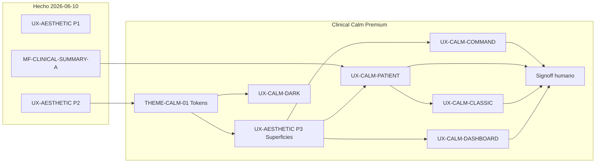

# EPIS2 — Plan estético «Clinical Calm Premium»

**Versión:** 1.0 · **Fecha:** 2026-06-10  
**Tipo:** Solo estética y composición — **sin cambio de lógica clínica**  
**Estado signoff:** **NO-GO** humano (`reports/epis2-ux-audit-visual-2026-06-10.md`)

**Canon relacionado:**

| Documento | Rol |
|-----------|-----|
| [`EPIS2_TYPOGRAPHY_AND_AESTHETICS_RULES.md`](./EPIS2_TYPOGRAPHY_AND_AESTHETICS_RULES.md) | 20 reglas tipográficas (implementadas en tema) |
| [`EPIS2_MATERIAL3_CLINICAL_EXPERIENCE.md`](./EPIS2_MATERIAL3_CLINICAL_EXPERIENCE.md) | Expresividad por contexto clínico |
| [`EPIS2_CLINICAL_SUMMARY_MD3.md`](./EPIS2_CLINICAL_SUMMARY_MD3.md) | Composición ficha — Fase A (producto) |
| [`EPIS2_MATERIAL_DESIGN_ANTI_PATTERNS.md`](./EPIS2_MATERIAL_DESIGN_ANTI_PATTERNS.md) | Prohibiciones de color decorativo |

---

## Norte estético

```text
EPIS2 Visual Language =
  Google-like calm
+ Material Design 3
+ ficha clínica editorial
+ command center tipo IA
+ superficies tonales
+ navegación discreta
+ color clínico sobrio
+ jerarquía extrema
```

**Sensación buscada:** mesa clínica digital ordenada — no dashboard Excel, no red social, no app bancaria. Mezcla **Google Workspace + ChatGPT + panel clínico de alta gama**.

**Principios:**

| Principio | Implicación EPIS2 |
|-----------|-------------------|
| Confianza | Superficies sobrias, alineación estricta, cero color al azar |
| Claridad | Un centro visual por pantalla; secundario contenido |
| Modernidad silenciosa | Profundidad tonal, microbordes; sin neón, gradientes agresivos ni sombras pesadas |
| Belleza clínica | Editorial, serena, profesional |

**Regla de color:** **80 % neutros · 15 % tonos clínicos suaves · 5 % color fuerte**. Error (`#BA1A1A`) solo alertas reales; IA en tertiary violeta suave.

---

## Paleta objetivo → tokens EPIS2

Paleta de referencia (light) y mapeo a implementación:

| Rol visual | Hex objetivo | Token / artefacto EPIS2 |
|------------|-------------|-------------------------|
| Fondo app | `#F7F9FC` | `epis2CanvasSx` / `palette.background.default` / `surfaceContainerLow` |
| Superficie principal | `#FFFFFF` | `epis2IslandSx` · `surfaceContainerLowest` |
| Superficie secundaria | `#EEF3F7` | Supporting pane · `surfaceContainer` |
| Primary | `#0B5C66` | Nuevo MTB **`clinical-calm`** o evolución de `calm-teal` |
| Primary suave | `#D8EEF1` | `primaryContainer` |
| Secondary | `#49636A` | `secondary` / nav secundaria |
| Tertiary (IA) | `#6B5C8A` | `tertiary` · icono barra comando |
| Warning suave | `#FFF3D6` | `warningContainer` · chips no críticos |
| Error clínico | `#BA1A1A` | `error` (ya en MTB `calm-teal`) |
| Texto principal | `#1A1C1E` | `onSurface` |
| Texto secundario | `#5F6870` | `onSurfaceVariant` |

**Dark clínico (objetivo):**

| Rol | Hex |
|-----|-----|
| Fondo | `#101418` |
| Superficie | `#171C20` |
| Surface-container | `#1F252A` |
| Texto principal | `#E1E5EA` |
| Primary | `#8BD4DD` |
| Tertiary IA | `#D2C1FF` |

> **Nota:** El tema default actual es `clinical-blue` (`#1E6FD6`). «Clinical Calm Premium» propone **accent petróleo** como default visual post-signoff — vía nuevo JSON MTB `clinical-calm.material-theme.json`, no hardcode en componentes.

---

## Superficies, forma y elevación

### Capas (sin shadow creep)

```text
Nivel 0 — fondo app (#F7F9FC)
Nivel 1 — tarjetas (borde 1px outlineVariant, sombra ninguna o mínima)
Nivel 2 — banner paciente sticky / panel activo (tonal)
Nivel 3 — menú flotante / autocomplete comando
Nivel 4 — modal / diálogo aprobación
```

### Radios (MD3 generosos, controlados)

| Elemento | Radio objetivo | Implementación |
|----------|---------------|----------------|
| App shell | 28px | `shape.shellRadius` (nuevo token) |
| Tarjetas principales | 20–24px | `epis2IslandSx` → 20px |
| Tarjetas pequeñas | 16px | `EpisClinicalSummaryCard` |
| Chips / botones pill | 999px | MUI `borderRadius: 9999` |
| Inputs | 14–16px | `components.ts` TextField |
| Modales | 28px | Dialog override |
| Barra comando | 28–32px | `EpisUniversalCommandBar` |

### Espaciado

Grilla **8dp**. Padding tarjetas **16–24px**. Gap entre tarjetas **16px**. Gap columnas layout **20–24px**. Padding pantalla **24px**.

Ya parcialmente aplicado: `sectionGap` 24dp (UX-AESTHETIC P1), `epis2IslandPaddingSx`.

---

## Tipografía editorial

Alineado con [`EPIS2_TYPOGRAPHY_AND_AESTHETICS_RULES.md`](./EPIS2_TYPOGRAPHY_AND_AESTHETICS_RULES.md):

| Uso | Objetivo premium | Token EPIS2 |
|-----|------------------|-------------|
| Título pantalla | 24–28px semibold | `headlineLarge` / Google Sans Text |
| Nombre paciente | 22–26px semibold | Banner header |
| Título tarjeta | 15–16px semibold | `titleMedium` |
| Texto clínico | 14–15px regular | `bodyMedium` |
| Metadatos | 12–13px medium | `labelMedium` |
| Dato destacado (lab) | Valor grande + meta pequeña | Patrón `EpisClinicalMetric` (nuevo, Fase B) |

**Modo clásico documento:** prose 15px, `line-height` 1.55, `maxWidth` 820–920px, padding 32–40px — `epis2ClinicalProseSx` + shell clásico.

---

## Iconografía

- Familia única: **Material Symbols Outlined** (22px nav, 20px inline).
- Export vía `@epis2/epis2-ui` — **prohibido** mezclar librerías (gate `no-direct-mui-imports`).
- Nav activa: cápsula tonal `primaryContainer`, no barra azul saturada.
- Iconos críticos **siempre con texto**; decorativos evitados.

Estado actual: iconos en mode switcher y rail dashboard (P1). Pendiente: rail clásico, tarjetas-resumen por tipo.

---

## Layout por pantalla

### Proporciones escritorio (ficha)

```text
Nav rail:     72–88px (compacto) / 240px expandido
Área central: 60–65 %
Panel derecho: 300–380px (supporting, ≥1280px)
Padding:      24px
Gap:          20–24px
```

### Sensación por ruta

| Pantalla | Objetivo visual | Estado |
|----------|-----------------|--------|
| Login | Tarjeta centrada, institucional, cero ruido | Parcial — gateway Vista 3 backlog |
| Centro de Comando | Casi vacío, barra grande, chips sugerencias | Parcial — hero + Google bar |
| Ficha paciente | Banner + mosaico + panel contexto | **Fase A** grid; banner avatar ✓; falta pulido tonal |
| Modo clásico | Hoja clínica digital premium | Shell MD3 ✓; documento SOAP pendiente CALM-CLASSIC |
| Dashboard | Editorial, 3–5 métricas, mucho aire | Widgets uniformes — pendiente CALM-DASHBOARD |
| Configuración | Centro preferencias visible | ⚙ en barra global ✓ (P1) |

---

## Roadmap integrado (estética × producto)

Los tramos **no sustituyen** MF clínico (Fases A–D resumen). Corren en paralelo o como capa visual sobre entregables existentes.



### Tramo THEME-CALM-01 — Tokens y tema petróleo

**Objetivo:** Materializar paleta «Clinical Calm» en MTB sin romper contraste AA.

**Alcance permitido:**

```text
packages/epis2-ui/src/theme/source/clinical-calm.material-theme.json  (nuevo)
scripts/theme/generate-material-themes.mjs
packages/epis2-ui/src/theme/material-theme-registry.ts
packages/epis2-ui/src/theme/create-epis2-theme.ts                     (default opcional post-signoff)
```

**Entregables:**

- [ ] JSON MTB light/dark alineado a tabla §Paleta
- [ ] `theme:validate` + `clinical-roles.contrast.test.ts` verdes
- [ ] Documentar en `EPIS2_CLINICAL_DESIGN_SYSTEM_M3.md`

**Gates:** `npm run check` · `theme:validate`

---

### Tramo UX-AESTHETIC P3 — Superficies y tarjetas

**Objetivo:** Unificar islas clínicas al mosaico sereno (borde suave, sin sombra, radios 16–24).

**Alcance:**

```text
packages/epis2-ui/src/theme/islands.ts              (epis2IslandSx, epis2IslandPaddingSx)
apps/web/src/components/clinical-summary/*          (EpisClinicalSummaryCard)
packages/epis2-ui/src/primitives/EpisWorkspaceSection.tsx
```

**Entregables:**

- [ ] `epis2IslandSx`: radius 20px, border 1px `outlineVariant`, shadow none
- [ ] Fondo app canvas `#F7F9FC` vía tema, no hex suelto en pages
- [ ] Chips alerta: tonal (`errorContainer`), no bloques rojos planos
- [ ] Eliminar duplicación visual restante (textos, CTAs redundantes)

**Depende de:** THEME-CALM-01 (ideal) o `calm-teal` temporal

---

### Tramo UX-CALM-COMMAND — Barra inteligente

**Objetivo:** Barra comando como pieza estética central (ChatGPT clínico).

**Spec:**

```text
Altura:     56–64px
Radio:      28–32px
Fondo:      surface-container-high
Borde:      1px outline-variant
Icono IA:   tertiary, 20px
```

**Alcance:** `EpisUniversalCommandBar`, `EpisCommandCenterGoogleBar`, docks clásico/dashboard (`embedded`).

**Entregables:**

- [ ] Una sola variante visual «premium» en comando y dock
- [ ] Placeholder gris elegante; sin sombras elevadas en botones filled secundarios

---

### Tramo UX-CALM-PATIENT — Banner y mosaico

**Objetivo:** Banner paciente como «rostro» de la ficha; mosaico tarjetas heterogéneo pero en grilla.

**Composición banner (máx. 2 líneas + chips):**

```text
[Avatar] Nombre · edad/meta          Ficha: código
         HTA · DM2 · …               Última atención: …
[Alergia] [Anticoagulada] [Riesgo]
```

**Alcance:**

```text
EpisClassicMd3PatientHeader.tsx          (avatar ✓ — ampliar meta/edad)
PatientClinicalSummaryGrid.tsx           (mosaico ✓ — iconos + métricas Fase B)
EpisClinicalSummaryCard.tsx              (dato destacado labs)
ClassicMd3WorkspaceLayout.tsx            (proporciones panel 300–380px)
```

**Entregables:**

- [ ] Banner sticky con borde inferior tonal (nivel 2)
- [ ] Tarjetas distinto peso visual (span 2 cols evolución vs vitals)
- [ ] Integración Fase B meds/alergias/labs crítica-first con estética métrica

**Producto enlazado:** MF-CLINICAL-SUMMARY-B

---

### Tramo UX-CALM-CLASSIC — Hoja clínica digital

**Objetivo:** Modo clásico ≠ ficha vieja; documento SOAP como papel premium.

**Spec documento:**

```text
Fondo:      #FFFFFF
Ancho max:  820–920px
Padding:    32–40px
Radio:      18px
Sombra:     muy leve
Tipografía: 15px / 1.55
```

**Alcance:** formularios evolución, epicrisis, `GeneratedClinicalFormPage` en `?mode=classic`, split índice | documento.

**Entregables:**

- [ ] Shell «papel» en main pane formularios clínicos
- [ ] Índice clínico lateral sobrio (lista, no widgets)

---

### Tramo UX-CALM-DASHBOARD — Panel ejecutivo

**Objetivo:** Dashboard editorial — 1 tarjeta estado + 3 métricas + listas limpias.

**Anti-patrones a eliminar:** 20 widgets iguales, gráficos decorativos, números sin jerarquía.

**Alcance:** `DashboardModePage`, `EpisRadDashboardTabShell`, scope bar, KPI cards.

**Entregables:**

- [ ] Composición «Hoy en [servicio]» hero card
- [ ] Máximo 3 métricas visibles above the fold
- [ ] Listas pendientes con aire, iconos suaves

---

### Tramo UX-CALM-DARK — Modo oscuro clínico

**Objetivo:** Azul-gris profundo; sin negro puro; primary `#8BD4DD`.

**Alcance:** MTB dark en `clinical-calm`, revisión capturas V1–V6 en oscuro.

**Gates:** `create-epis2-theme.dark.test.ts` · capturas `m3-visual-evidence`

---

### Tramo UX-CALM-SIGNOFF — Cierre estético

**Objetivo:** Pasar de **NO-GO** a signoff humano piloto.

**Checklist:**

1. Comando — barra centrada, calma, sin duplicados
2. Ficha clásico — banner + grid + supporting
3. Dashboard — métricas ≤5, scroll claro
4. Preferencias — densidad Compacta/Cómoda
5. Dark mode — contraste AA lectura clínica

**Gates:** `quality:m3-human-pilot` · actualizar `reports/epis2-m3-visual-pass-*.md`

---

## Errores estéticos — lista de prohibición (checklist revisión)

No ship si persiste:

- Bordes negros duros · sombras fuertes en cada tarjeta
- Iconos de familias mixtas · demasiados colores clínicos compitiendo
- Tarjetas todas iguales sin ritmo · formularios infinitos sin agrupación
- Dashboard >5 métricas visibles · botones apilados sin wrap
- Tablas sin aire · inputs desconectados visualmente
- Alertas rojas para no-críticos · AppBar grande sin valor
- Textos duplicados · viewport sin scroll claro

Referencia normativa: [`EPIS2_MATERIAL_DESIGN_ANTI_PATTERNS.md`](./EPIS2_MATERIAL_DESIGN_ANTI_PATTERNS.md)

---

## Prompt Cursor (tramo único)

Usar al abrir sesión de **solo estética**:

```text
Alcance: tramo UX-AESTHETIC P3 | THEME-CALM-01 (elegir uno).
Canon: docs/design/EPIS2_CLINICAL_CALM_PREMIUM_PLAN.md
Reglas: fondo #F7F9FC vía tema; superficies tonales; radius 16–28; sin sombras;
        primary petróleo; tertiary IA; error solo alertas reales;
        Material Symbols Outlined vía @epis2/epis2-ui; grilla 8dp.
Prohibido: lógica clínica, segundo registry, imports @mui en apps/web.
Gates: npm run check; no npm run test completo tras cada archivo.
```

---

## Trazabilidad sesión 2026-06-10

| Entrega previa | Relación con Calm Premium |
|----------------|---------------------------|
| UX-AESTHETIC P1/P2 | Scroll, dock, nav móvil, densidad — **infraestructura** del plan |
| MF-CLINICAL-SUMMARY-A | Grid Ahora/Contexto — **composición §8 mosaico** |
| NO-GO signoff | Este plan es la **hoja de ruta** hasta UX-CALM-SIGNOFF |

**Próximo tramo recomendado:** `THEME-CALM-01` + `UX-AESTHETIC P3` (tokens + islas) en la misma sesión si el humano aprueba cambio de accent default.

**Frase guía:** *EPIS2 acierta en producto command-first; Calm Premium pulirá la piel sin tocar el corazón clínico.*
