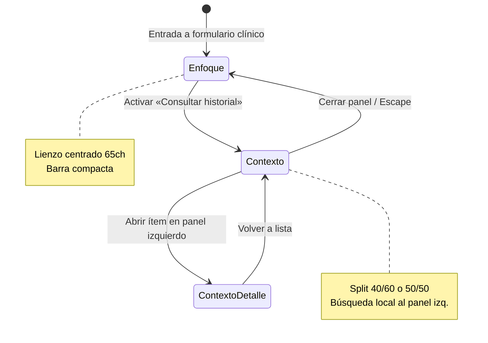

# EPIS2 — Diseño clínico two-pane (Enfoque ↔ Contexto)

**Versión:** 1.0 · **Fase:** LAYOUT-01 (diseño) · **Fecha:** 2026-06-05  
**Estado:** LAYOUT-01–05 implementados (signoff layout clínico 2026-06-05)  
**Patrón M3:** [Canonical Layout — Two-pane](https://m3.material.io/foundations/layout/canonical-layouts/two-pane)

---

## Resumen ejecutivo

EPIS2 adopta un **layout dual** en páginas de documentación clínica prolongada (evolución, epicrisis y derivados). Por defecto opera en **Modo Enfoque**: un lienzo único centrado, sin ruido, optimizado para escribir. Bajo demanda del profesional, transiciona a **Modo Contexto**: panel izquierdo de consulta histórica + panel derecho de acción activa, sin recarga ni pérdida de cursor.

La IA opera **en el panel de acción**, de forma predominantemente invisible (sugerencias predictivas), con intervenciones explícitas puntuales — nunca como chat lateral permanente.

**Alcance inicial:** `evolution_note`, `discharge_summary`. Extensible a recetas complejas, interconsulta y MAR tras validación piloto.

---

## 1. Problema y oportunidad

### 1.1 Ambulatorio simple

En consultas breves, un único lienzo maximiza velocidad y concentración. Cualquier panel adicional compite con la acción primaria: **documentar**.

### 1.2 Casos complejos

Cuadros que exigen paralelismo cognitivo — sin abandonar la nota en curso:

| Escenario | Necesidad de contexto |
|-----------|----------------------|
| Revisión antimicrobiana | Esquemas previos, cultivos, días de tratamiento |
| UCI / alta complejidad | Evoluciones recientes, parámetros, órdenes activas |
| Trazabilidad IAAS | Eventos, procedimientos, antibióticos en ventana temporal |
| Epicrisis | Hitos del internamiento sin navegar fuera del formulario |

Hoy EPIS2 separa **ficha** (`PatientWorkspacePage` + timeline) y **formulario** (`GeneratedClinicalFormPage`). El two-pane **unifica el espacio de trabajo** sin convertir la ficha en expediente completo.

### 1.3 Restricciones de producto (no negociables)

| Invariante | Implicación en layout |
|------------|----------------------|
| Información no solicitada oculta (#8 canon) | Contexto panel **cerrado** por defecto |
| Una acción primaria por pantalla | Guardar borrador permanece única CTA filled |
| IA asiste; no aprueba (#11) | Inserciones y sugerencias = borrador etiquetado |
| Borrador ≠ aprobado (#7) | Nada del panel izquierdo se persiste sin revisión humana |
| App sin Ollama (#15) | Layout y panel contexto funcionan sin IA |
| UI 100 % español (#14) | Microcopy en `copy/es.ts` |

---

## 2. Principios de diseño

1. **Escritura primero** — El panel derecho es el único espacio de edición activa.
2. **Contexto invocado** — El historial aparece solo cuando el profesional lo solicita.
3. **Mapa espacial estable** — Pasado a la izquierda; presente a la derecha; siempre.
4. **Elevación tonal, no líneas duras** — Diferenciación por `surface-container-*`, sin sombras decorativas.
5. **Movimiento con propósito** — Transiciones M3 emphasized; respeto a `prefers-reduced-motion`.
6. **IA invisible por defecto** — Asistencia en el flujo de escritura; disclosure solo cuando hay borrador IA.
7. **Inserción auditable** — Todo fragmento importado desde historial queda trazable en metadatos de borrador.

---

## 3. Estados del layout



### 3.1 Modo Enfoque (default)

**Objetivo:** Sensación de hoja en blanco profesional — escribir sin fricción.

```text
┌──────────────────────────────────────────────────────────────────────────┐
│  Top app bar clínica compacta (56px)                                     │
│  [←]  María González · 58 a · ⚠ Penicilina   ·····  Borrador · Autoguardado │
│                                                      [⊞ Consultar historial] │
├──────────────────────────────────────────────────────────────────────────┤
│                                                                          │
│              ┌─────────────────────────────────────────┐                 │
│              │  Surface container lowest               │                 │
│              │  max-width: min(65ch, 100% - 48px)      │                 │
│              │  margin: auto                           │                 │
│              │                                         │                 │
│              │  Evolución médica — SOAP                │                 │
│              │  [Subjetivo ························]   │                 │
│              │  [Objetivo  ························]   │                 │
│              │  [Análisis  ························]   │                 │
│              │  [Plan      ························]   │                 │
│              │                                         │                 │
│              │  [Sugerir con IA]  (tonal, secundaria)  │                 │
│              └─────────────────────────────────────────┘                 │
│                                                                          │
├──────────────────────────────────────────────────────────────────────────┤
│  Safety bar · [Guardar borrador] (filled, única primaria)                │
└──────────────────────────────────────────────────────────────────────────┘
```

| Elemento | Especificación |
|----------|----------------|
| Top bar | Altura fija 56px; `surface`; sin sombra (anti-patrón #1) |
| Identidad paciente | `headline` + edad; chip alergia crítica `clinicalRoles.critical` |
| Autoguardado | `labelMedium`, `text.secondary`; icono discreto + «Guardado hace 12 s» |
| Acción split | `IconButton` tonal, `aria-label="Consultar historial del paciente"`; icono `Splitscreen` o `ViewSidebar` |
| Lienzo | `bgcolor: surfaceContainerLowest` (tema); borde 1px `divider` opcional; `borderRadius: medium` |
| Ancho lectura | `maxWidth: 65ch` (regla tipográfica #3); en viewports ≥1280px márgenes laterales generosos |
| CTA primaria | Footer fijo o sticky inferior: «Guardar borrador» |

**Compacto (<600px):** Sin split en primera versión; botón «Consultar historial» abre `Drawer` temporal full-height (patrón M3 pane alternativo). El profesional consulta y cierra; el lienzo no se desplaza.

### 3.2 Modo Contexto (split)

**Objetivo:** Consulta paralela sin perder el hilo de la evolución activa.

```text
┌──────────────────────────────────────────────────────────────────────────┐
│  Top app bar (igual que Enfoque)              [⊞ Historial abierto ✓]   │
├───────────────────────┬──────────────────────────────────────────────────┤
│ PANEL CONSULTA (40%)  │ PANEL ACCIÓN (60%)                               │
│ surface-container-low │ surface-container-lowest                           │
│                       │                                                  │
│ [🔍 Buscar en historial…]              │  Evolución activa (mismo form)    │
│                       │  cursor preservado                               │
│ ▾ Timeline            │                                                  │
│   12/05 Evolución     │  [Subjetivo ·············]                       │
│   10/05 Lab Hb        │  [Plan      ·············]                       │
│   08/05 Receta AB     │                                                  │
│                       │  Chip: «+ Meropenem 1g c/8h (10/05)»  [Añadir]   │
│ (detalle lab abre     │                                                  │
│  aquí, no en derecha) │  [Sugerir con IA]                                │
│                       │                                                  │
├───────────────────────┴──────────────────────────────────────────────────┤
│  Safety bar · [Guardar borrador]                                         │
└──────────────────────────────────────────────────────────────────────────┘
```

| Panel | Token M3 | Rol perceptivo |
|-------|----------|----------------|
| Izquierda (consulta) | `surfaceContainerLow` | «Leer, comparar, recordar» |
| Derecha (acción) | `surfaceContainerLowest` | «Escribir, decidir, firmar borrador» |

**Proporciones:**

| Viewport | Split | Notas |
|----------|-------|-------|
| ≥1280px | 40 / 60 | Panel acción conserva ≥65ch efectivos |
| 960–1279px | 45 / 55 | Mínimo panel izq. 320px |
| 600–959px | Drawer overlay | Panel consulta como drawer; acción full-width detrás |
| <600px | Drawer only | Sin split side-by-side en v1 |

**Sin divisores duros:** Separación solo por contraste tonal + 1px `divider` en el eje vertical si contraste AA lo exige en modo claro.

---

## 4. Panel de consulta (izquierda)

### 4.1 Anatomía

```text
Stack vertical (gap: 16px)
├─ Search bar encapsulado (solo filtra este panel)
├─ Tabs de densidad alta (opcional v2): Timeline | Labs | Meds | Docs
├─ Lista M3 high-density (List + ListItemButton)
└─ Zona de detalle (reemplaza lista al seleccionar ítem)
```

### 4.2 Búsqueda local

- Placeholder: «Buscar en historial del paciente…»
- Ámbito: motivo de consulta, medicamento, diagnóstico, tipo de evento — **no** búsqueda global del sistema.
- Debounce 200ms; resultados resaltados en la lista activa.
- Reutiliza lógica de `DocumentSearchPanel` donde aplique; scope restringido a `patientId` actual.

### 4.3 Timeline

Fuente: `fetchPatientLongitudinal` → `PatientLongitudinalResponse.timeline`.

| Campo en fila | Tipografía |
|---------------|------------|
| Fecha | `labelMedium`, `text.secondary`, `tabular-nums` |
| Título evento | `body`, `text.primary` |
| Subtítulo | `body2`, `text.secondary`, máx. 2 líneas `line-clamp` |

**Interacción:** clic → detalle **dentro del panel izquierdo** (stack navigation: lista ← → detalle). El panel derecho **nunca** navega.

### 4.4 Detalle in-panel

Al abrir un lab, nota previa o receta:

```text
[← Volver al historial]
Título del evento · fecha
Contenido en prosa o grid según tipo
[Chip tonal: Añadir al plan actual]  [Chip text: Copiar fragmento]
```

- «Añadir al plan actual» inserta en el campo con foco del panel derecho (o `plan` por defecto).
- Inserción = texto prefijado con metadato `(ref: timeline:{eventId})` oculto en UI, presente en payload borrador.

### 4.5 Secciones colapsables (v1.1)

Alergias, medicamentos activos, últimos labs — `EpisSection` colapsado por defecto bajo la búsqueda. Evita duplicar la ficha completa.

### 4.6 IA en panel consulta — prohibido como chat

El panel izquierdo **no** aloja agente conversacional. Opción permitida (LAYOUT-03):

- Banner colapsado «Resumen del periodo» generado **solo** tras clic explícito.
- Una sola síntesis, regenerable, con `EpisAiDisclosure`.
- No ocupa altura fija; no compite con la lista.

---

## 5. Panel de acción (derecha)

### 5.1 Formulario

- `EpisClinicalForm` con `clinicalProse={true}` para blueprints prosa.
- Secciones SOAP sin cambio semántico.
- Estado borrador: `EpisDraftStatus` visible bajo el título del formulario.

### 5.2 Preservación de foco

Al abrir/cerrar split:

- Guardar `activeElement` y posición de cursor en ref.
- Tras transición CSS (`transitionend`), restaurar foco.
- `values` del formulario en estado React superior — **nunca** desmontar el formulario al split.

### 5.3 Asistencia IA (panel derecho únicamente)

| Modo | Comportamiento | Visibilidad |
|------|----------------|-------------|
| Predictivo | Huecos SOAP, duplicación con plan previo | Chips sutiles bajo el campo activo |
| Explícito | Botón «Sugerir con IA (demo)» | Tonal; resultado en campos con disclosure |
| Resumen periodo | Solo con panel consulta abierto | Banner colapsable; acción única |

**Prohibido:** tercer panel chat; panel IA permanente; mencionar Ollama/RAG en microcopy clínico.

### 5.4 Inserción desde historial

**v1 — Chip (preferido):**

```text
Usuario selecciona ítem → «Añadir al plan actual»
→ Snackbar: «Fragmento añadido al plan — revisa antes de guardar»
→ Texto append con salto de línea al campo destino
```

**v2 — Drag & drop (desktop):**

- `draggable` en filas de timeline con `aria-grabbed`.
- Drop zone: borde tonal en textarea con foco.
- Misma auditoría que chip; fallback siempre disponible.

---

## 6. Coreografía de movimiento

### 6.1 Tokens

```ts
import { epis2Motion, motionTransition } from '@epis2/epis2-ui/theme';

// Apertura split
duration: epis2Motion.duration.long      // 260ms
easing: epis2Motion.easing.emphasized     // desaceleración final
properties: transform, opacity, flex-basis
```

### 6.2 Secuencia de apertura

1. **0ms** — Usuario activa split; `aria-expanded="true"` en botón.
2. **0–260ms** — Panel izquierdo `translateX(-100%) → 0`; panel derecho `margin-left` o `flex` animado.
3. **260ms** — Foco restaurado en textarea activa; anuncio SR: «Panel de historial abierto».

### 6.3 Cierre

- Duración `medium` (180ms); easing `exit`.
- Panel izquierdo sale hacia la izquierda; lienzo se centra de nuevo.

### 6.4 Movimiento reducido

Si `prefersReducedMotion()` o preferencia usuario `motion: reduced`:

- Transición instantánea (`0ms`); cambio de layout sin slide.
- Estado visual (tonal) se mantiene para diferenciar paneles.

---

## 7. Top app bar clínica compacta

Componente propuesto: `EpisClinicalFocusAppBar` (wrapper en `epis2-ui`).

| Slot | Contenido | Prioridad visual |
|------|-----------|------------------|
| Leading | `ClinicalPageNav` back / breadcrumb mínimo | Media |
| Title | Nombre paciente + edad | Alta |
| Chips | Alergia crítica, demo badge si aplica | Alta solo crítico |
| Trailing | Autoguardado + split toggle | Media-baja |
| Oculto en barra | Timeline completo, panel IA, widgets | — |

Altura máxima 56px en desktop; 48px en compacto. Sin segunda fila de tabs en el formulario de evolución.

---

## 8. Mapa de componentes EPIS2

| Responsabilidad | Existente | Nuevo / evolución |
|-----------------|-----------|-------------------|
| Layout shell | `EpisClinicalFormPage` | `EpisClinicalTwoPaneLayout` |
| Formulario | `EpisClinicalForm` | Sin cambio API |
| Historial | `PatientLongitudinalPanel` | `EpisClinicalContextPane` (subset + detalle in-panel) |
| Búsqueda docs | `DocumentSearchPanel` | Scope paciente en context pane |
| Alertas | `ClinicalAlertsPanel` | Solo en Enfoque si CDS activo; colapsado en split |
| IA disclosure | `EpisAiDisclosure` | Sin cambio |
| Navegación | `ClinicalPageNav` | Integrar en app bar |
| Surfaces | `epis2TonalContainerSx` | Variantes `low` / `lowest` por panel |
| Prosa | `epis2ClinicalProseSx` | Panel derecho |
| Motion | `epis2Motion`, `motionTransition` | Layout transitions |

### 8.1 API sketch (`EpisClinicalTwoPaneLayout`)

```tsx
type EpisClinicalTwoPaneLayoutProps = {
  /** Barra superior — identidad y controles globales. */
  appBar: React.ReactNode;
  /** Lienzo de acción (formulario). Siempre montado. */
  actionPane: React.ReactNode;
  /** Panel de consulta; null si blueprint no soporta contexto. */
  contextPane?: React.ReactNode;
  /** Estado controlado del split. */
  contextOpen: boolean;
  onContextOpenChange: (open: boolean) => void;
  /** Footer con safety bar y CTA primaria. */
  footer: React.ReactNode;
};
```

Persistencia de preferencia split: **no** en v1 (siempre cerrado al entrar). v2: `sessionStorage` por `patientId+blueprintId` opcional.

---

## 9. Blueprints elegibles

| Blueprint | Enfoque default | Split | Prosa | Fase |
|-----------|-----------------|-------|-------|------|
| `evolution_note` | ✓ | ✓ | ✓ | LAYOUT-01 |
| `discharge_summary` | ✓ | ✓ | ✓ | LAYOUT-01 |
| `prescription` | ✓ | ✓ | ○ | LAYOUT-02 |
| `lab_request` | ✓ | ○ | ○ | — |
| `patient_summary` | ✓ | ○ | ○ | — |

Función de registro:

```ts
export function blueprintSupportsClinicalContext(blueprintId: string): boolean {
  return ['evolution_note', 'discharge_summary'].includes(blueprintId);
}
```

---

## 10. Microcopy (español — `copy/es.ts`)

Claves propuestas bajo `copy.clinicalLayout`:

| Clave | Texto |
|-------|-------|
| `splitOpen` | Consultar historial |
| `splitClose` | Cerrar historial |
| `splitOpenAria` | Abrir panel de historial del paciente |
| `splitCloseAria` | Cerrar panel de historial |
| `contextSearchPlaceholder` | Buscar en historial del paciente… |
| `contextBackToList` | Volver al historial |
| `insertIntoPlan` | Añadir al plan actual |
| `insertIntoField` | Añadir al campo activo |
| `insertSuccess` | Fragmento añadido — revisa antes de guardar |
| `periodSummaryAction` | Resumir periodo relevante |
| `periodSummaryTitle` | Síntesis del historial (borrador IA) |
| `autosaveSaving` | Guardando… |
| `autosaveSaved` | Guardado hace {seconds} s |
| `autosaveError` | No se pudo guardar automáticamente |

---

## 11. Accesibilidad

| Criterio | Implementación |
|----------|----------------|
| Teclado | `Ctrl+Shift+H` toggle panel (configurable); `Escape` cierra panel consulta |
| Foco | Trap **no** en panel izq.; tab order: bar → consulta (si abierto) → form → footer |
| SR | `role="complementary"` panel izq.; `role="main"` panel derecho |
| Contraste | Tokens M3 validados por `theme:validate` |
| Touch | Áreas mín. 48×48px en icon buttons; drawer en móvil |
| Estados | Split button `aria-expanded`; lista `aria-current` en ítem detalle |

---

## 12. Seguridad y auditoría

| Evento | Registro |
|--------|----------|
| Apertura/cierre split | Opcional telemetría UX (sin PHI) |
| Inserción fragmento | `draft.metadata.insertions[]` con `sourceEventId`, `fieldId`, `timestamp` |
| Sugerencia IA | Pipeline existente `ai_runs` + `EpisAiDisclosure` |
| Aprobación | Sin cambio — `DraftReviewPage` humano |

La inserción **no** equivale a prescripción ni diagnóstico aprobado.

---

## 13. Anti-patrones (rechazo en PR)

| # | Anti-patrón | Por qué |
|---|-------------|---------|
| 1 | Tercer panel chat IA | Viola «IA no domina» y mapa espacial |
| 2 | Historial visible por defecto en ambulatorio | Viola divulgación progresiva |
| 3 | Navegar away del form al ver detalle | Rompe preservación de foco |
| 4 | Recarga de ruta al abrir split | Rompe fluidez M3 |
| 5 | Sombras para separar paneles | Anti-patrón M3 #1 EPIS2 |
| 6 | Inserción silenciosa sin snackbar | Riesgo clínico de transcripción |
| 7 | Split en mobile side-by-side <600px | Ilegible; usar drawer |
| 8 | Múltiples CTAs filled | Viola acción primaria única |

---

## 14. Plan de implementación

```text
LAYOUT-01  Shell two-pane + transición + Enfoque default
           Blueprints: evolution_note, discharge_summary
           EpisClinicalTwoPaneLayout + app bar compacta
           Gate: golden journey evolución con split cerrado/abierto

LAYOUT-02  Context pane: timeline + detalle in-panel + búsqueda local
           Chip «Añadir al plan actual»
           Colapsar PatientClinicalAiPanel en ficha (deuda UX)

LAYOUT-03  Resumen periodo bajo demanda (IA local, borrador)
           Chips predictivos SOAP (sin Ollama = ocultos)

LAYOUT-04  Drag & drop desktop + sessionStorage preferencia split
           Prescription / interconsulta si piloto OK

LAYOUT-05  Búsqueda documental en context pane (tabs Eventos | Documentos)
           Colapsar PatientClinicalAiPanel en ficha + catálogo visual layouts
```

### 14.1 Criterios de aceptación LAYOUT-01

- [ ] Entrar a `/espacio/evolucion` muestra solo lienzo centrado 65ch.
- [ ] Botón «Consultar historial» abre split sin perder texto ni cursor.
- [ ] Cerrar split recentra lienzo con transición ≤260ms (o 0ms reduced).
- [ ] `Guardar borrador` sigue siendo la única acción filled.
- [ ] `npm run check`, `npm run test`, golden journey verde.
- [ ] Catálogo visual documenta el patrón en sección «Layouts clínicos».

---

## 15. Referencias

- `docs/PRODUCT_CANON.md` — flujo command-first
- `docs/product/PRODUCT_INVARIANTS.md` — invariantes #7, #8, #11, #15
- `docs/product/EPIS2_PRODUCTIVITY_AND_DISCLOSURE_RULES.md` — divulgación progresiva
- `docs/design/EPIS2_MATERIAL3_CLINICAL_EXPERIENCE.md` — §2 adaptativo expandido
- `docs/design/EPIS2_TYPOGRAPHY_AND_AESTHETICS_RULES.md` — reglas #3, #4, #7
- `docs/design/EPIS2_MATERIAL_DESIGN_ANTI_PATTERNS.md` — elevación tonal
- `packages/clinical-forms/src/clinical-prose-blueprints.ts`
- `apps/web/src/pages/GeneratedClinicalFormPage.tsx`
- `apps/web/src/components/PatientLongitudinalPanel.tsx`

---

## Frase guía

> **Escribir es el centro. El pasado se consulta al margen — nunca al frente.**
