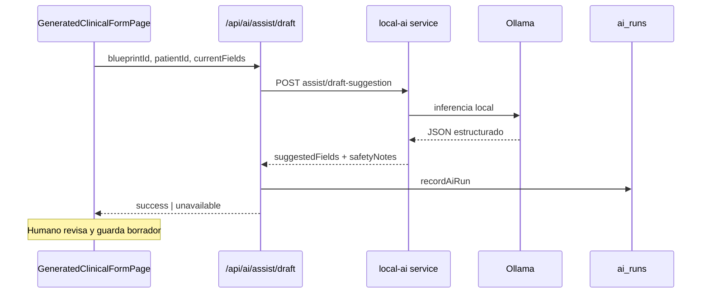

# EPIS2 — Mapa UI y seguridad IA local (Ollama)

**Versión:** 1.0 · **Fecha:** 2026-06-05  
**Complementa:** `docs/intelligence/EPIS2_OLLAMA_CAPABILITY_PLAN.md`

---

## 1. Principio rector

```text
IA local = capacidad contextual
  → nunca escritura directa a SoT
  → nunca aprobación ni firma
  → aplicación operativa sin Ollama
```

---

## 2. Superficies UI clínicas (donde aparece la IA)

| Superficie | Componente | Archivo | Comportamiento |
|------------|------------|---------|----------------|
| Barra de comando | Hint IA disponible | `CommandCenterPage.tsx` | `getCommandBarAiHint()` |
| Formulario clínico | Botón sugerir + disclosure | `GeneratedClinicalFormPage.tsx` | Solo blueprints con draft |
| Ficha paciente | Panel asistencia | `PatientClinicalAiPanel.tsx` | RAG, resumen 24h, runs |
| Dev catalog | Chips demo | `UiCatalogPage.tsx` | Solo `/dev/*` |

**No existe** pantalla «IA» como home ni ficha separada — **COMPLETE** respecto al canon.

---

## 3. Microcopy clínico vs técnico

### Mostrar en UI clínica

| Texto canónico | Estado actual |
|----------------|---------------|
| Asistencia de IA disponible | ◐ (`aiHint` parcial) |
| Generado con asistencia de IA | ✓ `EpisAiDisclosure` |
| Requiere revisión humana | ✓ `copy.ai.humanReviewRequired` |
| Fuentes / citas | ✓ `copy.ai.citations` |
| Modo manual (IA no disponible) | ◐ |

### No mostrar en UI clínica

| Texto prohibido | Estado actual | Acción |
|-----------------|---------------|--------|
| Ollama | **VIOLACIÓN** — `statusOn: 'Ollama disponible'` | Corregir Ola 1 |
| RAG | ✓ No expuesto | — |
| embeddings | ✓ No expuesto | — |
| chunks | ✓ No expuesto | — |
| pgvector | ✓ No expuesto | — |

**Archivo copy:** `packages/design-system/src/copy/es.ts` líneas 106–118.

---

## 4. API IA y seguridad

| Endpoint | Permiso | Rate limit | Timeout |
|----------|---------|------------|---------|
| `GET /api/ai/status` | session | — | 3s ping |
| `POST /api/ai/assist/draft` | `draft.write` | 30/min | 60s |
| `POST /api/ai/rag/query` | `ai.read` | 30/min | — |
| `POST /api/ai/suggest/summary` | `ai.read` | 30/min | — |
| `GET /api/ai/runs` | `ai.read` | — | — |

**Cliente:** `apps/api/src/ai/client.ts` — `AbortSignal.timeout`.

---

## 5. Verificación seguridad (checklist auditoría)

| Requisito | Estado | Evidencia |
|-----------|--------|-----------|
| App funciona sin Ollama | ✓ | Golden V0 pasos 1–10 sin IA |
| IA no ejecuta SQL | ✓ | Sin acceso DB en ai routes |
| IA no aprueba | ✓ | Solo `suggestedFields` |
| IA no firma | ✓ | `requiresHumanReview: true` |
| IA no escribe registros finales | ✓ | Solo borrador vía humano |
| Respuesta valida schema | ✓ | Zod `aiAssistDraftResponseSchema` |
| Timeout | ✓ | 60s assist, 3s ping |
| Fallback | ✓ | `status: unavailable` + mensaje |
| Fuentes e incertidumbre | ◐ | RAG citas ✓; incertidumbre explícita ○ |
| Auditoría ejecuciones | ✓ | `ai_runs` + `recordAiRun` |
| CDS mezclado con IA | ✓ | `getDemoSafetyNotesForPatient` separado |
| Rate limit abuso | ✓ | Plan F |

---

## 6. Flujo assist borrador



**Invariante:** UI nunca llama a Ollama directamente — solo API EPIS2.

---

## 7. Funciones IA por área (estado)

### Centro de Comando

| Función | IA hoy | Estado |
|---------|--------|--------|
| Interpretar NL | Registry determinista + `suggest` | **PARTIAL** |
| Datos faltantes | `needs_patient` | **PARTIAL** |
| Sugerir comando | `POST /api/commands/suggest` | **PARTIAL** |

### Formularios

| Función | Estado |
|---------|--------|
| Proponer borrador por blueprint | **COMPLETE** |
| Contexto desde resumen demo | **COMPLETE** `pickAssistContextFromSummary` |
| Epicrisis estructurada | **PARTIAL** |

### Información clínica

| Función | Estado |
|---------|--------|
| Resumen 24h | **PARTIAL** `suggestPatientSummary24h` |
| RAG documental | **PARTIAL** `queryPatientRag` |
| Tendencias laboratorio | **MISSING** |
| Explicar cambios | **MISSING** |

### Seguridad

| Función | Estado |
|---------|--------|
| Notas seguridad en assist | **COMPLETE** |
| CDS demo (alergias) | **COMPLETE** |
| IA no diagnostica final | ✓ copy + diseño |

---

## 8. Pantallas técnicas restringidas (catálogo N)

| Pantalla | Estado |
|----------|--------|
| Estado servicio IA | **PARTIAL** — `/api/ai/status` solo |
| Modelos disponibles | **MISSING** UI |
| Evaluaciones sintéticas | **COMPLETE** CLI `npm run ai:evals` |
| Historial ejecuciones | **PARTIAL** — API + panel ficha |
| Prompts versionados | **MISSING** |
| Errores / rendimiento | **MISSING** UI |
| Configuración IA | **MISSING** UI admin |

**Ruta restringida sugerida:** `/diagnostico-tecnico` — **MISSING** (correcto para demo).

---

## 9. Offline y degradación

| Escenario | Comportamiento esperado | Verificado |
|-----------|----------------------|------------|
| Ollama down | `available: false`, flujo manual | ✓ |
| local-ai down | Mismo | ✓ |
| Timeout assist | Error amigable, no crash | ✓ |
| Sin permiso `ai.read` | Hint desactivado en comando | ✓ |
| Sin `draft.write` | Sin botón sugerir | ✓ |

---

## 10. Brechas priorizadas IA

| ID | Brecha | Ola |
|----|--------|-----|
| IA1 | Microcopy «Ollama» en UI clínica | 1 |
| IA2 | Incertidumbre explícita en assist | 7 |
| IA3 | NL interpretación real (no solo regex) | 7 |
| IA4 | Panel IA ficha siempre visible | 1 |
| IA5 | Prompts versionados + UI técnica | 7 |
| IA6 | RLS en rutas IA | 8 |

---

## 11. Tests relevantes

| Test | Archivo |
|------|---------|
| AI routes | `apps/api/src/ai/routes.test.ts` |
| Evals sintéticas | `npm run ai:evals` (5/5) |
| Golden V5 | `golden-clinical-journey.api.spec.ts` |
| Comando + IA hint | `CommandCenterPage.test.tsx` |

---

## Referencias

- Routes: `apps/api/src/ai/routes.ts`
- Store: `apps/api/src/ai/store.ts`
- RAG: `apps/api/src/ai/rag.ts`
- Summary: `apps/api/src/ai/summary.ts`
- Contracts: `packages/contracts` (schemas Zod)
