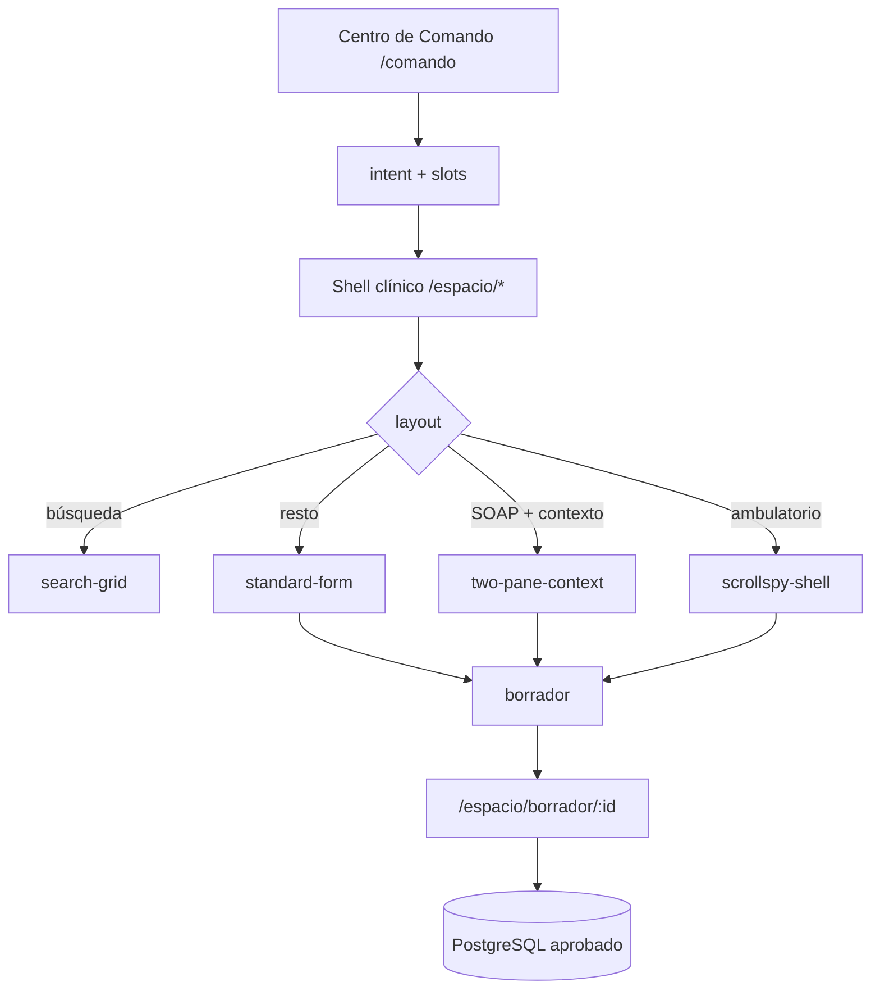

# EPIS2 — Árbol formulario → pantalla (canon)

**Versión:** 1.0 · **Fecha:** 2026-06-04  
**Canon:** [`docs/PRODUCT_CANON.md`](../PRODUCT_CANON.md) · [`PRODUCT_INVARIANTS.md`](./PRODUCT_INVARIANTS.md)  
**Registry:** `packages/clinical-forms/src/registry.ts`  
**Árbol programático:** `packages/clinical-forms/src/formScreenTree.ts`

---

## Principio rector (canon §3–4)

> **Command-first:** texto → intent → formulario mínimo → borrador → revisión humana.

| Principio canon | Implicación en pantallas |
|-----------------|--------------------------|
| Home = Centro de Comando | Los formularios **no** son home; se abren tras comando o deep link `/espacio/*` |
| Información no solicitada oculta | Layout `standard-form` por defecto; contexto/historial bajo demanda |
| Un solo Form Registry (#10) | 19 blueprints → 19 rutas `/espacio/*` → un renderer (`GeneratedClinicalFormPage`) |
| IA asiste, no aprueba (#5, #11) | Panel contexto + sugerencias opcionales; firma siempre humana |

---

## Flujo canónico → superficie



---

## Layouts de pantalla (5)

| Layout | Blueprints | Renderer | Viewport |
|--------|------------|----------|----------|
| `search-grid` | `patient_search` | Autocomplete + grid | 100% ancho; grid scroll embebido |
| `read-only-summary` | `patient_summary` | Formulario solo lectura | canvas max 560→720px |
| `two-pane-context` | `evolution_note`, `discharge_summary`, `prescription`, `referral` | Two-pane + panel contexto cerrado | split ≥960px; drawer en compacto |
| `scrollspy-shell` | `outpatient_visit` | Scrollspy + acordeones | índice oculto &lt;lg; formulario 100% |
| `standard-form` | resto (13) | `EpisClinicalFormPage` + RHF | canvas responsive 100%→720px |

**Encuadre MD3:** token `epis2BarLayout.clinicalFormMaxWidth` — `{ xs: 100%, sm: 560, md: 640, lg: 720 }`.

---

## Árbol por dominio clínico

### Acceso y paciente

| Blueprint | Pantalla | Ruta | Layout |
|-----------|----------|------|--------|
| `patient_search` | Búsqueda paciente | `/espacio/buscar-paciente` | search-grid |
| `patient_summary` | Resumen clínico | `/espacio/resumen` | read-only-summary |

**Hub relacionado:** `/espacio/ficha` — workspace, no blueprint.

### Documentación y borrador

| Blueprint | Pantalla | Ruta | Layout |
|-----------|----------|------|--------|
| `evolution_note` | Evolución SOAP | `/espacio/evolucion` | two-pane-context |
| `discharge_summary` | Epicrisis | `/espacio/epicrisis` | two-pane-context |
| `admission_note` | Ingreso | `/espacio/ingreso` | standard-form |
| `transfer_note` | Traslado | `/espacio/traslado` | standard-form |
| `outpatient_visit` | Consulta ambulatoria | `/espacio/ambulatorio` | scrollspy-shell |
| `referral_report` | Informe interconsulta | `/espacio/informe-interconsulta` | standard-form |
| `medical_certificate` | Certificado | `/espacio/certificado` | standard-form |

**Revisión:** `/espacio/borrador/$draftId` — superficie `document`, no blueprint.

**Impresión:** `/espacio/certificado/imprimir` — vista A5, fuera del árbol de blueprints.

### Órdenes

| Blueprint | Pantalla | Ruta |
|-----------|----------|------|
| `prescription` | Receta | `/espacio/receta` |
| `procedure_request` | Procedimiento | `/espacio/procedimiento` |
| `lab_request` | Laboratorio | `/espacio/laboratorio` |
| `imaging_request` | Imagenología | `/espacio/imagenologia` |
| `referral` | Interconsulta | `/espacio/interconsulta` |

(`prescription`, `referral` → two-pane-context; resto → standard-form)

### Enfermería y farmacia

| Blueprint | Pantalla | Ruta |
|-----------|----------|------|
| `nursing_note` | Nota enfermería | `/espacio/enfermeria` |
| `medication_administration` | MAR | `/espacio/mar` |
| `pharmacy_validation` | Validación farmacéutica | `/espacio/farmacia` |

### Datos estructurados paciente

| Blueprint | Pantalla | Ruta |
|-----------|----------|------|
| `allergy_entry` | Alergia | `/espacio/alergia` |
| `clinical_problem_entry` | Problema clínico | `/espacio/problema` |
| `medication_reconciliation` | Conciliación | `/espacio/conciliacion` |

---

## Pantallas `/espacio/*` sin blueprint

| Ruta | Superficie | Canon |
|------|------------|-------|
| `/espacio/ficha` | Workspace paciente | Contexto antes de formularios |
| `/espacio/resultados` | Grid resultados | Tarea acotada (IDC 58) |
| `/espacio/admin` | Consola admin | Fuera del flujo clínico command-first |
| `/espacio/borrador/$draftId` | Documento + aprobación | Paso 8–9 del flujo canónico |

---

## Responsive (MD3 compact / medium / expanded)

| Breakpoint | px | Formularios |
|------------|-----|-------------|
| compact | 0–767 | Campos 12 cols; canvas 100%; contexto en drawer |
| medium | 768–1279 | Grid proporcional; canvas ≤560–640px |
| expanded | ≥1280 | Scrollspy visible; canvas ≤720px; split contexto 40% |

Referencias: `packages/epis2-ui/src/theme/breakpoints.ts`, `EpisClinicalTwoPaneLayout`, `EpisClinicalScrollspyLayout`.

---

## Gate

```bash
npm run quality:form-screen-tree-gate
```

---

## Referencias

- Catálogo formularios: [`EPIS2_COMPLETE_FORM_CATALOG.md`](./EPIS2_COMPLETE_FORM_CATALOG.md)
- Catálogo pantallas: [`EPIS2_COMPLETE_SCREEN_CATALOG.md`](./EPIS2_COMPLETE_SCREEN_CATALOG.md)
- Simetría MD3: [`../design/EPIS2_M3_SYMMETRY_AND_FRAMING.md`](../design/EPIS2_M3_SYMMETRY_AND_FRAMING.md)
- Stack RHF: [`../design/EPIS2_CLINICAL_FORM_RHF.md`](../design/EPIS2_CLINICAL_FORM_RHF.md)

*Los errores de EPIS no son recuerdos: son gates de EPIS2.*
