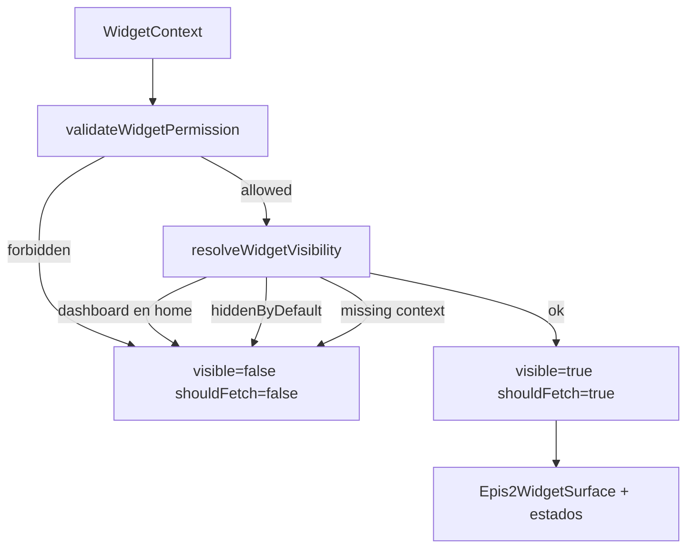

# EPIS2 — Arquitectura de widgets clínicos contextuales

**Fase:** WIDGET-00 · **Estado:** Fundación  
**Frase guía:** *Los widgets muestran lo necesario, cuando es necesario, y siempre conducen al trabajo clínico.*

---

## Principio rector

Los widgets **no** son tarjetas decorativas ni reemplazan el **Centro de Comando** (home canónica).

Cada widget:

- Responde una necesidad concreta en contexto (usuario, rol, paciente, encuentro, servicio, comando, actividad).
- Permanece **oculto por defecto** salvo widgets esenciales declarados.
- Soporta estados: `loading`, `ready`, `empty`, `error`, `forbidden`, `offline`.
- Carga de forma diferida solo si `shouldFetch === true`.
- Conduce a **comando** o **ruta clínica** — nunca escribe ni aprueba datos.
- Muestra copy en **español**.

## Paquetes

| Paquete | Responsabilidad |
|---------|-----------------|
| `@epis2/epis2-widgets` | Contratos, registry único, visibilidad, permisos, layout, fixtures sintéticos |
| `@epis2/epis2-ui` | Superficies M3 reutilizables (`Epis2Widget*`) |

## Registry único

```text
packages/epis2-widgets/src/registry/widget-registry.ts
```

Gate arquitectónico: `single-widget-registry.mjs`.

## Flujo de resolución



## Fuera de alcance (WIDGET-00)

- Integración API clínica real
- Montaje en `apps/web`
- WIDGET-01 y posteriores

## Referencias

- `docs/widgets/EPIS2_WIDGET_CATALOG.md`
- `docs/widgets/EPIS2_WIDGET_VISIBILITY_RULES.md`
- `docs/widgets/EPIS2_WIDGET_MATERIAL3_PATTERN.md`
- `docs/product/PRODUCT_INVARIANTS.md` (invariantes 6–10)
