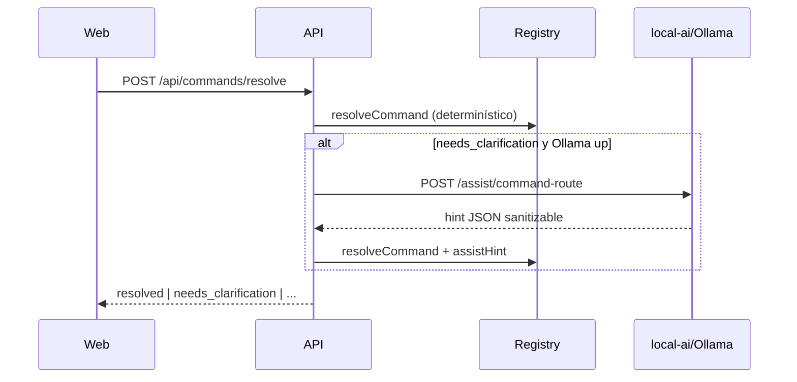

# EPIS2 CE-3 — Assist Route (micro-router local)

**Fecha:** 2026-06-04  
**Alcance:** CE-3 — hint de ruta vía `local-ai`, subordinado al Command Registry  
**Fase:** Command Engine post CE-2

## Objetivo

Desambiguar frases long-tail cuando el ranker determinístico devuelve `needs_clarification`, usando un micro-LLM local (Ollama) que **solo** clasifica intents del catálogo permitido por rol. La IA no ejecuta, no prescribe ni firma.

Principio reforzado: **IA interpreta · Registry autoriza · Usuario confirma · EPIS2 ejecuta**.

## Entregables

| Área | Cambio |
|------|--------|
| `services/local-ai` | `POST /assist/command-route` — prompt JSON, timeout 8s, validación Zod |
| `packages/contracts` | Schemas `aiAssistCommandRouteRequest/Response`, `localAiCommandRouteOutput` |
| `packages/command-registry` | `CommandAssistHint`, `assist-route.ts`, boost en `rank.ts`, bypass coloquial/disambiguation con hint, `pickAssistFallback` |
| `apps/api` | `resolveCommandWithOptionalAssist` — segunda pasada tras `needs_clarification` si local-ai up |
| Telemetría | `assistRouteUsed: true` en audit `command.resolve` |
| Tests | `assist-route.test.ts`, suite 20 frases, `commandRoute.test.ts` |

## Flujo

## Gates

| Gate | Resultado |
|------|-----------|
| `npm run check` | OK |
| `npm run test` | OK (478 tests) |
| `npm run db:validate` | OK |
| `architecture:validate` | OK — un solo registry, frontera IA |

## Riesgos

- **Latencia:** segunda pasada + Ollama (~3–8s). Si local-ai down, comportamiento idéntico a CE-2.
- **Alucinación de intent:** mitigado por whitelist por rol + `sanitizeAssistRouteHint` + re-ranking determinístico.
- **Frases coloquiales:** algunas del suite resuelven ya sin IA; el test filtra dinámicamente ≥15 ambiguas.

## No incluido (CE-3b+)

- Prefill de formularios desde slots
- Router LLM en web (solo API en Enter)
- Segundo registry o agente autónomo

## Próximo paso

- CE-3b: prefill de campos desde `CommandSlots` al abrir formulario
- Validación manual UX-G02 en Centro de Comando con Ollama local activo
