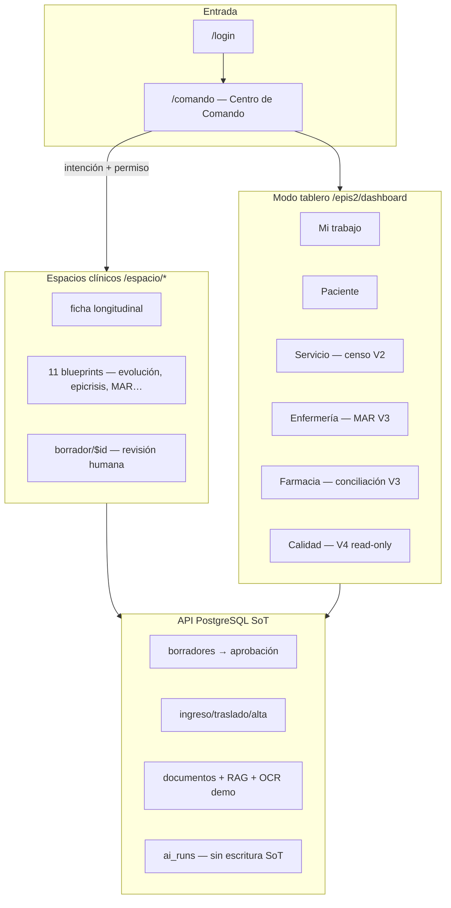

# EPIS2 — Auditoría integral (producto, técnica, MUI)

**Fecha:** 2026-06-05 · **Alcance:** Mapeo, errores, truncos, riesgos, diseño M3  
**Gates locales:** `check` OK · 297 tests · `db:validate` OK · Plan F+G signoffs recientes

---

## 1. Veredicto ejecutivo

| Dimensión | Estado | Nota |
|-----------|--------|------|
| **Arquitectura** | Sólida | 15/15 gates `architecture:validate`; invariantes respetados |
| **MVP demo V0–V5** | Cerrado | Journeys API en CI con Postgres; signoffs UI v1–v3 + calidad |
| **Catálogo producto completo** | ~28 % pantallas / ~12 % formularios | Coherente con demo, no EHR completo |
| **MUI/M3** | Adopción madura | M3-00…09 + LAYOUT + WIDGET; bundle dentro de presupuesto |
| **Producción clínica real** | No lista | OIDC, RLS enforce, dominios resultados/admin ausentes |

**Frase guía aplicada:** los gates de EPIS2 funcionan; el gap principal es **cobertura de catálogo**, no deriva arquitectónica.

---

## 2. Mapa del sistema (demo actual)



**Flujo vertical obligatorio (canon):** Comando → intención → permiso → página → formulario → borrador → aprobación humana → dato versionado → auditoría.

---

## 3. Cobertura por dominio (catálogo)

Fuente: `docs/product/EPIS2_COMPLETE_SCREEN_CATALOG.md` §22

| Dominio | Cobertura | Trunco principal |
|---------|-----------|------------------|
| Acceso y sesión | 22 % | Sin OIDC, sin multi-rol |
| Centro de Comando | 58 % | Sin historial comandos |
| Paciente | 28 % | Sin CRUD alergias/problemas |
| Atención médica | 42 % | Consulta ambulatoria MISSING |
| Documentación | 38 % | Sin nota traslado/procedimiento |
| Órdenes | 18 % | Bandeja resultados ausente |
| **Resultados** | **8 %** | Dominio casi vacío en UI |
| Medicamentos | 32 % | Interacciones, suspensión |
| Hospitalización | 35 % | Ingreso sin blueprint form |
| Enfermería | 33 % | Balance, turno, heridas |
| Farmacia | 28 % | Cola validación productiva |
| Documentos/búsqueda | 22 % | OCR productivo |
| IA local (UI) | 48 % | NL interpret no productivo |
| Modo tablero | 52 % | 5/7 tabs con slice demo |
| **Administración** | **5 %** | Casi todo MISSING |
| Interop/Chile | 30 % | HL7 inbound writeback |

**Formularios:** 11 blueprints implementados; ~39 filas MISSING en catálogo (`EPIS2_COMPLETE_FORM_CATALOG.md` §4).

---

## 4. MVP demo — qué está cerrado vs trunco

### Cerrado (slices + signoffs)

| Versión | Gate | Evidencia |
|---------|------|-----------|
| V0 | Comando + evolución + tablero trabajo | `golden-v0-*`, GO DEMO |
| V1 | Longitudinal + export/OCR UI | `epis2-v1-ui-signoff.md` |
| V2 | Hospitalización operativa UI | `epis2-v2-ui-signoff.md` |
| V3 | Enfermería/farmacia + MAR programado | `epis2-v3-ui-signoff.md` |
| V4/V5 + hardening | Interop read-only + IA trazable | `epis2-plan-f-complete.md` |
| CI | Bundle + golden + evals | `epis2-plan-g-complete.md` |
| M3 | Tema + layout + widgets | `M3_ADOPTION_PLAN.md` |

### Truncos funcionales (cadena vertical incompleta)

| ID | Trunco | Severidad | Detalle |
|----|--------|-----------|---------|
| **T1** | Ingreso hospitalario | P1 | Comando `admit_patient_hospital` → tablero servicio; **sin blueprint** `admission_note` ni formulario (`SCREEN_CONNECTION_MAP` C1 sigue válido) |
| **T2** | Resultados clínicos | P1 | Sin bandeja, tendencia dedicada, acuse UI fuera de servicio (~8 % dominio) |
| **T3** | CRUD problemas/alergias | P1 | Datos demo en API; sin formularios MISSING en catálogo |
| **T4** | Nota traslado / alta (form) | P2 | Alta operativa API+UI; epicrisis sí; **nota traslado** MISSING |
| **T5** | Consulta ambulatoria | P2 | 15 pantallas bulk MISSING (§6 catálogo) |
| **T6** | Administración | P2 | 5 % cobertura — usuarios, catálogos, backups UI |

### Documentación desactualizada (deriva)

| Documento | Problema |
|-----------|----------|
| `EPIS2_SCREEN_CONNECTION_MAP.md` §7 | C3–C6 **obsoletos** (documentos UI, widgets, nursing router ya resueltos) |
| `epis2-complete-product-gap-audit.md` | WIDGET-01 pendiente — **supersedido** |
| `epis2-project-audit-2026-06-05.md` | Piloto pendiente — **supersedido** por GO DEMO |
| `EPIS2_RELEASE_ROADMAP.md` fase EPIS2-13/14 | Tabla histórica vs signoffs UI recientes |

---

## 5. Errores y hallazgos concretos

### Copy / español (invariante 14)

| Archivo | Hallazgo |
|---------|----------|
| `QualityDashboardTab.tsx` | Métricas hardcodeadas; **`IA runs`** en inglés en UI clínica |
| `DocumentSearchPanel.tsx` | Labels `Tipo`, `Título` fuera de `copy/es.ts` |
| `QualityDashboardTab.test.tsx` | Test aserta el inglés `IA runs` — perpetúa el bug |

Gate `spanish-visible-copy` pasa por ámbito/heurística; estos casos son **falsos negativos**.

### Seguridad / hardening (aceptado demo, riesgo prod)

| Ítem | Estado demo | Riesgo prod |
|------|-------------|-------------|
| `RLS_MODE=off` default | Opt-in enforce | Filas clínicas sin aislamiento tenant |
| `AUTH_MODE=demo` | Claves demo | Sin OIDC enterprise (ADR-006) |
| Service key híbrido | Piloto | No sustituye IAM |
| Rate limits | Login/AI/commands | Parcial |

### Tests

| Hallazgo | Impacto |
|----------|---------|
| **10 suites** `skipIf(!DATABASE_URL)` | 20 tests skipped localmente; CI con Postgres los ejecuta |
| Sin Playwright E2E obligatorio | Regresiones UI solo vía RTL + journey API |
| MAR seed ventanas relativas a `NOW()` | CI debe migrar antes de tests V3 |

### Arquitectura — sin errores activos

- 0 imports `@mui/*` en `apps/web` (correcto vía `@epis2/epis2-ui`)
- Un solo Command/Form/Widget registry
- IA sin escritura SoT (`ai-write-boundary` OK)
- Home = `/comando` (no dashboard)

---

## 6. Diseño MUI / Material 3

### Adoptado en producción

| Capa | Componentes | Patrón |
|------|-------------|--------|
| **Tema** | `createEpis2Theme`, MTB Calm Teal, dark pilot | Único generador |
| **Primitivos** | `EpisButton` filled/tonal/outlined, chips, alerts | M3 roles |
| **Comando** | `EpisCommandBar`, `EpisCommandCenterLayout` | Expressive controlado |
| **Formularios** | `EpisClinicalForm`, two-pane layout | Standard documento |
| **Datos** | `EpisDataGrid`, `EpisTreeView`, `EpisTrendChart` | Lazy `*Suspense` |
| **Tablero** | `EpisDashboardShell`, métricas, worklists | Adaptativo |
| **Widgets** | `Epis2WidgetGrid`, breakpoint 768/1280 | M3 motion reducido |

### Solo spike / dev

| Ítem | Ruta | Licencia |
|------|------|----------|
| Scheduler calendario | `/dev/scheduler-spike` | Community worklist en prod; Pro rechazado |
| Catálogos UI/tema | `/dev/ui-catalog`, `/dev/visual-theme-catalog` | Gated env |

### Presupuesto bundle (gzip)

| Chunk | Medido | Límite | Estado |
|-------|--------|--------|--------|
| mui-x-grid | 98 KB | 150 KB | OK |
| mui-x-charts | 61 KB | 120 KB | OK |
| mui-x-scheduler | 78 KB | 200 KB | OK (mayoría dev lazy) |
| **mui-core** | **169 KB** | — | Monitorear; mayor chunk |
| app entry | 129 KB | — | Lazy dashboards ayuda |

### Riesgos diseño M3 (humanos, no CI)

| Riesgo | Fuente |
|--------|--------|
| Modo oscuro sin revisión en todas las pantallas clínicas | `epis2-m3-post-signoff-session.md` |
| Contraste gradientes Aurora en dark | `epis2-visual-theme-aurora-2026-06-05.md` |
| Google Fonts offline | Tema depende de red para tipografía |
| `mui-core` ~45 % del JS gzip total | Oportunidad tree-shaking futuro |
| Islands con doble margen | Mitigado (`epis2-drive-m3-desktop-pattern.md`) |

---

## 7. Matriz de riesgos priorizada

| P | Riesgo | Mitigación sugerida |
|---|--------|---------------------|
| **P0** | RLS off en despliegue real | Documentar + enforce en staging pre-piloto |
| **P1** | Copy inglés `IA runs` en tablero calidad | Mover a `copy/es.ts` (`ejecucionesIa`) |
| **P1** | Ingreso sin formulario (cadena vertical rota) | Blueprint `admission_note` + Ola 2 |
| **P1** | Dominio resultados ~8 % | Bandeja lectura + comando mínimo |
| **P1** | Doc deriva (connection map, gap audits) | Sesión sync docs P2 |
| **P2** | 72 % catálogo sin UI | Roadmap por olas; no big-bang |
| **P2** | OIDC / HL7 inbound | ADR-006 + Plan F fuera de alcance |
| **P2** | Dark mode clínico | Checklist humano M3-09 ampliado |
| **P3** | Vitest GHSA advisory dev-only | Dependabot / upgrade 4.x |

---

## 8. Gates y CI (estado actual)

```bash
npm run check              # lint + typecheck + architecture — OK
npm run test               # 297 passed, 20 skipped (sin DB local)
npm run db:validate        # 22 migraciones — OK
npm run ai:evals           # 5 casos — OK
npm run quality:golden-journey  # spec OK; API requiere DATABASE_URL
npm run qa:bundle-analyze  # presupuestos MUI X — OK
```

**Journeys dorados:** V0–V5 automatizados en CI con Postgres (`golden-clinical-journey.api.spec.ts`).

---

## 9. Próximos pasos recomendados

**Programa canónico:** `docs/quality/microphase-ledger.json` · `npm run quality:microphase-next`

Tras **MF-151** (gobernanza): ejecutar **MF-152** (copy + deriva documental).

1. **MF-152:** fix copy `QualityDashboardTab` + actualizar `SCREEN_CONNECTION_MAP` C3–C6.
2. **MF-156–158:** blueprint ingreso hospitalario.
3. **MF-161:** bandeja resultados (8 % → usable).
4. **MF-179:** piloto humano formal.
5. **Post-piloto MF-180+:** HL7 inbound cuarentena.

---

## Referencias

- Canon: `docs/PRODUCT_CANON.md`, `docs/product/PRODUCT_INVARIANTS.md`
- Catálogos: `EPIS2_COMPLETE_SCREEN_CATALOG.md`, `EPIS2_COMPLETE_FORM_CATALOG.md`
- M3: `docs/design/M3_ADOPTION_PLAN.md`, `docs/design/MUI_LICENSING_DECISION_LOG.md`
- Journeys: `docs/quality/EPIS2_GOLDEN_JOURNEYS.md`
- Signoffs recientes: `epis2-v1-ui-signoff.md` … `epis2-plan-f-g-ui-signoff.md`
