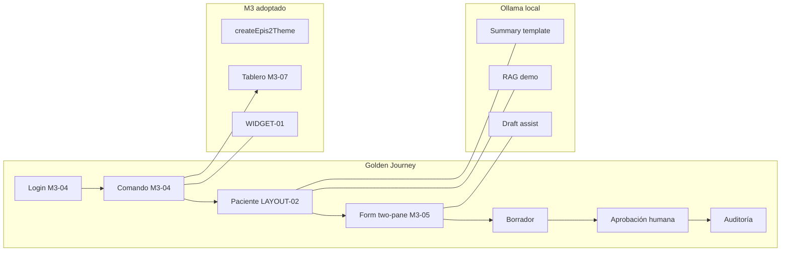

# EPIS2 — Revisión arquitecto maestro: Programa v2 (Golden × M3 × Ollama)

**Fecha:** 2026-06-05  
**Rol:** Arquitecto maestro post-MVP  
**Base:** MF-151…154 DONE · MF-155 READY · auditoría `epis2-comprehensive-audit-2026-06-05.md`  
**Propuesta:** Renumerar programa a **MF-2xx** con tres ejes transversales obligatorios en cada microfase clínica.

---

## 1. Veredicto ejecutivo

| Dimensión | Estado | Acción v2 |
|-----------|--------|-----------|
| Arquitectura command-first | **Sólida** (15/15 gates) | Mantener; no abrir segundo registry |
| MVP demo V0–V5 + M3-00…09 + LAYOUT + WIDGET | **Cerrado** | Congelar como baseline; extender vía journey |
| Programa MF-151…182 | **Válido pero lineal** | Renumerar + insertar ejes Golden/M3/IA |
| Golden Journey | **4 capas desalineadas** | Unificar matriz; E2E solo cubre pasos 1–5 |
| Material Design 3 | **Maduro en shell** | Exigir checklist M3 por microfase de UI |
| IA local (Ollama) | **Draft assist real; RAG/summary demo** | Patrón «IA por proceso» con evals sintéticos |

**Frase guía v2:** *Cada microfase clínica entrega un paso del Golden Journey, una superficie M3 verificable y un contrato IA (assist, retrieval o N/A explícito) — sin escritura SoT.*

---

## 2. Espina dorsal: Golden Journey en 4 capas

Toda microfase clínica (MF-212+) debe declarar qué capas extiende:

| Capa | Artefacto | CI hoy | Gap v2 |
|------|-----------|--------|--------|
| **G0** Contrato | `golden-clinical-journey.spec.ts` | ✓ | Ampliar intents por dominio |
| **G1** API + SoT | `golden-clinical-journey.api.spec.ts` | ✓ (Postgres) | Slices V2 ingreso, resultados, CRUD |
| **G2** UI RTL | `*.test.tsx` en `apps/web` | Parcial | Por blueprint nuevo |
| **G3** E2E Playwright | `e2e/golden-command-evolution.spec.ts` | ✓ mínimo | Pasos 6–9 (borrador→aprobación→auditoría) |
| **G4** Humano | `PILOT_DEMO_CHECKLIST.md` | Manual | MF-2xx piloto |

### Mapa journey × capacidades M3 actuales



---

## 3. Eje IA local (Ollama) por proceso clínico

**Invariante:** PostgreSQL = SoT; IA → borrador o lectura asistida; `requiresHumanReview: true`; `ai:evals` en CI sin Ollama.

| Proceso | Hoy | Target v2 | Microfase propuesta |
|---------|-----|-----------|---------------------|
| Comando NL | Registry determinista | Mantener; opcional MF-2xx+ «sugerencias IA» sin resolver intents | MF-235 (post-piloto) |
| Evolución / epicrisis / receta | Draft assist ✓ | Eval por blueprint + E2E «Sugerir IA» | MF-211 patrón |
| MAR / farmacia | Draft assist ✓ | Journey G1 slice enfermería | MF-213+ |
| Documentos / OCR | Demo + pgvector | Embeddings Ollama `nomic-embed-text` | MF-220 |
| RAG ficha | Citas demo | Síntesis Ollama en `local-ai` (nuevo endpoint) | MF-221 |
| Resumen 90d | Template | LLM bajo política preamble | MF-222 |
| Resultados / tendencias | Missing | «Explicar cambio» solo lectura | MF-228 |
| Ingreso / traslado | API sin form | Assist en `admission_note` / `transfer_note` | MF-214 / MF-227 |
| Interop HL7 | Validate only | IA **prohibida** writeback | MF-280+ |

**Stack automatizado (ya parcial):**

```bash
npm run stack:up      # postgres + ollama + migrate + ai:enable
npm run dev:ai        # local-ai :3002
npm run ai:evals      # CI — 5 casos sintéticos
```

**Mejora MF-207 (nueva):** `local-ai` en `docker-compose` + job CI opcional `ai:live-smoke` (no bloqueante).

---

## 4. Eje Material Design 3 por microfase

Checklist mínimo por entrega UI (derivado `M3_ANTI_DRIFT_GATES.md`):

| Gate | Aplica cuando |
|------|----------------|
| M3-G01 | Siempre |
| M3-G04 | Nueva pantalla / panel |
| M3-G10 | Lista, grid, form |
| M3-G13 | Una acción primaria |
| M3-G15 | Si toca tablero |

**MF-205 (nueva):** `docs/quality/GOLDEN_M3_MATRIX.md` — tabla dominio × pantalla × gates M3-Gxx.

---

## 5. Subagentes recomendados (Cursor)

| Subagente | Responsabilidad | Dispara en |
|-----------|-----------------|------------|
| **golden-guardian** | Mantener G0–G3; ampliar `e2e/` y API specs | Cada MF clínica |
| **m3-guardian** | M3-G01…G15 en diff UI | PR con `apps/web` |
| **ollama-clinical** | `assistSchemas`, `draftPromptCatalog`, `ai:evals` | MF con blueprint |
| **ledger-keeper** | `microphase-ledger.json`, `quality:microphases` | Cierre MF |
| **ci-parity** | `quality:local-ci`, Docker Postgres | Pre-push |

No crear subagentes para implementación masiva de catálogo (prohibido por invariantes).

---

## 6. Renumeración MF-2xx (programa v2)

**Reglas:**

- MF-200…204 = Ola 0 histórica (mapeo 1:1 desde MF-151…155).
- MF-205…209 = Ola 0 bis (nuevos — espina journey + auth + IA stack).
- MF-210+ = clínica con triple entregable: **Journey + M3 + IA**.
- MF-270…279 = piloto (antes MF-175…179).
- MF-280…284 = HL7 post-piloto (antes MF-180…182).

### Ola 0 — Verdad operativa (DONE + READY)

| Nuevo ID | Antiguo | Nombre | Estado | Mejora v2 |
|----------|---------|--------|--------|-----------|
| **MF-200** | MF-151 | Gobernanza programa | DONE | Actualizar a ledger v2 |
| **MF-201** | MF-152 | Copy español + docs | DONE | — |
| **MF-202** | MF-153 | Paridad CI Postgres | DONE | — |
| **MF-203** | MF-154 | Playwright E2E | DONE | Extender G3 pasos 6–9 en MF-206 |
| **MF-204** | MF-155 | RLS staging fail-closed | **READY** | — |
| **MF-205** | — | **Matriz Golden × M3 × dominios** | NEW | `GOLDEN_M3_MATRIX.md` |
| **MF-206** | — | **Auth UI: /login sin redirect 401** | NEW | Fix `apiFetch` en bootstrap sesión |
| **MF-207** | — | **Ollama stack docker + smoke** | NEW | `local-ai` service compose |
| **MF-208** | — | **Golden G3 completo E2E** | NEW | borrador→aprobación→comando |
| **MF-209** | — | **Integración tests API estables** | NEW | export 500, RLS, censo |

### Ola 1 — Ingreso y longitudinales

| Nuevo ID | Antiguo | Nombre | Journey | M3 | IA |
|----------|---------|--------|---------|-----|-----|
| **MF-210** | MF-156 | Contrato scaffolder blueprints | G0 | — | Plantilla eval |
| **MF-211** | — | **Patrón IA por blueprint** | — | — | Schema+prompt+eval |
| **MF-212** | MF-157 | `admission_note` | G2 | G10 | Assist |
| **MF-213** | MF-158 | Cadena ingreso vertical | G1+G3 | G04 | Assist |
| **MF-214** | MF-159 | CRUD alergias | G1 | Form | N/A + CDS |
| **MF-215** | MF-160 | CRUD problemas | G1 | Form | N/A |

### Ola 2 — Resultados

| Nuevo ID | Antiguo | Nombre | Journey | M3 | IA |
|----------|---------|--------|---------|-----|-----|
| **MF-220** | MF-161 | Bandeja resultados | G2 | Grid G10 | N/A |
| **MF-221** | MF-162 | Críticos y acuse | G1+G3 | Alert G08 | N/A |
| **MF-222** | MF-163 | Orden → resultado | G1 | — | N/A |
| **MF-223** | MF-164 | Tendencias (`EpisTrendChart`) | G2 | Chart | **Explicar cambio** |
| **MF-224** | MF-165 | Comandos resultados | G0 | Comando | Hints |

### Ola 3 — Formularios prioritarios

| Nuevo ID | Antiguo | Nombre | Journey | M3 | IA |
|----------|---------|--------|---------|-----|-----|
| **MF-225** | MF-166 | Conciliación farmacia | G1 | Tablero | Assist ✓ |
| **MF-226** | MF-167 | Nota traslado | G1+G3 | Two-pane | Assist |
| **MF-227** | MF-168 | Consulta ambulatoria | G3 | Form | Assist |
| **MF-228** | MF-169 | Interconsulta + informe | G1 | Form | Assist referral |
| **MF-229** | MF-170 | Cola formularios restantes | — | — | Ledger queue |

### Ola 4 — Administración

| Nuevo ID | Antiguo | Nombre |
|----------|---------|--------|
| **MF-230** | MF-171 | Usuarios y roles |
| **MF-231** | MF-172 | Catálogos clínicos |
| **MF-232** | MF-173 | Consola auditoría |
| **MF-233** | MF-174 | Consola operacional |

### Ola 5 — Piloto

| Nuevo ID | Antiguo | Nombre |
|----------|---------|--------|
| **MF-270** | MF-175 | OIDC staging |
| **MF-271** | MF-176 | Rate limits |
| **MF-272** | MF-177 | Backup/restore |
| **MF-273** | MF-178 | Signoff humano M3 |
| **MF-274** | MF-179 | Ensayo piloto (G4 completo) |

### Ola 6 — HL7 post-piloto

| Nuevo ID | Antiguo | Nombre | IA |
|----------|---------|--------|-----|
| **MF-280** | MF-180 | HL7 cuarentena | Prohibida |
| **MF-281** | MF-181 | Mapeo HL7 | Prohibida |
| **MF-282** | MF-182 | Writeback auditado | Solo humano |

**Total:** 38 microfases numeradas (vs 32 originales) — 6 inserciones estratégicas en Ola 0–1.

---

## 7. Mejoras concretas al plan MF-155…182 original

| ID antiguo | Problema | Mejora v2 |
|------------|----------|-----------|
| MF-155 | RLS solo staging | Añadir test negativo en journey API |
| MF-158 | «golden ampliado» vago | Criterio: nuevo spec `golden-v2-admission.spec.ts` |
| MF-161–165 | Secuencia rígida | Permitir MF-221 (críticos) en paralelo tras MF-220 |
| MF-166–170 | Sin IA explícita | MF-211 bloquea assist antes de form nuevos |
| MF-178 | M3 humano al final | Checklist M3 parcial **por ola** (MF-205 matriz) |
| MF-179 | Piloto sin E2E completo | Depende de MF-208 (G3 pasos 6–9) |
| — | Login E2E roto | MF-206 antes de ampliar G3 |
| — | RAG/summary no LLM | MF-221/222 en Ola 2 (opcional piloto) |

---

## 8. Automatización recomendada (Docker + Ollama)

```text
npm run stack:up           # postgres + ollama + migrate + ai:enable
npm run quality:local-ci   # gates sin GPU
EPIS2_LOCAL_CI_E2E=1 npm run quality:local-ci
npm run quality:golden-journey
npm run test:e2e
```

**CI GitHub (target):**

```text
migrate → check → test → quality:ci-parity → playwright → golden-journey → ai:evals
```

**Opcional nightly:** `ai:live-smoke` con Ollama service (no bloquear PR).

---

## 9. Próximas 3 sesiones (orden estricto)

| Sesión | MF v2 | Entregable |
|--------|-------|------------|
| 1 | **MF-204** (155) | RLS staging enforce |
| 2 | **MF-205** | Matriz Golden×M3 + actualizar `GOLDEN_CLINICAL_JOURNEY.md` |
| 3 | **MF-206** | Fix auth `/login` + E2E login UI real |

Luego **MF-209** (tests API estables) antes de Ola 1 clínica.

---

## 10. Migración del ledger

1. Bump `microphase-ledger.json` → `version: "2.0.0"`.
2. Tabla `legacyIdMap`: MF-151 → MF-200, etc.
3. Mantener MF-151…154 como alias DONE en comentario hasta limpieza docs.
4. `validate-microphase-ledger.mjs`: rango MF-200…MF-282.
5. Reporte cierre: `reports/epis2-mf-2xx-*.md`.

**Decisión 2026-06-05:** sin renumerar MF-2xx aún; se insertaron **MF-183…188** en el ledger v1.1 con `canonicalExecutionOrder`. Ver `docs/quality/MICROPHASE_PROGRAM.md` §Orden canónico.

---

## 11. Riesgos

| Riesgo | Mitigación |
|--------|------------|
| Scope creep IA (chat, agentes) | `gatewayCapabilities` — solo endpoints aprobados |
| Renumeración rompe agentes/docs | `legacyIdMap` + punteros en `MICROPHASE_PROGRAM.md` |
| Ollama en CI lento/flaky | Evals sintéticos en PR; live smoke nightly |
| Catálogo 28 % → 100 % | Cola MF-229; una pantalla por microfase |

---

*Los errores de EPIS no son recuerdos: son gates de EPIS2.*
