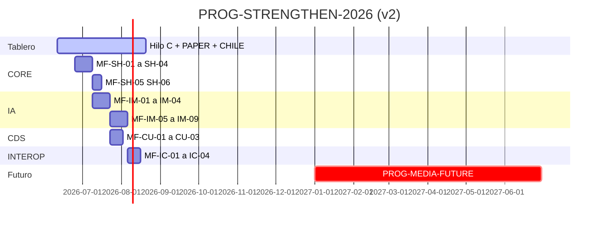

# EPIS2 — Propuesta: fortalecer · modernizar · diferir multimedia

**Fecha:** 2026-06-11 · **Revisión:** v2 (prioridad usuario)  
**Tipo:** Planificación · **Estado:** Propuesta adoptable  
**Sistema:** [SDEPIS2](../docs/product/EPIS2_DEV_SYSTEM.md) · Canon: [PRODUCT_INVARIANTS.md](../docs/product/PRODUCT_INVARIANTS.md)

> **Estrategia v2:** Consolidar y modernizar **lo que EPIS2 ya tiene** (command-first, borradores, IA local, pgvector, Chile, dual-chart). **Audio, dictado, OCR avanzado y multimedia clínica → etapa futura (2027+)**. Sin migración de SoT.

---

## 1. Resumen ejecutivo

| Pregunta | Respuesta v2 |
|----------|--------------|
| ¿Qué hacer primero? | **Fortalecer** pipeline clínico, registries, evals IA y datos Chile ya iniciados. |
| ¿Qué modernizar? | RAG sobre chunks existentes, AI Provenance sobre `ai_runs`, CDS cards, export FHIR Chile, observabilidad. |
| ¿Qué diferir? | Dictado (IDC 92), ASR, ambient, OCR Tesseract, video/imagen clínica, spike Medplum. |
| ¿Migrar SoT? | **No.** PostgreSQL relacional + Drizzle permanece. |
| ¿Cuándo empezar PROG-STRENGTHEN? | En paralelo con cierre **Hilo C**; no compite con C-3/C-4. |

**Frase guía del tramo:**

> *Perfeccionar el núcleo antes de abrir nuevos sentidos (voz, imagen, video).*

---

## 2. Mapa: fortalecer vs modernizar vs futuro

```text
┌─────────────────────────────────────────────────────────────────┐
│ 2026 — PROG-STRENGTHEN-2026 (este documento)                    │
├─────────────────────────────────────────────────────────────────┤
│ FORTALECER          │ MODERNIZAR           │ TABLERO (continuar) │
│ · draft→approve     │ · RAG 384d           │ · Hilo C C-3/C-4    │
│ · ai_runs/evals     │ · AI Provenance FHIR │ · PROG-PAPER-MODE   │
│ · command/forms     │ · CDS cards          │ · PROG-CHILE        │
│ · audit + RLS       │ · OTel + gates       │ · PROG-CALM         │
│ · clinicalSafety    │ · embed Ollama       │                     │
└─────────────────────────────────────────────────────────────────┘
                              │
                              ▼
┌─────────────────────────────────────────────────────────────────┐
│ 2027+ — PROG-MEDIA-FUTURE (backlog, no iniciar en 2026)         │
│ · dictado / whisper (IDC 92) · ambient documentation           │
│ · OCR avanzado · imágenes/video clínico · MCP agentes           │
│ · spike Medplum sidecar (solo si interop lo exige)              │
└─────────────────────────────────────────────────────────────────┘
```

---

## 3. Principios vinculantes

Sin cambios respecto a v1 — invariantes EPIS2 permanecen. Además:

8. **No añadir servicios nuevos** (`asr-local`, pipelines multimedia) hasta cierre PROG-STRENGTHEN.
9. **`ClinicalDictationButton`** permanece stub documentado; no conectar ASR en 2026.
10. Toda mejora IA **extiende** `services/local-ai`, `ai_runs` y `packages/contracts`; no sidecar con ORM.

---

## 4. Programa 2026: PROG-STRENGTHEN-2026

Cuatro subprogramas + continuidad tablero. Orden recomendado:

```text
PROG-STRENGTHEN-2026
├── A · PROG-CORE-HARDEN      ← prioridad 1 (confianza clínica)
├── B · PROG-IA-MODERNIZE     ← prioridad 2 (IA sobre lo existente)
├── C · PROG-CDS-UX           ← prioridad 3 (alertas ya codificadas)
└── D · PROG-INTEROP-CHILE    ← prioridad 4 (frontera FHIR)
```

### Relación con tablero (no duplicar)

| Iniciativa tablero | Rol en PROG-STRENGTHEN |
|--------------------|------------------------|
| Hilo C (C-3, C-4) | **Continuar** — no es parte del programa IA pero es prerrequisito operativo |
| PROG-PAPER-MODE MF-04/05 | **Continuar** — IA meta en papel sin dictado |
| PROG-CHILE-CLINICAL | **Continuar** — MF-CHILE-*; PROG-INTEROP-CHILE extiende export |
| PROG-CALM-PREMIUM | **Continuar** — pulido visual independiente |

---

## A. PROG-CORE-HARDEN — Fortalecer el núcleo clínico

**Objetivo:** Hacer más robusto lo ya construido: borrador, aprobación, auditoría, registries, degradación sin IA.

### Inventario a fortalecer (ya existe)

| Activo | Ubicación | Brecha |
|--------|-----------|--------|
| Pipeline borrador | `clinical_drafts`, API drafts/approvals | Side-effects modulares ✓; falta gate transaccional documentado |
| 19 blueprints | `packages/clinical-forms` | Metadata Chile incompleta en algunos campos |
| ~25 intents | `packages/command-registry` | Coloquial + assist route ✓; evals por intent dispersos |
| `ai_runs` | migración 005 | Sin link formal a `approvals` |
| RLS piloto | migración 022–023 | No forzado en prod |
| Evals IA | `ai:evals:live` | Cobertura parcial por blueprint |
| pgvector | migración 019 | 128d; seeds demo only |

### Microfases

| ID | Entrega | Alcance | Gate |
|----|---------|---------|------|
| **MF-SH-01** | Trazabilidad draft→approve→audit | Columna o vista `approvals.ai_run_id` nullable; populate en approve asistido | test approve + audit payload |
| **MF-SH-02** | Evals por intent | Fixture `COMMAND_PHRASE_SUITE` + 1 eval por intent top-10 en `ai:evals` | `ai:evals:live` verde |
| **MF-SH-03** | Degradación IA | Test explícito: Ollama down → formulario manual + comando resuelve | test EPIS2-07 ampliado |
| **MF-SH-04** | Registry meta Chile | Completar `registryMeta` en blueprints con campos SNRE/RUT en allowlist CHILE | `quality:registry-meta-gate` |
| **MF-SH-05** | RLS documentación | Runbook operador RLS; flag `EPIS2_RLS_FORCE` en staging C-4 | doc ops + smoke staging |
| **MF-SH-06** | Migraciones control | Tabla control ✓ (F4); script `db:validate` incluye checksum 035–040 Chile | `db:validate` |

### Archivos permitidos

- `apps/api/src/routes/drafts/**`, `approvals/**`, `audit/**`
- `database/migrations/041_approvals_ai_run.sql` (si aplica)
- `packages/command-registry/**`, `clinical-forms/**`
- `services/local-ai/**`, `scripts/ai/evals/**`
- `docs/ops/**`

---

## B. PROG-IA-MODERNIZE — Modernizar IA sobre infra existente

**Objetivo:** Mejorar calidad y trazabilidad de la IA **sin** nuevos modos de entrada (voz/imagen).

### Microfases

| ID | Entrega | Alcance | Gate |
|----|---------|---------|------|
| **MF-IM-01** | Embeddings 384d | Migración `041_rag_embeddings_384.sql`; re-index script; lectura dual 128/384 | `db:validate` · search test |
| **MF-IM-02** | Embed vía Ollama | Contrato `embedDocument`; modelo `nomic-embed-text` en stack dev | smoke embed |
| **MF-IM-03** | RAG incremental | Retrieval secuencial por chunk en `local-ai` (patrón UFPEL 2026) | unit test + fixture demo-005 |
| **MF-IM-04** | Assist con citas | `ai_runs.output_payload` incluye `document_id` + `chunk_index[]` | eval no-hallucination |
| **MF-IM-05** | AI Provenance interno | Tipos `AiProvenanceRecord` en `contracts`; link approve | typecheck |
| **MF-IM-06** | Export Provenance FHIR | `fhir-export`: Provenance + Device + AIAST tag post-approve asistido | `quality:ai-provenance-gate` |
| **MF-IM-07** | Model card estático | Markdown versión modelo/prompt policy en export | test fhir-export |
| **MF-IM-08** | Anti feedback-loop | Policy assist: excluir contexto con tag AIAST | eval regression |
| **MF-IM-09** | OTel IA | Span `ai.run` latencia modelo en pipeline existente | trace smoke CI |

### No hacer en PROG-IA-MODERNIZE

- GraphRAG en SoT clínico (solo doc interna opcional, defer).
- Langfuse/Phoenix hasta MF-IM-06 cerrado (evaluar en 2027).
- Nuevos modelos cloud.

### Archivos permitidos

- `database/migrations/041_*.sql`, `042_ai_provenance*.sql`
- `services/local-ai/**`, `packages/fhir-export/**`, `packages/contracts/**`
- `apps/api/src/routes/ai/**`, `documents/**`

---

## C. PROG-CDS-UX — Modernizar presentación de alertas

**Objetivo:** Las reglas `clinicalSafety` y `clinicalDecisionRules` **ya existen**; modernizar su UX a cards estilo CDS Hooks (sin servidor CDS externo).

| ID | Entrega | Alcance | Gate |
|----|---------|---------|------|
| **MF-CU-01** | `ClinicalCdsCard` | Componente MUI: info / suggestion / warning | Storybook + unit |
| **MF-CU-02** | Hook patient-view | Al abrir ficha: alergias, gaps, CDS advisory | E2E dual-chart |
| **MF-CU-03** | Hook order-select | Al prescribir: interacciones + duplicidad | test API + E2E receta |
| **MF-CU-04** | API `/cds/cards` | Endpoint interno; prefetch paciente; sin FHIR server externo | `quality:cds-hooks-gate` |

Archivos: `packages/clinical-domain/**`, `apps/web/src/components/cds/**`, `apps/api/src/routes/cds/**`.

---

## D. PROG-INTEROP-CHILE — Fortalecer frontera (no migrar)

**Objetivo:** Completar export interoperable Chile sobre `fhir-export` existente.

| ID | Entrega | Alcance | Gate |
|----|---------|---------|------|
| **MF-IC-01** | Perfil MINSAL export | Patient + Encounter + DocumentReference | tests Chile |
| **MF-IC-02** | SNRE staging | Draft `prescription` → MedicationRequest staging JSON | CHILE-RX gate |
| **MF-IC-03** | Questionnaire piloto | Export FHIR Questionnaire desde `evolution_note` blueprint | round-trip schema test |
| **MF-IC-04** | HL7 quarantine hardening | Tests + runbook ingestión `hl7_quarantine` | doc + test |

**Diferido:** MF-IC-05 spike Medplum → **PROG-MEDIA-FUTURE** (solo si operador exige sidecar).

---

## 5. Etapa futura: PROG-MEDIA-FUTURE (2027+)

Backlog explícito. **No iniciar microfases ni spikes en 2026.**

| Programa futuro | IDC / ref | Prerrequisito |
|-----------------|-----------|---------------|
| **PROG-VOICE-DRAFT** | IDC 92 | PROG-STRENGTHEN cerrado + ADR consentimiento Chile |
| **PROG-AMBIENT-DOC** | — | VOICE estable + legal review |
| **PROG-OCR-ADVANCED** | Fase E Tesseract | Pipeline documentos + RAG maduro |
| **PROG-CLINICAL-MEDIA** | Imagen/video adjuntos | Storage policy PHI + audit extend |
| **PROG-MCP-AGENTS** | — | AI Provenance export ✓ + RBAC MCP |
| **Spike Medplum sidecar** | ARCHITECTURE_TARGET | Decisión operador interop |

### Stub permitido en 2026 (sin implementar)

`ClinicalDictationButton` — mantener como placeholder con copy:

> «Dictado clínico — disponible en etapa futura. Use el teclado o asistencia IA en el borrador.»

IDC matrix: IDC 92 permanece **Planned / Post-core**.

---

## 6. Cronograma 2026 (10 semanas)

Sin semanas de voz/ASR. Alineado con Hilo C + PAPER + CHILE en paralelo.

| Semana | Foco | Microfases |
|--------|------|------------|
| 1–2 | Tablero | C-3b, C-4 staging · MF-PAPER-04/05 |
| 3 | CORE | MF-SH-01, MF-SH-02 |
| 4 | CORE | MF-SH-03, MF-SH-04 |
| 5 | IA | MF-IM-01, MF-IM-02 |
| 6 | IA | MF-IM-03, MF-IM-04 |
| 7 | IA | MF-IM-05, MF-IM-06 |
| 8 | CDS | MF-CU-01, MF-CU-02 |
| 9 | CDS + CORE | MF-CU-03, MF-SH-05, MF-SH-06 |
| 10 | INTEROP | MF-IC-01…04 · cierre PROG-STRENGTHEN |



---

## 7. Herramientas 2026 vs 2027

### Adoptar en 2026 (modernización sobre lo existente)

| Herramienta | Uso | Programa |
|-------------|-----|----------|
| **nomic-embed-text** (Ollama) | Re-index chunks 384d | IA-MODERNIZE |
| **OpenTelemetry** (ya iniciado) | Trazas command→draft→ai→approve | CORE + IA |
| **Evals fixtures** | Regresión intent/blueprint | CORE |
| **FHIR Provenance IG** | Export trazabilidad IA | IA-MODERNIZE |

### Mantener sin cambio mayor

PostgreSQL · Drizzle · Fastify · Ollama · pgvector · MUI · TanStack · Docker Compose.

### Explícitamente en 2027+

| Herramienta | Motivo defer |
|-------------|--------------|
| faster-whisper / whisper.cpp | Audio = etapa futura |
| Tesseract OCR prod | Multimedia Fase E |
| Medplum sidecar | Migración no prioritaria |
| Langfuse / Phoenix | Tras Provenance estable |
| Temporal.io | Workflows post-núcleo |
| vLLM / GPU serving | Ops prod post-demo |
| MCP server | Agentes post-Provenance |

---

## 8. Gates de cierre PROG-STRENGTHEN-2026

```bash
npm run check
npm run test
npm run db:validate
npm run ai:evals:live
npm run quality:registry-meta-gate    # MF-SH-04
npm run quality:golden-journey        # si tramo tocado
```

| Gate nuevo | Comando | Criterio |
|------------|---------|----------|
| Draft trace | `quality:draft-trace-gate` | approve asistido → audit + ai_run_id |
| RAG retrieval | `quality:rag-retrieval-gate` | top-3 chunks demo-005 |
| AI provenance | `quality:ai-provenance-gate` | export Provenance válido |
| CDS cards | `quality:cds-hooks-gate` | patient-view ≥1 card |
| No voice | `quality:no-asr-gate` | sin `services/asr-local/` en repo |

---

## 9. Riesgos

| Riesgo | Mitigación v2 |
|--------|---------------|
| Scope creep voz/OCR | PROG-MEDIA-FUTURE + gate `no-asr` |
| Embeddings migration | Dual-read 128/384; re-index batch |
| Paralelismo Hilo C vs STRENGTHEN | MF-SH/IM no tocan print E2E salvo MF-CU-02 |
| Automation bias | Banner AIAST + diff borrador (MF-IM-06) |
| Presión Medplum | Spike movido a 2027; ADR reject M1 vigente |

---

## 10. Próxima sesión sugerida

Tras aprobar v2:

```text
Programa: PROG-STRENGTHEN-2026 / PROG-CORE-HARDEN
Microfase: MF-SH-01 — Trazabilidad draft→approve→ai_runs
Permitido:
  apps/api/src/routes/approvals/**
  apps/api/src/routes/drafts/**
  database/migrations/041_approvals_ai_run.sql
  packages/contracts/src/approval*.ts
Prohibido:
  services/asr-local, voice, OCR, nuevos registries
Gate: test approve asistido persiste ai_run_id + audit_events
```

Ledger: [`docs/quality/strengthen-ledger.json`](../docs/quality/strengthen-ledger.json) · **PAUSADO** — seguir [`EPIS2_TABLERO.md`](../docs/product/EPIS2_TABLERO.md) y `quality:paper-mode-next`.

---

## 11. Referencias

- [EPIS2_TABLERO.md](../docs/product/EPIS2_TABLERO.md)
- [EPIS2_CHILE_CLINICAL_MODEL.md](../docs/product/EPIS2_CHILE_CLINICAL_MODEL.md)
- [EPIS2_SINGLE_SOURCE_OF_TRUTH.md](../docs/architecture/EPIS2_SINGLE_SOURCE_OF_TRUTH.md)
- [EPIS2_IDC_EXECUTION_MATRIX.md](../docs/product/EPIS2_IDC_EXECUTION_MATRIX.md) — IDC 92 Planned
- HL7 AI Transparency on FHIR v1.0.0-ballot · CDS Hooks v2.0.1

---

**Revisión v2:** fortalecer núcleo · modernizar IA/CDS/interop · multimedia diferida 2027+  
**Autor:** sesión planificación · **Humano:** pendiente ledger
