# EPIS2 — Orquestación paralela de subagentes

**Versión:** 1.0 · **Fecha:** 2026-06-14  
**Programa:** PROG-STRENGTHEN · PROG-IA-MODERNIZE · higiene Fase B  
**Plan maestro:** [`epis2-plan-desarrollo-unificado-2026-06-14.md`](./epis2-plan-desarrollo-unificado-2026-06-14.md)

> **Modo:** ola paralela (4 tracks simultáneos) · sin commit automático · gates por alcance · un MF clínico activo por track.

**Resultado ola (2026-06-14):** ✓ 4/4 tracks completados · `npm run check` verde · MF-IM-03 DONE · MF-IM-04 READY · 10 specs E2E migrados.

---

## 1. Resumen ejecutivo

Tras el cierre de **PROG-FICHA-FIRST** (Ola 1) y la consolidación del plan unificado, esta sesión ejecuta **cuatro tracks en paralelo** sin mezclar zonas de escritura. El norte clínico sigue en **MF-IM-03** (RAG incremental); la higiene E2E censo-first avanza en Fase B; la documentación de orquestación se actualiza en L0; y el cierre de gates valida el working tree acumulado (28 cambios pendientes).

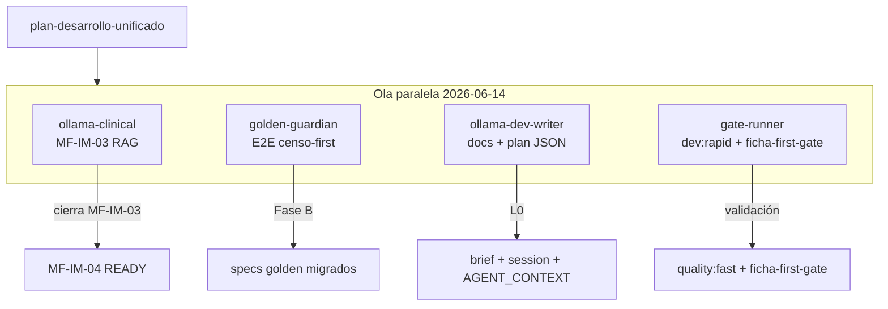

---

## 2. Estado de programas (pre-ola)

| Programa | Estado | Evidencia |
|----------|--------|-----------|
| **PROG-RAPID** | ✓ CERRADO | `quality:rapid-gate` |
| **PROG-FICHA-FIRST** | ✓ CERRADO (Ola 1) | MF-FF-01…03 + MF-FF-06 · [`epis2-prog-ficha-first-wave1-close-2026-06-14.md`](./epis2-prog-ficha-first-wave1-close-2026-06-14.md) |
| **PROG-STRENGTHEN** | ACTIVO | MF-SH-01…06 ✓ · MF-IM-01…03 ✓ · **MF-IM-04 READY** |
| **PROG-IA-MODERNIZE** | ACTIVO (subprograma IM) | Ledger: `docs/quality/strengthen-ledger.json` |

**Home canónica:** `/espacio/buscar-paciente` · barra transversal · `/comando` = redirect compat.

---

## 3. Tracks paralelos

### Track 1 — `ollama-clinical` → MF-IM-03 RAG

| Campo | Valor |
|-------|-------|
| **MF** | MF-IM-03 — RAG incremental (retrieval secuencial) |
| **Subprograma** | PROG-IA-MODERNIZE |
| **Objetivo** | Retrieval secuencial por chunk en `local-ai`; fixture demo-005; gate RAG |
| **Allowlist** | `services/local-ai/src/rag/**`, `scripts/quality/validate-rag-retrieval-gate.mjs`, `packages/test-fixtures/**` |
| **Gate cierre** | `npm run quality:rag-retrieval-gate` |
| **Iteración** | `npm run dev:rapid` (si toca scripts quality) · `npm run quality:clinical` al cerrar MF |
| **Prompt** | [`dev-agent-prompt-ollama-clinical.md`](./dev-agent-prompt-ollama-clinical.md) |
| **Reporte cierre** | `reports/epis2-mf-im-03-rag-incremental.md` |

**Prerrequisitos:** `npm run stack:dev` · `npm run dev:ai` (terminal 2, `:3002`).

---

### Track 2 — `golden-guardian` → E2E censo-first (Fase B)

| Campo | Valor |
|-------|-------|
| **MF** | Fase B — higiene E2E residual (no bloqueante para IM-03) |
| **Objetivo** | Migrar specs que aún usan `epis2-power-bar` en `/comando` al patrón censo-first (`getTransversalCommandBar`) |
| **Allowlist** | `e2e/**`, `e2e/helpers/demoPatient.ts` |
| **Specs prioritarios** | `golden-v2-admission-discharge`, `golden-command-evolution`, `m3-visual-signoff*`, `ola1c-results-journey`, `three-modes-journey`, `ux-g02-command-first` |
| **Gate cierre** | subset E2E en `npm run quality:clinical` o `npm run test:e2e:ux-g02` |
| **Iteración** | `npm run quality:clinical` |
| **Prompt** | [`dev-agent-prompt-golden-guardian.md`](./dev-agent-prompt-golden-guardian.md) |

**Patrón:** Login → censo `/espacio/buscar-paciente` → barra transversal (no página `/comando` como home).

---

### Track 3 — `ollama-dev-writer` → documentación orquestación (este entregable)

| Campo | Valor |
|-------|-------|
| **MF** | MF-RAPID-03 / L0 dev-write |
| **Objetivo** | Sincronizar brief, session, plan JSON y reporte de orquestación paralela |
| **Allowlist** | `reports/**`, `docs/AGENT_CONTEXT_MINIMAL.md`, `scripts/quality/ficha-first-*.mjs` (solo si gate-runner lo requiere; este track no los modifica) |
| **Prohibido** | `apps/**`, `services/**`, `e2e/**`, `packages/**` clínicos, migraciones |
| **Gate cierre** | `npm run quality:fast` o `npm run dev:rapid -- --skip-audit` |
| **Prompt** | [`dev-agent-prompt-ollama-dev-writer.md`](./dev-agent-prompt-ollama-dev-writer.md) |

**Entregables:** este reporte · `dev-agent-orchestration-plan.json` · actualización `dev-agent-brief.md` · `dev-agent-session.md`.

---

### Track 4 — `gate-runner` → validación working tree

| Campo | Valor |
|-------|-------|
| **MF** | Validación transversal (no implementa features) |
| **Objetivo** | Ejecutar `dev:rapid` + `quality:ficha-first-gate` sobre el árbol de 28 cambios pendientes |
| **Allowlist** | lectura global · escritura solo en `reports/dev-agent-audit-diff-latest.json` si audit-diff genera salida |
| **Gates** | `npm run dev:rapid` · `npm run quality:ficha-first-gate` |
| **Cierre sesión (si humano pide pre-PR)** | `npm run check` · `npm run test` · `npm run db:validate` |
| **Prompt** | [`dev-agent-prompt-gate-runner.md`](./dev-agent-prompt-gate-runner.md) |

**Rol:** último track en arrancar o en paralelo tardío — valida que FICHA-FIRST sigue verde tras cambios acumulados.

---

## 4. Matriz de archivos prohibidos cruzados

Evitar conflictos de merge y violación de invariantes:

| Zona | Track dueño | Prohibido para otros tracks |
|------|-------------|----------------------------|
| `services/local-ai/src/rag/**` | ollama-clinical | golden-guardian, ollama-dev-writer, gate-runner (escritura) |
| `e2e/**` | golden-guardian | ollama-clinical, ollama-dev-writer |
| `apps/web/**` | *(ninguno en esta ola)* | todos — cambios existentes son working tree previo; no ampliar sin MF explícita |
| `reports/**`, `docs/AGENT_CONTEXT_MINIMAL.md` | ollama-dev-writer | ollama-clinical, golden-guardian |
| `scripts/quality/validate-rag-retrieval-gate.mjs` | ollama-clinical | golden-guardian |
| `scripts/quality/validate-ficha-first-gate.mjs` | gate-runner (ejecución) | ollama-clinical — dev-writer solo lectura |
| `database/migrations/**` | — | **todos** (prohibido sin MF migración) |
| `packages/contracts/dist/**` | — | **todos** (artefactos build; no commitear) |

**Regla de oro:** si dos tracks necesitan el mismo archivo, **serializar** — prioridad: IM-03 > E2E > docs > gates.

---

## 5. Secuencia de arranque recomendada

```text
1. Humano: npm run stack:dev && npm run dev:velocity
2. Cursor: adjuntar @reports/dev-agent-brief.md + prompt del track activo
3. Paralelo (4 ventanas / 4 agentes):
   ├─ ollama-clinical    → MF-IM-03
   ├─ golden-guardian    → e2e censo-first
   ├─ ollama-dev-writer  → docs orquestación
   └─ gate-runner        → dev:rapid + ficha-first-gate (tardío)
4. Humano reconcilia working tree antes de commit (solo si lo pide)
5. Cierre: npm run dev:agent:close + reporte reports/
```

**No** iniciar MF-IM-04 hasta cierre formal de MF-IM-03 en ledger.

---

## 6. Gates por track

| Track | Iteración | Cierre MF / track |
|-------|-----------|-------------------|
| ollama-clinical | `dev:rapid` | `quality:rag-retrieval-gate` · `quality:clinical` |
| golden-guardian | — | `quality:clinical` · subset E2E |
| ollama-dev-writer | `quality:fast` | `dev:rapid --skip-audit` |
| gate-runner | `dev:rapid` | `quality:ficha-first-gate` |

**Pre-PR (humano):** `npm run quality:full` = check + test + db:validate.

---

## 7. Working tree (28 cambios pendientes)

Resumen por zona — **no commit automático**:

| Zona | Archivos | Notas |
|------|----------|-------|
| **Modos / CommandCenter** | 6 en `apps/web/src/modes/**`, `CommandCenterPage.tsx` | Tres modos MD3 + redirect |
| **Docs canon** | `PRODUCT_CANON`, `EPIS2_TABLERO`, `PRODUCT_INVARIANTS`, `AGENT_CONTEXT_MINIMAL` | Sync censo-first |
| **FICHA-FIRST** | `ficha-first-ledger.json`, scripts validate/context, reportes MF-FF | Ola 1 cerrada |
| **E2E** | `demoPatient.ts`, `three-modes-journey`, `ux-g02-command-first` | Fase B en curso |
| **Dev agent** | `dev-agent-brief`, `dev-agent-session`, `gate-runner` prompt | Orquestación |
| **Nuevos (untracked)** | plan unificado, cierre FICHA-FIRST, auditoría externa, ledger-lib | L0 / evidencia |

Detalle completo en [`dev-agent-brief.md`](./dev-agent-brief.md) § Working tree.

---

## 8. Próximo paso — MF-IM-04

Tras cierre de **MF-IM-03**:

| Campo | Valor |
|-------|-------|
| **MF** | MF-IM-04 — Assist con citas documentales |
| **Depende de** | MF-IM-03 ✓ |
| **Objetivo** | `ai_runs.output_payload` con `document_id` + `chunk_index[]`; eval no-hallucination |
| **Allowlist** | `services/local-ai/**`, `apps/api/src/routes/ai/**`, `database/migrations/005_ai_runs.sql` |
| **Gates** | `quality:rag-retrieval-gate` + `npm run ai:evals:live` |
| **Reporte** | `reports/epis2-mf-im-04-assist-citas.md` |

Consultar hoja de ruta completa en [`epis2-plan-desarrollo-unificado-2026-06-14.md`](./epis2-plan-desarrollo-unificado-2026-06-14.md) §3 Fase A.

---

## 9. Referencias

| Artefacto | Rol |
|-----------|-----|
| [`epis2-plan-desarrollo-unificado-2026-06-14.md`](./epis2-plan-desarrollo-unificado-2026-06-14.md) | Plan maestro único |
| [`dev-agent-orchestration-plan.json`](./dev-agent-orchestration-plan.json) | Plan machine-readable |
| [`dev-agent-brief.md`](./dev-agent-brief.md) | Brief Cursor arranque |
| [`EPIS2_DEV_AGENT_ORCHESTRATION.md`](../docs/product/EPIS2_DEV_AGENT_ORCHESTRATION.md) | Canon orquestación |
| [`strengthen-ledger.json`](../docs/quality/strengthen-ledger.json) | MF STRENGTHEN |
| [`ficha-first-ledger.json`](../docs/quality/ficha-first-ledger.json) | PROG-FICHA-FIRST cerrado |

---

## 10. Riesgos y mitigación

| Riesgo | Mitigación |
|--------|------------|
| Merge conflict en `e2e/helpers/demoPatient.ts` | golden-guardian dueño; clinical no toca e2e |
| Gate ficha-first rojo tras cambios modos | gate-runner tardío; revisar `EpisModeGuard` + ledger |
| IM-03 y IM-04 mezclados en una sesión | Un MF por sesión clínica; IM-04 solo tras cierre IM-03 |
| Commit prematuro de 28 archivos | Humano decide; sin push automático |

---

*Generado por subagente `ollama-dev-writer` · ola paralela 2026-06-14 · requiresHumanReview: false (L0 docs)*

---

## 11. Ola 2 — MF-IM-05 + gates

**Versión ola:** 2.0 · **Modo:** fast dev (`npm run dev:rapid`) · **Tracks:** 3 en paralelo  
**Plan maestro:** [`epis2-plan-desarrollo-unificado-2026-06-14.md`](./epis2-plan-desarrollo-unificado-2026-06-14.md)

> Tras cierre de Ola 1 (IM-03, IM-04, E2E Fase B, FICHA-FIRST), la Ola 2 reduce a **tres tracks** sin golden-guardian. El norte clínico es **MF-IM-05** (AI Provenance interno); la validación corre en fast gates; la documentación se sincroniza en L0.

### Pendientes cerrados (Ola 1)

| Item | Evidencia |
|------|-----------|
| **PROG-FICHA-FIRST** | [`epis2-prog-ficha-first-wave1-close-2026-06-14.md`](./epis2-prog-ficha-first-wave1-close-2026-06-14.md) |
| **MF-IM-03** RAG incremental | [`epis2-mf-im-03-rag-incremental.md`](./epis2-mf-im-03-rag-incremental.md) |
| **MF-IM-04** Assist citas | [`epis2-mf-im-04-assist-citas.md`](./epis2-mf-im-04-assist-citas.md) |
| **E2E Fase B** censo-first | 10 specs migrados · `getTransversalCommandBar` |

### Pendientes abiertos

| Item | Estado | Notas |
|------|--------|-------|
| **MF-IM-05** AI Provenance (contracts) | **EN CURSO** | Track `ollama-clinical` |
| **Commit tree** | **HUMANO** | ~63 cambios acumulados; sin push automático |
| **MF-IM-06** Export FHIR Provenance | **BLOCKED** | Tras cierre IM-05 · `quality:ai-provenance-gate` |

**STRENGTHEN:** 10/23 MF cerradas · ledger: [`strengthen-ledger.json`](../docs/quality/strengthen-ledger.json)

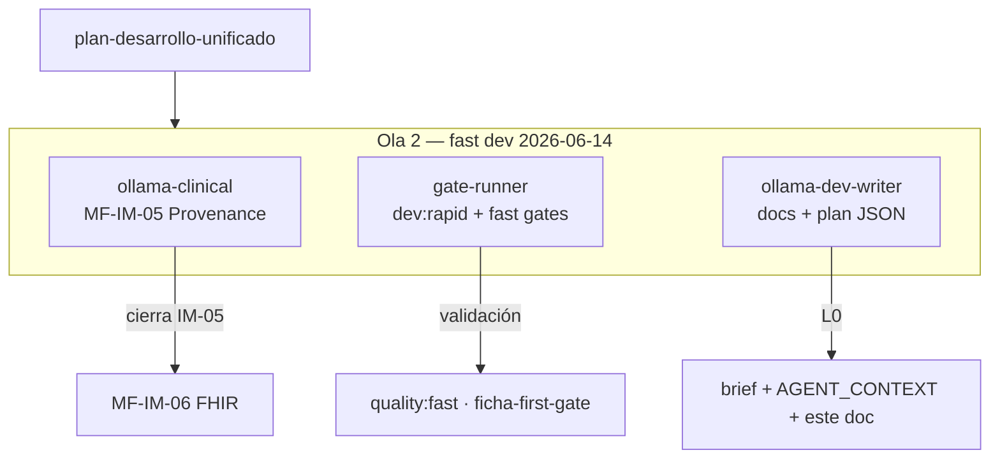

---

### Track 1 — `ollama-clinical` → MF-IM-05 Provenance

| Campo | Valor |
|-------|-------|
| **MF** | MF-IM-05 — AI Provenance interno (contracts) |
| **Subprograma** | PROG-IA-MODERNIZE |
| **Objetivo** | Tipos `AiProvenanceRecord` en `packages/contracts`; link approve → provenance record |
| **Allowlist** | `packages/contracts/src/ai-provenance*.ts`, `apps/api/src/routes/approvals/**` |
| **Gate cierre** | `npm run check` |
| **Iteración** | `npm run dev:rapid` |
| **Prompt** | [`dev-agent-prompt-ollama-clinical.md`](./dev-agent-prompt-ollama-clinical.md) |
| **Reporte cierre** | `reports/epis2-mf-im-05-provenance-internal.md` |

**Prerrequisitos:** MF-IM-04 ✓ · `npm run stack:dev` · `npm run dev:ai` (si eval assist).

---

### Track 2 — `gate-runner` → fast gates

| Campo | Valor |
|-------|-------|
| **MF** | Validación transversal (no implementa features) |
| **Objetivo** | `dev:rapid` + gates rápidos sobre working tree acumulado |
| **Allowlist** | lectura global · escritura solo en `reports/dev-agent-audit-diff-latest.json` |
| **Gates** | `npm run dev:rapid` · `npm run quality:ficha-first-gate` · `npm run quality:fast` |
| **Cierre sesión (si humano pide pre-PR)** | `npm run check` · `npm run test` · `npm run db:validate` |
| **Iteración** | `npm run dev:rapid` |
| **Prompt** | [`dev-agent-prompt-gate-runner.md`](./dev-agent-prompt-gate-runner.md) |

**Rol:** validar que FICHA-FIRST y arquitectura siguen verdes tras IM-04/IM-05.

---

### Track 3 — `ollama-dev-writer` → documentación orquestación (este entregable)

| Campo | Valor |
|-------|-------|
| **MF** | MF-RAPID-03 / L0 dev-write |
| **Objetivo** | Sync brief, plan JSON, AGENT_CONTEXT y sección Ola 2 |
| **Allowlist** | `reports/**`, `docs/AGENT_CONTEXT_MINIMAL.md` |
| **Prohibido** | `apps/**`, `services/**`, `e2e/**`, `packages/**` clínicos |
| **Gate cierre** | `npm run dev:rapid -- --skip-audit` |
| **Iteración** | `npm run dev:rapid` |
| **Prompt** | [`dev-agent-prompt-ollama-dev-writer.md`](./dev-agent-prompt-ollama-dev-writer.md) |

---

### Matriz Ola 2 (3 tracks)

| Zona | Track dueño | Prohibido para otros |
|------|-------------|---------------------|
| `packages/contracts/src/ai-provenance*.ts` | ollama-clinical | dev-writer, gate-runner (escritura) |
| `apps/api/src/routes/approvals/**` | ollama-clinical | dev-writer |
| `reports/**`, `docs/AGENT_CONTEXT_MINIMAL.md` | ollama-dev-writer | ollama-clinical |
| `database/migrations/**` | — | **todos** |

**Comando iteración unificado (todos los tracks):** `npm run dev:rapid`

### Arranque Ola 2

```text
1. Humano: npm run stack:dev && npm run dev:velocity
2. Cursor: @reports/dev-agent-brief.md + prompt del track activo
3. Paralelo (3 ventanas):
   ├─ ollama-clinical    → MF-IM-05
   ├─ gate-runner        → dev:rapid + fast gates
   └─ ollama-dev-writer  → docs Ola 2
4. Humano reconcilia working tree antes de commit (solo si lo pide)
5. Tras IM-05: MF-IM-06 FHIR (sesión dedicada)
```

*Actualizado por subagente `ollama-dev-writer` · Ola 2 fast dev · requiresHumanReview: false (L0 docs)*

---

## 12. Ola 3 — MF-IM-06 FHIR

**Versión ola:** 3.0 · **Modo:** fast dev (`npm run dev:rapid`) · **Tracks:** 3 en paralelo  
**Plan maestro:** [`epis2-plan-desarrollo-unificado-2026-06-14.md`](./epis2-plan-desarrollo-unificado-2026-06-14.md)

> Tras cierre de Ola 2 (IM-05 Provenance interno), la Ola 3 mantiene **tres tracks** en fast dev. El norte clínico es **MF-IM-06** (Export FHIR Provenance + AIAST); la validación corre en fast gates; la documentación se sincroniza en L0.

### Pendientes cerrados (Ola 1–2)

| Item | Evidencia |
|------|-----------|
| **PROG-FICHA-FIRST** | [`epis2-prog-ficha-first-wave1-close-2026-06-14.md`](./epis2-prog-ficha-first-wave1-close-2026-06-14.md) |
| **MF-IM-01…05** | IM-03 [`epis2-mf-im-03-rag-incremental.md`](./epis2-mf-im-03-rag-incremental.md) · IM-04 [`epis2-mf-im-04-assist-citas.md`](./epis2-mf-im-04-assist-citas.md) · IM-05 [`epis2-mf-im-05-provenance-internal.md`](./epis2-mf-im-05-provenance-internal.md) |
| **E2E Fase B** censo-first | 10 specs migrados · `getTransversalCommandBar` |

### Pendientes abiertos

| Item | Estado | Notas |
|------|--------|-------|
| **MF-IM-06** Export FHIR Provenance + AIAST | **EN CURSO** | Track `ollama-clinical` · gate `quality:ai-provenance-gate` |
| **Commit tree** | **HUMANO** | ~68 cambios acumulados; sin push automático |
| **MF-IM-07** Model card estático (export) | **BLOCKED** | Tras cierre IM-06 · `quality:ai-provenance-gate` |

**STRENGTHEN:** 11/23 MF cerradas · ledger: [`strengthen-ledger.json`](../docs/quality/strengthen-ledger.json)

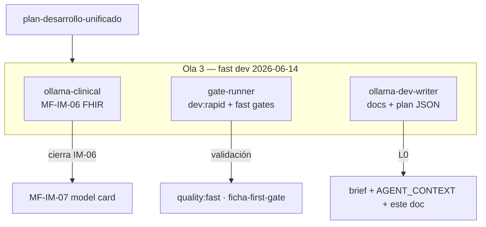

---

### Track 1 — `ollama-clinical` → MF-IM-06 FHIR

| Campo | Valor |
|-------|-------|
| **MF** | MF-IM-06 — Export FHIR Provenance + AIAST |
| **Subprograma** | PROG-IA-MODERNIZE |
| **Objetivo** | `fhir-export` genera Provenance + Device; tag AIAST post-approve asistido |
| **Allowlist** | `packages/fhir-export/**`, `database/migrations/043_ai_provenance.sql`, `scripts/quality/validate-ai-provenance-gate.mjs` |
| **Gate cierre** | `npm run quality:ai-provenance-gate` |
| **Iteración** | `npm run dev:rapid` |
| **Prompt** | [`dev-agent-prompt-ollama-clinical.md`](./dev-agent-prompt-ollama-clinical.md) |
| **Reporte cierre** | `reports/epis2-mf-im-06-provenance-fhir.md` |

**Prerrequisitos:** MF-IM-05 ✓ · `npm run stack:dev` · `npm run dev:ai` (si eval assist).

---

### Track 2 — `gate-runner` → fast gates

| Campo | Valor |
|-------|-------|
| **MF** | Validación transversal (no implementa features) |
| **Objetivo** | `dev:rapid` + gates rápidos sobre working tree acumulado |
| **Allowlist** | lectura global · escritura solo en `reports/dev-agent-audit-diff-latest.json` |
| **Gates** | `npm run dev:rapid` · `npm run quality:ficha-first-gate` · `npm run quality:fast` |
| **Cierre sesión (si humano pide pre-PR)** | `npm run check` · `npm run test` · `npm run db:validate` |
| **Iteración** | `npm run dev:rapid` |
| **Prompt** | [`dev-agent-prompt-gate-runner.md`](./dev-agent-prompt-gate-runner.md) |

**Rol:** validar que FICHA-FIRST y arquitectura siguen verdes tras IM-05/IM-06.

---

### Track 3 — `ollama-dev-writer` → documentación orquestación (este entregable)

| Campo | Valor |
|-------|-------|
| **MF** | MF-RAPID-03 / L0 dev-write |
| **Objetivo** | Sync brief, plan JSON, AGENT_CONTEXT y sección Ola 3 |
| **Allowlist** | `reports/**`, `docs/AGENT_CONTEXT_MINIMAL.md` |
| **Prohibido** | `apps/**`, `services/**`, `e2e/**`, `packages/**` clínicos |
| **Gate cierre** | `npm run dev:rapid -- --skip-audit` |
| **Iteración** | `npm run dev:rapid` |
| **Prompt** | [`dev-agent-prompt-ollama-dev-writer.md`](./dev-agent-prompt-ollama-dev-writer.md) |

---

### Matriz Ola 3 (3 tracks)

| Zona | Track dueño | Prohibido para otros |
|------|-------------|---------------------|
| `packages/fhir-export/**` | ollama-clinical | dev-writer, gate-runner (escritura) |
| `database/migrations/043_ai_provenance.sql` | ollama-clinical | dev-writer |
| `scripts/quality/validate-ai-provenance-gate.mjs` | ollama-clinical | dev-writer |
| `reports/**`, `docs/AGENT_CONTEXT_MINIMAL.md` | ollama-dev-writer | ollama-clinical |
| `database/migrations/**` (otras) | — | **todos** |

**Comando iteración unificado (todos los tracks):** `npm run dev:rapid`

### Arranque Ola 3

```text
1. Humano: npm run stack:dev && npm run dev:velocity
2. Cursor: @reports/dev-agent-brief.md + prompt del track activo
3. Paralelo (3 ventanas):
   ├─ ollama-clinical    → MF-IM-06 FHIR
   ├─ gate-runner        → dev:rapid + fast gates
   └─ ollama-dev-writer  → docs Ola 3
4. Humano reconcilia working tree antes de commit (solo si lo pide)
5. Tras IM-06: MF-IM-07 model card (sesión dedicada)
```

*Actualizado por subagente `ollama-dev-writer` · Ola 3 fast dev · requiresHumanReview: false (L0 docs)*

---

## 13. Ola 4 — MF-IM-07 model card

**Versión ola:** 4.0 · **Modo:** fast dev (`npm run dev:rapid`) · **Tracks:** 3 en paralelo  
**Plan maestro:** [`epis2-plan-desarrollo-unificado-2026-06-14.md`](./epis2-plan-desarrollo-unificado-2026-06-14.md)

> Tras cierre de Ola 3 (IM-06 FHIR Provenance + AIAST), la Ola 4 mantiene **tres tracks** en fast dev. El norte clínico es **MF-IM-07** (Model card estático en export FHIR); la validación corre en fast gates; la documentación se sincroniza en L0.

### Pendientes cerrados (Ola 1–3)

| Item | Evidencia |
|------|-----------|
| **PROG-FICHA-FIRST** | [`epis2-prog-ficha-first-wave1-close-2026-06-14.md`](./epis2-prog-ficha-first-wave1-close-2026-06-14.md) |
| **MF-IM-01…07** | IM-03 [`epis2-mf-im-03-rag-incremental.md`](./epis2-mf-im-03-rag-incremental.md) · IM-04 [`epis2-mf-im-04-assist-citas.md`](./epis2-mf-im-04-assist-citas.md) · IM-05 [`epis2-mf-im-05-provenance-internal.md`](./epis2-mf-im-05-provenance-internal.md) · IM-06 [`epis2-mf-im-06-provenance-fhir.md`](./epis2-mf-im-06-provenance-fhir.md) · IM-07 [`epis2-mf-im-07-model-card.md`](./epis2-mf-im-07-model-card.md) |
| **E2E Fase B** censo-first | 10 specs migrados · `getTransversalCommandBar` |

### Pendientes abiertos (Ola 4 — ✓ cerrada)

| Item | Estado | Notas |
|------|--------|-------|
| **MF-IM-07** Model card estático (export) | ✓ **DONE** | [`epis2-mf-im-07-model-card.md`](./epis2-mf-im-07-model-card.md) · gate `quality:ai-provenance-gate` |
| **Commit tree** | **HUMANO** | ~68 cambios acumulados; sin push automático |
| **MF-IM-08** Anti feedback-loop (policy assist) | **BLOCKED** (deps ✓) | Tras cierre IM-07 · `ai:evals:live` · **Ola 5** |

**STRENGTHEN:** **13/23** MF cerradas · ledger: [`strengthen-ledger.json`](../docs/quality/strengthen-ledger.json)

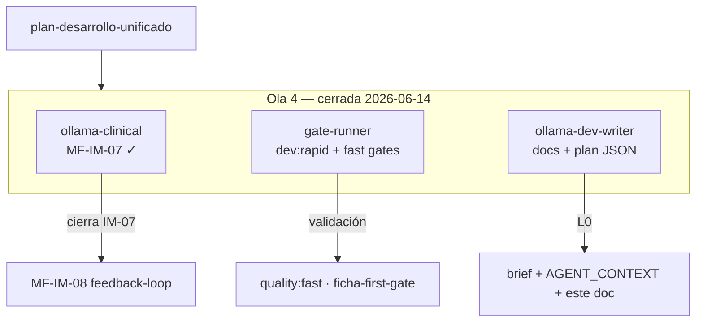

---

### Track 1 — `ollama-clinical` → MF-IM-07 model card

| Campo | Valor |
|-------|-------|
| **MF** | MF-IM-07 — Model card estático (export) |
| **Subprograma** | PROG-IA-MODERNIZE |
| **Objetivo** | `DocumentReference` markdown model card en `fhir-export`; test export round-trip |
| **Allowlist** | `packages/fhir-export/**`, `docs/product/EPIS2_AI_MODEL_CARD.md` |
| **Gate cierre** | `npm run quality:ai-provenance-gate` |
| **Iteración** | `npm run dev:rapid` |
| **Prompt** | [`dev-agent-prompt-ollama-clinical.md`](./dev-agent-prompt-ollama-clinical.md) |
| **Reporte cierre** | `reports/epis2-mf-im-07-model-card.md` |

**Prerrequisitos:** MF-IM-06 ✓ · `npm run stack:dev` · `npm run dev:ai` (si eval assist).

---

### Track 2 — `gate-runner` → fast gates

| Campo | Valor |
|-------|-------|
| **MF** | Validación transversal (no implementa features) |
| **Objetivo** | `dev:rapid` + gates rápidos sobre working tree acumulado |
| **Allowlist** | lectura global · escritura solo en `reports/dev-agent-audit-diff-latest.json` |
| **Gates** | `npm run dev:rapid` · `npm run quality:ficha-first-gate` · `npm run quality:fast` |
| **Cierre sesión (si humano pide pre-PR)** | `npm run check` · `npm run test` · `npm run db:validate` |
| **Iteración** | `npm run dev:rapid` |
| **Prompt** | [`dev-agent-prompt-gate-runner.md`](./dev-agent-prompt-gate-runner.md) |

**Rol:** validar que FICHA-FIRST y arquitectura siguen verdes tras IM-06/IM-07.

---

### Track 3 — `ollama-dev-writer` → documentación orquestación (este entregable)

| Campo | Valor |
|-------|-------|
| **MF** | MF-RAPID-03 / L0 dev-write |
| **Objetivo** | Sync brief, plan JSON, AGENT_CONTEXT y sección Ola 4 |
| **Allowlist** | `reports/**`, `docs/AGENT_CONTEXT_MINIMAL.md` |
| **Prohibido** | `apps/**`, `services/**`, `e2e/**`, `packages/**` clínicos |
| **Gate cierre** | `npm run dev:rapid -- --skip-audit` |
| **Iteración** | `npm run dev:rapid` |
| **Prompt** | [`dev-agent-prompt-ollama-dev-writer.md`](./dev-agent-prompt-ollama-dev-writer.md) |

---

### Matriz Ola 4 (3 tracks)

| Zona | Track dueño | Prohibido para otros |
|------|-------------|---------------------|
| `packages/fhir-export/**` | ollama-clinical | dev-writer, gate-runner (escritura) |
| `docs/product/EPIS2_AI_MODEL_CARD.md` | ollama-clinical | dev-writer |
| `reports/**`, `docs/AGENT_CONTEXT_MINIMAL.md` | ollama-dev-writer | ollama-clinical |
| `database/migrations/**` | — | **todos** |

**Comando iteración unificado (todos los tracks):** `npm run dev:rapid`

### Arranque Ola 4

```text
1. Humano: npm run stack:dev && npm run dev:velocity
2. Cursor: @reports/dev-agent-brief.md + prompt del track activo
3. Paralelo (3 ventanas):
   ├─ ollama-clinical    → MF-IM-07 model card
   ├─ gate-runner        → dev:rapid + fast gates
   └─ ollama-dev-writer  → docs Ola 4
4. Humano reconcilia working tree antes de commit (solo si lo pide)
5. Tras IM-07: MF-IM-08 anti feedback-loop (sesión dedicada)
```

*Actualizado por subagente `ollama-dev-writer` · Ola 4 cerrada · STRENGTHEN 13/23 · requiresHumanReview: false (L0 docs)*

---

## 14. Ola 5 — MF-IM-08 anti feedback-loop

**Versión ola:** 5.0 · **Modo:** fast dev (`npm run dev:rapid`) · **Tracks:** 3 en paralelo  
**Plan maestro:** [`epis2-plan-desarrollo-unificado-2026-06-14.md`](./epis2-plan-desarrollo-unificado-2026-06-14.md)

> Tras cierre de Ola 4 (IM-07 model card), la Ola 5 mantiene **tres tracks** en fast dev. El norte clínico es **MF-IM-08** (Anti feedback-loop — policy assist excluye contexto AIAST); la validación corre en evals live; la documentación se sincroniza en L0.

### Pendientes cerrados (Ola 1–4)

| Item | Evidencia |
|------|-----------|
| **PROG-FICHA-FIRST wave1** | [`epis2-prog-ficha-first-wave1-close-2026-06-14.md`](./epis2-prog-ficha-first-wave1-close-2026-06-14.md) |
| **MF-IM-01…07** | IM-07 [`epis2-mf-im-07-model-card.md`](./epis2-mf-im-07-model-card.md) · cadena IM-03…06 en reports `epis2-mf-im-*` |
| **E2E Fase B** censo-first | 10 specs migrados · `getTransversalCommandBar` |

### Pendientes abiertos

| Item | Estado | Notas |
|------|--------|-------|
| **MF-IM-08** Anti feedback-loop (policy assist) | ✓ **DONE** | [`epis2-mf-im-08-feedback-loop.md`](./epis2-mf-im-08-feedback-loop.md) · gate `ai:evals:feedback-loop` |
| **Commit tree** | **HUMANO** | ~68 cambios acumulados; sin push automático |
| **MF-IM-09** OTel spans pipeline IA | ✓ **DONE** | [`epis2-mf-im-09-otel.md`](./epis2-mf-im-09-otel.md) · gate `quality:ai-otel-gate` · **Ola 6** |

**STRENGTHEN:** **15/23** MF cerradas · ledger: [`strengthen-ledger.json`](../docs/quality/strengthen-ledger.json)

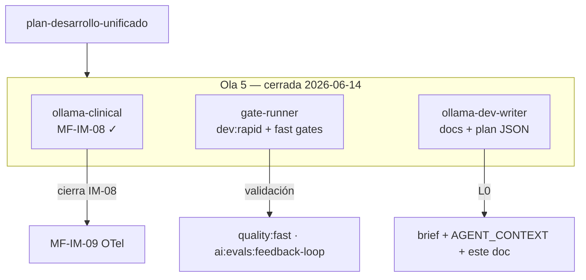

---

### Track 1 — `ollama-clinical` → MF-IM-08 anti feedback-loop

| Campo | Valor |
|-------|-------|
| **MF** | MF-IM-08 — Anti feedback-loop (policy assist) |
| **Subprograma** | PROG-IA-MODERNIZE |
| **Objetivo** | Policy assist excluye contexto AIAST; eval regression fixture |
| **Allowlist** | `services/local-ai/**`, `scripts/ai/evals/**` |
| **Gate cierre** | `npm run ai:evals:live` |
| **Iteración** | `npm run dev:rapid` |
| **Prompt** | [`dev-agent-prompt-ollama-clinical.md`](./dev-agent-prompt-ollama-clinical.md) |
| **Reporte cierre** | `reports/epis2-mf-im-08-feedback-loop.md` |

**Prerrequisitos:** MF-IM-06 ✓ · MF-IM-07 ✓ · `npm run stack:dev` · `npm run dev:ai`.

---

### Track 2 — `gate-runner` → fast gates

| Campo | Valor |
|-------|-------|
| **MF** | Validación transversal (no implementa features) |
| **Objetivo** | `dev:rapid` + gates rápidos sobre working tree acumulado |
| **Allowlist** | lectura global · escritura solo en `reports/dev-agent-audit-diff-latest.json` |
| **Gates** | `npm run dev:rapid` · `npm run quality:ficha-first-gate` · `npm run quality:fast` |
| **Cierre sesión (si humano pide pre-PR)** | `npm run check` · `npm run test` · `npm run db:validate` |
| **Iteración** | `npm run dev:rapid` |
| **Prompt** | [`dev-agent-prompt-gate-runner.md`](./dev-agent-prompt-gate-runner.md) |

**Rol:** validar que FICHA-FIRST y arquitectura siguen verdes tras IM-07/IM-08.

---

### Track 3 — `ollama-dev-writer` → documentación orquestación (este entregable)

| Campo | Valor |
|-------|-------|
| **MF** | MF-RAPID-03 / L0 dev-write |
| **Objetivo** | Sync brief, plan JSON, AGENT_CONTEXT y sección Ola 5 |
| **Allowlist** | `reports/**`, `docs/AGENT_CONTEXT_MINIMAL.md` |
| **Prohibido** | `apps/**`, `services/**`, `e2e/**`, `packages/**` clínicos |
| **Gate cierre** | `npm run dev:rapid -- --skip-audit` |
| **Iteración** | `npm run dev:rapid` |
| **Prompt** | [`dev-agent-prompt-ollama-dev-writer.md`](./dev-agent-prompt-ollama-dev-writer.md) |

---

### Matriz Ola 5 (3 tracks)

| Zona | Track dueño | Prohibido para otros |
|------|-------------|---------------------|
| `services/local-ai/**` | ollama-clinical | dev-writer, gate-runner (escritura) |
| `scripts/ai/evals/**` | ollama-clinical | dev-writer |
| `reports/**`, `docs/AGENT_CONTEXT_MINIMAL.md` | ollama-dev-writer | ollama-clinical |
| `database/migrations/**` | — | **todos** |

**Comando iteración unificado (todos los tracks):** `npm run dev:rapid`

### Arranque Ola 5

```text
1. Humano: npm run stack:dev && npm run dev:velocity
2. Cursor: @reports/dev-agent-brief.md + prompt del track activo
3. Paralelo (3 ventanas):
   ├─ ollama-clinical    → MF-IM-08
   ├─ gate-runner        → dev:rapid + fast gates
   └─ ollama-dev-writer  → docs Ola 5
4. Humano reconcilia working tree antes de commit (solo si lo pide)
5. Tras IM-08: MF-IM-09 OTel spans (sesión dedicada)
```

*Actualizado por subagente `ollama-dev-writer` · Ola 5 cerrada · MF-IM-08 ✓ · requiresHumanReview: false (L0 docs)*

---

## 15. Ola 6 — MF-IM-09 OTel

**Versión ola:** 6.0 · **Modo:** fast dev (`npm run dev:rapid`) · **Tracks:** 3 en paralelo  
**Plan maestro:** [`epis2-plan-desarrollo-unificado-2026-06-14.md`](./epis2-plan-desarrollo-unificado-2026-06-14.md)

> Tras cierre de Ola 5 (IM-08 anti feedback-loop), la Ola 6 cierra **MF-IM-09** (OTel spans pipeline IA). PROG-IA-MODERNIZE queda completo (IM-01…09 ✓). Siguiente subprograma: **PROG-CDS-UX** → MF-CU-01.

### Pendientes cerrados (Ola 6 — ✓ cerrada)

| Item | Evidencia |
|------|-----------|
| **MF-IM-09** OTel spans pipeline IA | [`epis2-mf-im-09-otel.md`](./epis2-mf-im-09-otel.md) · gate `quality:ai-otel-gate` |
| **PROG-IA-MODERNIZE** | MF-IM-01…09 ✓ |

### Pendientes abiertos (Ola 6 — ✓ cerrada)

| Item | Estado | Notas |
|------|--------|-------|
| **MF-CU-01** ClinicalCdsCard | ✓ **→ Ola 7 cerrada** | ver §16 · [`epis2-mf-cu-01-cds-card.md`](./epis2-mf-cu-01-cds-card.md) |
| **Commit tree** | **HUMANO** | push pendiente; sin commit automático |

**STRENGTHEN:** **15/23** MF cerradas (al cierre Ola 6) · ledger: [`strengthen-ledger.json`](../docs/quality/strengthen-ledger.json)

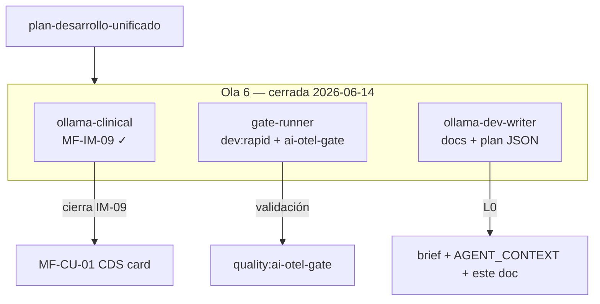

**Allowlist IM-09:** `apps/api/src/routes/ai/**`, `services/local-ai/**`, `apps/api/src/otel/**` · **Gate:** `npm run quality:ai-otel-gate`

*Actualizado por subagente `ollama-dev-writer` · Ola 6 cerrada · STRENGTHEN 15/23 · requiresHumanReview: false (L0 docs)*

---

## 16. Ola 7 — MF-CU-01 ClinicalCdsCard

**Versión ola:** 7.0 · **Modo:** fast dev (`npm run dev:rapid`) · **Tracks:** 3 en paralelo  
**Plan maestro:** [`epis2-plan-desarrollo-unificado-2026-06-14.md`](./epis2-plan-desarrollo-unificado-2026-06-14.md)

> Tras cierre de Ola 6 (IM-09 OTel · **PROG-IA-MODERNIZE** completo), la Ola 7 abrió **PROG-CDS-UX** con **MF-CU-01** (componente `ClinicalCdsCard` — variantes info / suggestion / warning). Ola 7 ✓ cerrada; siguiente: **Ola 8** → MF-CU-02.

### Pendientes cerrados (Ola 7 — ✓ cerrada)

| Item | Evidencia |
|------|-----------|
| **MF-CU-01** ClinicalCdsCard | [`epis2-mf-cu-01-cds-card.md`](./epis2-mf-cu-01-cds-card.md) · gate `npm run check` · unit + Storybook |
| **PROG-IA-MODERNIZE** | MF-IM-01…09 ✓ · IM-09 [`epis2-mf-im-09-otel.md`](./epis2-mf-im-09-otel.md) |
| **PROG-FICHA-FIRST wave1** | [`epis2-prog-ficha-first-wave1-close-2026-06-14.md`](./epis2-prog-ficha-first-wave1-close-2026-06-14.md) |
| **E2E Fase B** censo-first | 10 specs migrados · `getTransversalCommandBar` |

### Pendientes abiertos (Ola 7 — ✓ cerrada)

| Item | Estado | Notas |
|------|--------|-------|
| **MF-CU-02** Hook patient-view | ✓ **→ Ola 8 cerrada** | ver §17 · [`epis2-mf-cu-02-patient-view.md`](./epis2-mf-cu-02-patient-view.md) |
| **Commit tree** | **HUMANO** | push pendiente; sin commit automático |

**STRENGTHEN:** **16/23** MF cerradas (al cierre Ola 7) · ledger: [`strengthen-ledger.json`](../docs/quality/strengthen-ledger.json)

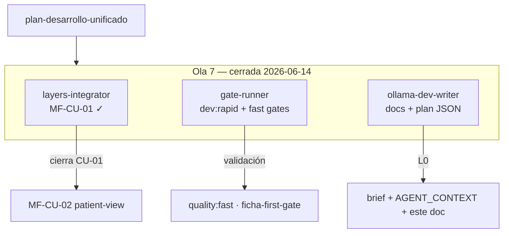

---

### Track 1 — `layers-integrator` → MF-CU-01 ClinicalCdsCard

| Campo | Valor |
|-------|-------|
| **MF** | MF-CU-01 — Componente ClinicalCdsCard |
| **Subprograma** | PROG-CDS-UX |
| **Objetivo** | Tarjeta CDS compacta MUI (info / suggestion / warning); Storybook o unit test |
| **Allowlist** | `apps/web/src/components/cds/**`, `packages/epis2-ui/src/stories/**`, `packages/design-system/src/copy/es.ts` |
| **Gate cierre** | `npm run check` |
| **Iteración** | `npm run dev:rapid` |
| **Prompt** | [`dev-agent-prompt-layers-integrator.md`](./dev-agent-prompt-layers-integrator.md) |
| **Reporte cierre** | `reports/epis2-mf-cu-01-cds-card.md` |

**Prerrequisitos:** MF-IM-04 ✓ (deps ledger) · PROG-IA-MODERNIZE ✓ · reutilizar patrones `@epis2/epis2-ui` (no `@mui/*` directo en web).

**Prohibido:** tocar hooks CDS (CU-02), API `/cds/cards` (CU-04), migraciones.

---

### Track 2 — `gate-runner` → fast gates

| Campo | Valor |
|-------|-------|
| **MF** | Validación transversal (no implementa features) |
| **Objetivo** | `dev:rapid` + gates rápidos sobre working tree acumulado |
| **Allowlist** | lectura global · escritura solo en `reports/dev-agent-audit-diff-latest.json` |
| **Gates** | `npm run dev:rapid` · `npm run quality:ficha-first-gate` · `npm run quality:fast` |
| **Cierre sesión (si humano pide pre-PR)** | `npm run check` · `npm run test` · `npm run db:validate` |
| **Iteración** | `npm run dev:rapid` |
| **Prompt** | [`dev-agent-prompt-gate-runner.md`](./dev-agent-prompt-gate-runner.md) |

**Rol:** validar que FICHA-FIRST y arquitectura siguen verdes mientras CU-01 toca `apps/web`.

---

### Track 3 — `ollama-dev-writer` → documentación orquestación (este entregable)

| Campo | Valor |
|-------|-------|
| **MF** | MF-RAPID-03 / L0 dev-write |
| **Objetivo** | Sync brief, plan JSON, AGENT_CONTEXT y sección Ola 7 |
| **Allowlist** | `reports/**`, `docs/AGENT_CONTEXT_MINIMAL.md` |
| **Prohibido** | `apps/**`, `services/**`, `e2e/**`, `packages/**` clínicos |
| **Gate cierre** | `npm run dev:rapid -- --skip-audit` |
| **Iteración** | `npm run dev:rapid` |
| **Prompt** | [`dev-agent-prompt-ollama-dev-writer.md`](./dev-agent-prompt-ollama-dev-writer.md) |

---

### Matriz Ola 7 (3 tracks)

| Zona | Track dueño | Prohibido para otros |
|------|-------------|---------------------|
| `apps/web/src/components/cds/**` | layers-integrator | dev-writer, gate-runner (escritura) |
| `packages/epis2-ui/src/stories/**` | layers-integrator | dev-writer |
| `packages/design-system/src/copy/es.ts` | layers-integrator | dev-writer |
| `reports/**`, `docs/AGENT_CONTEXT_MINIMAL.md` | ollama-dev-writer | layers-integrator |
| `apps/api/**`, `services/local-ai/**` | — | **todos** (fuera de alcance CU-01) |
| `database/migrations/**` | — | **todos** |

**Comando iteración unificado (todos los tracks):** `npm run dev:rapid`

### Arranque Ola 7

```text
1. Humano: npm run stack:dev && npm run dev:velocity
2. Cursor: @reports/dev-agent-brief.md + dev-agent-prompt-layers-integrator.md
3. Paralelo (3 ventanas):
   ├─ layers-integrator  → MF-CU-01 ClinicalCdsCard
   ├─ gate-runner        → dev:rapid + fast gates
   └─ ollama-dev-writer  → docs Ola 7
4. Humano reconcilia working tree antes de commit (solo si lo pide)
5. Tras CU-01: MF-CU-02 hook patient-view (sesión dedicada · cds-hooks-gate)
```

*Actualizado por subagente `ollama-dev-writer` · Ola 7 ✓ cerrada · MF-CU-01 ✓ · STRENGTHEN 16/23 · requiresHumanReview: false (L0 docs)*

---

## 17. Ola 8 — MF-CU-02 patient-view CDS hook

**Versión ola:** 8.0 · **Modo:** fast dev (`npm run dev:rapid`) · **Tracks:** 3 en paralelo  
**Plan maestro:** [`epis2-plan-desarrollo-unificado-2026-06-14.md`](./epis2-plan-desarrollo-unificado-2026-06-14.md)

> Tras cierre de Ola 7 (MF-CU-01 `ClinicalCdsCard` ✓), la Ola 8 integra el **hook patient-view**: cards CDS (alergias, gaps) al abrir ficha paciente. Primera MF con gate `quality:cds-hooks-gate`. Reutiliza `ClinicalCdsCard`; **no** expone API `/cds/cards` (CU-04) ni hook order-select (CU-03).

### Pendientes cerrados (Ola 1–7)

| Item | Evidencia |
|------|-----------|
| **MF-CU-01** ClinicalCdsCard | [`epis2-mf-cu-01-cds-card.md`](./epis2-mf-cu-01-cds-card.md) |
| **PROG-IA-MODERNIZE** | MF-IM-01…09 ✓ |
| **PROG-FICHA-FIRST wave1** | [`epis2-prog-ficha-first-wave1-close-2026-06-14.md`](./epis2-prog-ficha-first-wave1-close-2026-06-14.md) |

### Pendientes abiertos (Ola 8 — ✓ cerrada)

| Item | Estado | Notas |
|------|--------|-------|
| **MF-CU-02** Hook patient-view | ✓ **CERRADO** | [`epis2-mf-cu-02-patient-view.md`](./epis2-mf-cu-02-patient-view.md) · commits `654bf93` · `310c909` |
| **MF-CU-03** Hook order-select | ✓ **CERRADO** | [`epis2-mf-cu-03-order-select.md`](./epis2-mf-cu-03-order-select.md) · ver §19 |
| **MF-CU-04** API `/cds/cards` | **BLOCKED** | ver §20 · sesión dedicada |
| **Push remoto** | **HUMANO** | 13+ commits ahead of `origin/master` |

**STRENGTHEN:** **18/23** MF cerradas · ledger: [`strengthen-ledger.json`](../docs/quality/strengthen-ledger.json)

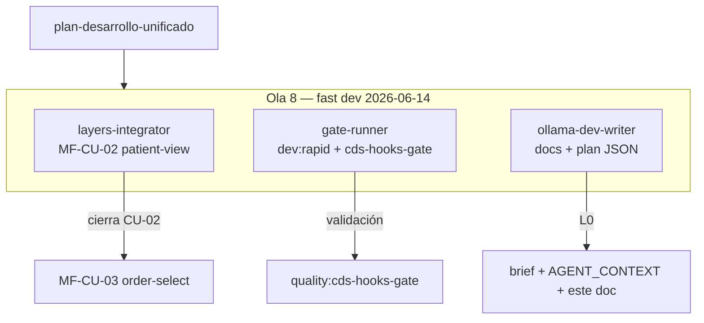

---

### Track 1 — `layers-integrator` → MF-CU-02 patient-view hook

| Campo | Valor |
|-------|-------|
| **MF** | MF-CU-02 — Hook patient-view (cards al abrir ficha) |
| **Subprograma** | PROG-CDS-UX |
| **Objetivo** | Al abrir ficha (`/espacio/ficha`), mostrar `ClinicalCdsCard` con alergias/gaps demo; hook patient-view estilo CDS Hooks (sin servidor externo) |
| **Allowlist** | `apps/web/src/components/cds/**`, `apps/web/src/components/chart/**`, `apps/api/src/routes/cds/**`, `packages/clinical-domain/**` |
| **Gate cierre** | `npm run quality:cds-hooks-gate` |
| **Iteración** | `npm run dev:rapid` |
| **Prompt** | [`dev-agent-prompt-layers-integrator.md`](./dev-agent-prompt-layers-integrator.md) |
| **Reporte cierre** | `reports/epis2-mf-cu-02-patient-view.md` |

**Prerrequisitos:** MF-CU-01 ✓ · dual-chart ON (ficha-first) · reutilizar `ClinicalCdsCard` (no `@mui/*` directo en web).

**Evidencia requerida:** cards alergias/gaps al abrir ficha · E2E dual-chart · `scripts/quality/validate-cds-hooks-gate.mjs`

**Prohibido:** API `/cds/cards` completa (CU-04), hook order-select (CU-03), migraciones, FHIR server externo.

---

### Track 2 — `gate-runner` → fast gates + cds-hooks

| Campo | Valor |
|-------|-------|
| **MF** | Validación transversal (no implementa features) |
| **Objetivo** | `dev:rapid` + `quality:cds-hooks-gate` sobre working tree acumulado |
| **Allowlist** | lectura global · escritura solo en `reports/dev-agent-audit-diff-latest.json` |
| **Gates** | `npm run dev:rapid` · `npm run quality:ficha-first-gate` · `npm run quality:cds-hooks-gate` |
| **Cierre sesión (si humano pide pre-PR)** | `npm run check` · `npm run test` · `npm run db:validate` |
| **Iteración** | `npm run dev:rapid` |
| **Prompt** | [`dev-agent-prompt-gate-runner.md`](./dev-agent-prompt-gate-runner.md) |

**Rol:** validar FICHA-FIRST + arquitectura + gate CDS mientras CU-02 toca `apps/web` y `apps/api`.

---

### Track 3 — `ollama-dev-writer` → documentación orquestación (este entregable)

| Campo | Valor |
|-------|-------|
| **MF** | MF-RAPID-03 / L0 dev-write |
| **Objetivo** | Sync brief, plan JSON, AGENT_CONTEXT y sección Ola 8 |
| **Allowlist** | `reports/**`, `docs/AGENT_CONTEXT_MINIMAL.md`, `docs/product/EPIS2_TABLERO.md` |
| **Prohibido** | `apps/**`, `services/**`, `e2e/**`, `packages/**` clínicos |
| **Gate cierre** | `npm run dev:rapid -- --skip-audit` |
| **Iteración** | `npm run dev:rapid` |
| **Prompt** | [`dev-agent-prompt-ollama-dev-writer.md`](./dev-agent-prompt-ollama-dev-writer.md) |

---

### Matriz Ola 8 (3 tracks)

| Zona | Track dueño | Prohibido para otros |
|------|-------------|---------------------|
| `apps/web/src/components/cds/**` | layers-integrator | dev-writer, gate-runner (escritura) |
| `apps/web/src/components/chart/**` | layers-integrator | dev-writer |
| `apps/api/src/routes/cds/**` | layers-integrator | dev-writer |
| `packages/clinical-domain/**` | layers-integrator | dev-writer |
| `scripts/quality/validate-cds-hooks-gate.mjs` | layers-integrator | dev-writer |
| `reports/**`, `docs/AGENT_CONTEXT_MINIMAL.md` | ollama-dev-writer | layers-integrator |
| `database/migrations/**` | — | **todos** |

**Comando iteración unificado (todos los tracks):** `npm run dev:rapid`

### Arranque Ola 8

```text
1. Humano: npm run stack:dev && npm run dev:velocity
2. Cursor: @reports/dev-agent-brief.md + dev-agent-prompt-layers-integrator.md
3. Paralelo (3 ventanas):
   ├─ layers-integrator  → MF-CU-02 patient-view hook
   ├─ gate-runner        → dev:rapid + cds-hooks-gate
   └─ ollama-dev-writer  → docs Ola 8
4. Humano reconcilia working tree antes de commit (solo si lo pide)
5. Tras CU-02: MF-CU-03 order-select o MF-CU-04 API (sesión dedicada · no mezclar)
```

*Actualizado 2026-06-15 · Ola 8 ✓ cerrada · MF-CU-02 ✓ · STRENGTHEN 17/23 · HEAD `e98af45`*

---

## 18. Ola 9 — MF-CU-03 order-select (✓ cerrada)

**MF:** MF-CU-03 — Hook order-select (prescripción) · **Gate:** `quality:cds-hooks-gate` ✓  
**Evidencia:** [`epis2-mf-cu-03-order-select.md`](./epis2-mf-cu-03-order-select.md) · detalle operativo §19

**Siguiente:** MF-CU-04 API `/cds/cards` · §20 (Ola 10 activa)

---

## 19. Ola 9 — MF-CU-03 order-select CDS hook

**Versión ola:** 9.0 · **Modo:** fast dev (`npm run dev:rapid`) · **Tracks:** 3 en paralelo  
**Plan maestro:** [`epis2-plan-desarrollo-unificado-2026-06-14.md`](./epis2-plan-desarrollo-unificado-2026-06-14.md)

> Tras cierre de Ola 8 (MF-CU-02 patient-view ✓), la Ola 9 integra el **hook order-select**: alertas interacción/duplicidad al prescribir. Reutiliza `ClinicalCdsCard` y la infra CDS de CU-02; **no** expone API `/cds/cards` completa (CU-04).

### Pendientes cerrados (Ola 1–9)

| Item | Evidencia |
|------|-----------|
| **MF-CU-01** ClinicalCdsCard | [`epis2-mf-cu-01-cds-card.md`](./epis2-mf-cu-01-cds-card.md) |
| **MF-CU-02** Hook patient-view | [`epis2-mf-cu-02-patient-view.md`](./epis2-mf-cu-02-patient-view.md) |
| **MF-CU-03** Hook order-select | [`epis2-mf-cu-03-order-select.md`](./epis2-mf-cu-03-order-select.md) |
| **PROG-IA-MODERNIZE** | MF-IM-01…09 ✓ |
| **PROG-FICHA-FIRST wave1** | [`epis2-prog-ficha-first-wave1-close-2026-06-14.md`](./epis2-prog-ficha-first-wave1-close-2026-06-14.md) |

### Pendientes abiertos

| Item | Estado | Notas |
|------|--------|-------|
| **MF-CU-04** API `/cds/cards` | ✓ **→ Ola 10 activa** | ver §20 · track `layers-integrator` |
| **Push remoto** | **HUMANO** | 13+ commits ahead of `origin/master` |

**STRENGTHEN:** **18/23** MF cerradas (al cierre Ola 9) · ledger: [`strengthen-ledger.json`](../docs/quality/strengthen-ledger.json)

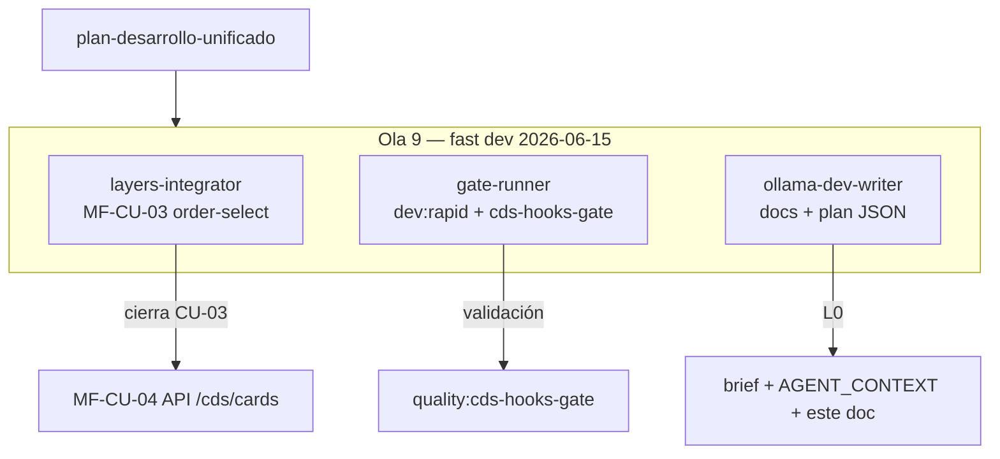

---

### Track 1 — `layers-integrator` → MF-CU-03 order-select hook

| Campo | Valor |
|-------|-------|
| **MF** | MF-CU-03 — Hook order-select (prescripción) |
| **Subprograma** | PROG-CDS-UX |
| **Objetivo** | Al seleccionar/prescribir medicamento, mostrar `ClinicalCdsCard` con alertas interacción/duplicidad demo; hook order-select estilo CDS Hooks (sin servidor externo) |
| **Allowlist** | `apps/api/src/routes/cds/**`, `apps/web/src/pages/**/prescription/**`, `packages/clinical-domain/**`, `scripts/quality/validate-cds-hooks-gate.mjs` |
| **Gate cierre** | `npm run quality:cds-hooks-gate` |
| **Iteración** | `npm run dev:rapid` |
| **Prompt** | [`dev-agent-prompt-layers-integrator.md`](./dev-agent-prompt-layers-integrator.md) |
| **Reporte cierre** | `reports/epis2-mf-cu-03-order-select.md` |

**Prerrequisitos:** MF-CU-01 ✓ · MF-CU-02 ✓ · dual-chart ON (ficha-first) · reutilizar `ClinicalCdsCard` (no `@mui/*` directo en web).

**Evidencia requerida:** alertas interacción/duplicidad al prescribir · test API + E2E receta demo · `scripts/quality/validate-cds-hooks-gate.mjs`

**Prohibido:** API `/cds/cards` completa (CU-04), migraciones, FHIR server externo, tocar hook patient-view salvo contrato compartido mínimo.

---

### Track 2 — `gate-runner` → fast gates + cds-hooks

| Campo | Valor |
|-------|-------|
| **MF** | Validación transversal (no implementa features) |
| **Objetivo** | `dev:rapid` + `quality:cds-hooks-gate` sobre working tree acumulado |
| **Allowlist** | lectura global · escritura solo en `reports/dev-agent-audit-diff-latest.json` |
| **Gates** | `npm run dev:rapid` · `npm run quality:ficha-first-gate` · `npm run quality:cds-hooks-gate` |
| **Cierre sesión (si humano pide pre-PR)** | `npm run check` · `npm run test` · `npm run db:validate` |
| **Iteración** | `npm run dev:rapid` |
| **Prompt** | [`dev-agent-prompt-gate-runner.md`](./dev-agent-prompt-gate-runner.md) |

**Rol:** validar FICHA-FIRST + arquitectura + gate CDS mientras CU-03 toca `apps/web`, `apps/api` y prescripción.

---

### Track 3 — `ollama-dev-writer` → documentación orquestación (este entregable)

| Campo | Valor |
|-------|-------|
| **MF** | MF-RAPID-03 / L0 dev-write |
| **Objetivo** | Sync brief, plan JSON, AGENT_CONTEXT y sección Ola 9 |
| **Allowlist** | `reports/**`, `docs/AGENT_CONTEXT_MINIMAL.md`, `docs/product/EPIS2_TABLERO.md` |
| **Prohibido** | `apps/**`, `services/**`, `e2e/**`, `packages/**` clínicos |
| **Gate cierre** | `npm run dev:rapid -- --skip-audit` |
| **Iteración** | `npm run dev:rapid` |
| **Prompt** | [`dev-agent-prompt-ollama-dev-writer.md`](./dev-agent-prompt-ollama-dev-writer.md) |

---

### Matriz Ola 9 (3 tracks)

| Zona | Track dueño | Prohibido para otros |
|------|-------------|---------------------|
| `apps/web/src/pages/**/prescription/**` | layers-integrator | dev-writer, gate-runner (escritura) |
| `apps/api/src/routes/cds/**` | layers-integrator | dev-writer |
| `packages/clinical-domain/**` | layers-integrator | dev-writer |
| `scripts/quality/validate-cds-hooks-gate.mjs` | layers-integrator | dev-writer |
| `reports/**`, `docs/AGENT_CONTEXT_MINIMAL.md` | ollama-dev-writer | layers-integrator |
| `packages/contracts/src/cds*.ts` | — | **todos** (alcance CU-04) |
| `database/migrations/**` | — | **todos** |

**Comando iteración unificado (todos los tracks):** `npm run dev:rapid`

### Arranque Ola 9

```text
1. Humano: npm run stack:dev && npm run dev:velocity
2. Cursor: @reports/dev-agent-brief.md + dev-agent-prompt-layers-integrator.md
3. Paralelo (3 ventanas):
   ├─ layers-integrator  → MF-CU-03 order-select hook
   ├─ gate-runner        → dev:rapid + cds-hooks-gate
   └─ ollama-dev-writer  → docs Ola 9
4. Humano reconcilia working tree antes de commit (solo si lo pide)
5. Tras CU-03: MF-CU-04 API /cds/cards (sesión dedicada · no mezclar)
```

*Actualizado 2026-06-15 · Ola 9 ✓ cerrada · MF-CU-03 ✓ · STRENGTHEN 18/23*

---

## 20. Ola 10 — MF-CU-04 API `/cds/cards` interno

**Versión ola:** 10.0 · **Modo:** fast dev (`npm run dev:rapid`) · **Tracks:** 3 en paralelo  
**Plan maestro:** [`epis2-plan-desarrollo-unificado-2026-06-14.md`](./epis2-plan-desarrollo-unificado-2026-06-14.md)

> Tras cierre de Ola 9 (MF-CU-03 order-select ✓), la Ola 10 expone la **API interna `/cds/cards`**: endpoint de prefetch paciente con contratos tipados en `packages/contracts`. Consolida la infra CDS de CU-02/CU-03; **no** añade FHIR server externo ni migraciones. Al cierre: **STRENGTHEN 19/23** · siguiente **MF-IC-01**.

### Pendientes cerrados (Ola 1–10)

| Item | Evidencia |
|------|-----------|
| **MF-CU-01** ClinicalCdsCard | [`epis2-mf-cu-01-cds-card.md`](./epis2-mf-cu-01-cds-card.md) |
| **MF-CU-02** Hook patient-view | [`epis2-mf-cu-02-patient-view.md`](./epis2-mf-cu-02-patient-view.md) |
| **MF-CU-03** Hook order-select | [`epis2-mf-cu-03-order-select.md`](./epis2-mf-cu-03-order-select.md) |
| **MF-CU-04** API `/cds/cards` | [`epis2-mf-cu-04-cds-api.md`](./epis2-mf-cu-04-cds-api.md) |
| **PROG-CDS-UX** | MF-CU-01…04 ✓ |
| **PROG-IA-MODERNIZE** | MF-IM-01…09 ✓ |
| **PROG-FICHA-FIRST wave1** | [`epis2-prog-ficha-first-wave1-close-2026-06-14.md`](./epis2-prog-ficha-first-wave1-close-2026-06-14.md) |

### Pendientes abiertos

| Item | Estado | Notas |
|------|--------|-------|
| **MF-IC-01** Perfil export MINSAL | **BLOCKED** | ver §21 · PROG-INTEROP-CHILE |
| **Push remoto** | **HUMANO** | 16+ commits ahead of `origin/master` |

**STRENGTHEN:** **19/23** MF cerradas · ledger: [`strengthen-ledger.json`](../docs/quality/strengthen-ledger.json)

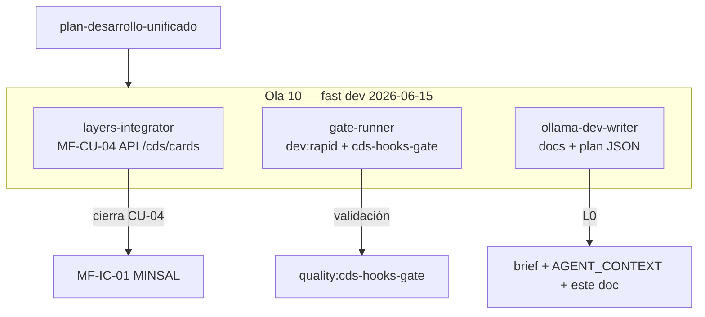

---

### Track 1 — `layers-integrator` → MF-CU-04 API `/cds/cards`

| Campo | Valor |
|-------|-------|
| **MF** | MF-CU-04 — API `/cds/cards` interno (prefetch paciente) |
| **Subprograma** | PROG-CDS-UX |
| **Objetivo** | `GET/POST /api/cds/cards` con prefetch paciente demo; contratos `CdsCard*` en `packages/contracts`; reutilizar mappers CU-02/CU-03 sin FHIR server externo |
| **Allowlist** | `apps/api/src/routes/cds/**`, `packages/contracts/src/cds*.ts`, `scripts/quality/validate-cds-hooks-gate.mjs` |
| **Gate cierre** | `npm run quality:cds-hooks-gate` |
| **Iteración** | `npm run dev:rapid` |
| **Prompt** | [`dev-agent-prompt-layers-integrator.md`](./dev-agent-prompt-layers-integrator.md) |
| **Reporte cierre** | `reports/epis2-mf-cu-04-cds-api.md` |

**Prerrequisitos:** MF-CU-01 ✓ · MF-CU-02 ✓ · MF-CU-03 ✓ · dual-chart ON (ficha-first).

**Evidencia requerida:** `GET/POST /cds/cards` con prefetch paciente · test API integración · gate `validate-cds-hooks-gate.mjs` ampliado para CU-04 · `npm run test` subset CDS

**Prohibido:** migraciones, FHIR server externo, refactor hooks patient-view/order-select salvo contrato compartido mínimo, tocar `apps/web/**` salvo consumo opcional posterior (fuera de alcance CU-04).

---

### Track 2 — `gate-runner` → fast gates + cds-hooks

| Campo | Valor |
|-------|-------|
| **MF** | Validación transversal (no implementa features) |
| **Objetivo** | `dev:rapid` + `quality:cds-hooks-gate` sobre working tree acumulado |
| **Allowlist** | lectura global · escritura solo en `reports/dev-agent-audit-diff-latest.json` |
| **Gates** | `npm run dev:rapid` · `npm run quality:ficha-first-gate` · `npm run quality:cds-hooks-gate` |
| **Cierre sesión (si humano pide pre-PR)** | `npm run check` · `npm run test` · `npm run db:validate` |
| **Iteración** | `npm run dev:rapid` |
| **Prompt** | [`dev-agent-prompt-gate-runner.md`](./dev-agent-prompt-gate-runner.md) |

**Rol:** validar FICHA-FIRST + arquitectura + gate CDS mientras CU-04 toca `apps/api` y `packages/contracts`.

---

### Track 3 — `ollama-dev-writer` → documentación orquestación (este entregable)

| Campo | Valor |
|-------|-------|
| **MF** | MF-RAPID-03 / L0 dev-write |
| **Objetivo** | Sync brief, plan JSON, AGENT_CONTEXT, TABLERO y sección Ola 10 |
| **Allowlist** | `reports/**`, `docs/AGENT_CONTEXT_MINIMAL.md`, `docs/product/EPIS2_TABLERO.md` |
| **Prohibido** | `apps/**`, `services/**`, `e2e/**`, `packages/**` clínicos |
| **Gate cierre** | `npm run dev:rapid -- --skip-audit` |
| **Iteración** | `npm run dev:rapid` |
| **Prompt** | [`dev-agent-prompt-ollama-dev-writer.md`](./dev-agent-prompt-ollama-dev-writer.md) |

---

### Matriz Ola 10 (3 tracks)

| Zona | Track dueño | Prohibido para otros |
|------|-------------|---------------------|
| `apps/api/src/routes/cds/**` | layers-integrator | dev-writer, gate-runner (escritura) |
| `packages/contracts/src/cds*.ts` | layers-integrator | dev-writer |
| `scripts/quality/validate-cds-hooks-gate.mjs` | layers-integrator | dev-writer |
| `reports/**`, `docs/AGENT_CONTEXT_MINIMAL.md`, `docs/product/EPIS2_TABLERO.md` | ollama-dev-writer | layers-integrator |
| `apps/web/src/pages/**/prescription/**` | — | **todos** (alcance CU-03 cerrado) |
| `apps/web/src/components/chart/**` | — | **todos** (alcance CU-02 cerrado) |
| `database/migrations/**` | — | **todos** |

**Comando iteración unificado (todos los tracks):** `npm run dev:rapid`

### Arranque Ola 10

```text
1. Humano: npm run stack:dev && npm run dev:velocity
2. Cursor: @reports/dev-agent-brief.md + dev-agent-prompt-layers-integrator.md
3. Paralelo (3 ventanas):
   ├─ layers-integrator  → MF-CU-04 API /cds/cards
   ├─ gate-runner        → dev:rapid + cds-hooks-gate
   └─ ollama-dev-writer  → docs Ola 10
4. Humano reconcilia working tree antes de commit (solo si lo pide)
5. Tras CU-04: MF-IC-01 Perfil export MINSAL (sesión dedicada · PROG-INTEROP-CHILE)
```

*Actualizado 2026-06-15 · Ola 10 ✓ cerrada · MF-CU-04 ✓ · PROG-CDS-UX ✓ · STRENGTHEN 19/23*

---

## 21. Ola 11 — MF-IC-01 Perfil export MINSAL (✓ cerrada)

**Versión ola:** 11.0 · **Modo:** fast dev (`npm run dev:rapid`) · **Tracks:** 3 en paralelo · **Estado ola:** **✓ CERRADA**  
**Plan maestro:** [`epis2-plan-desarrollo-unificado-2026-06-14.md`](./epis2-plan-desarrollo-unificado-2026-06-14.md)

> Tras cierre de Ola 10 (MF-CU-04 ✓ · **PROG-CDS-UX** completo), la Ola 11 cerró **MF-IC-01** (perfil export MINSAL). Siguiente **MF-IC-02** SNRE staging · **STRENGTHEN 20/23**.

### Pendientes cerrados (Ola 1–11)

| Item | Evidencia |
|------|-----------|
| **MF-CU-01…04** | CU-04 [`epis2-mf-cu-04-cds-api.md`](./epis2-mf-cu-04-cds-api.md) · cadena CU-01…03 en reports `epis2-mf-cu-*` |
| **PROG-CDS-UX** | MF-CU-01…04 ✓ |
| **MF-IC-01** Perfil export MINSAL | [`epis2-mf-ic-01-minsal-export.md`](./epis2-mf-ic-01-minsal-export.md) · tests `fhir-export` · `db:validate` |
| **PROG-IA-MODERNIZE** | MF-IM-01…09 ✓ · IM-06 [`epis2-mf-im-06-provenance-fhir.md`](./epis2-mf-im-06-provenance-fhir.md) (prerrequisito IC-01) |
| **PROG-FICHA-FIRST wave1** | [`epis2-prog-ficha-first-wave1-close-2026-06-14.md`](./epis2-prog-ficha-first-wave1-close-2026-06-14.md) |

### Pendientes abiertos

| Item | Estado | Notas |
|------|--------|-------|
| **Commit tree / push** | **HUMANO** | ~22 commits ahead of `origin/master` |
| **MF-IC-02** SNRE staging MedicationRequest | ✓ **→ Ola 12 cerrada** | ver §22 · [`epis2-mf-ic-02-snre-staging.md`](./epis2-mf-ic-02-snre-staging.md) |

**STRENGTHEN:** **20/23** MF cerradas (al cierre Ola 11) · ledger: [`strengthen-ledger.json`](../docs/quality/strengthen-ledger.json)


---

### Track 1 — `ollama-clinical` → MF-IC-01 Perfil export MINSAL

| Campo | Valor |
|-------|-------|
| **MF** | MF-IC-01 — Perfil export MINSAL (Patient/Encounter/DocumentReference) |
| **Subprograma** | PROG-INTEROP-CHILE |
| **Estado** | ✓ **DONE** |
| **Objetivo** | Export FHIR Chile MINSAL: Patient, Encounter, DocumentReference desde demo; tests round-trip en `fhir-export`; alinear con [`EPIS2_CHILE_CLINICAL_MODEL.md`](../docs/product/EPIS2_CHILE_CLINICAL_MODEL.md) |
| **Allowlist** | `packages/fhir-export/**`, `packages/clinical-domain/src/chile/**`, `docs/product/EPIS2_CHILE_CLINICAL_MODEL.md` |
| **Gate cierre** | `npm run test packages/fhir-export` · `npm run db:validate` |
| **Iteración** | `npm run dev:rapid` |
| **Prompt** | [`dev-agent-prompt-ollama-clinical.md`](./dev-agent-prompt-ollama-clinical.md) |
| **Reporte cierre** | `reports/epis2-mf-ic-01-minsal-export.md` |

**Prerrequisitos:** MF-IM-06 ✓ (export FHIR base) · MF-CU-04 ✓ (PROG-CDS-UX cerrado) · `npm run stack:dev`.

**Evidencia requerida:** tests fhir-export Chile MINSAL · round-trip Patient/Encounter/DocumentReference · `npm run test packages/fhir-export` · ledger [`strengthen-ledger.json`](../docs/quality/strengthen-ledger.json)

**Prohibido:** FHIR server externo, envío MINSAL/SNRE real, migraciones sin MF explícita, tocar CDS hooks (CU-02/CU-03) o API `/cds/cards` salvo contrato compartido mínimo, `apps/web/**` salvo consumo posterior fuera de alcance IC-01.

---

### Track 2 — `gate-runner` → fast gates + fhir-export

| Campo | Valor |
|-------|-------|
| **MF** | Validación transversal (no implementa features) |
| **Estado** | ✓ **DONE** |
| **Objetivo** | `dev:rapid` + subset `fhir-export` + `db:validate` sobre working tree acumulado |
| **Allowlist** | lectura global · escritura solo en `reports/dev-agent-audit-diff-latest.json` |
| **Gates** | `npm run dev:rapid` · `npm run quality:ficha-first-gate` · `npm run quality:fast` · `npm run test packages/fhir-export` · `npm run db:validate` |
| **Cierre sesión (si humano pide pre-PR)** | `npm run check` · `npm run test` · `npm run db:validate` |
| **Iteración** | `npm run dev:rapid` |
| **Prompt** | [`dev-agent-prompt-gate-runner.md`](./dev-agent-prompt-gate-runner.md) |

**Rol:** validar FICHA-FIRST + arquitectura + tests export MINSAL mientras IC-01 toca `packages/fhir-export` y `clinical-domain/src/chile`.

---

### Track 3 — `ollama-dev-writer` → documentación orquestación (este entregable)

| Campo | Valor |
|-------|-------|
| **MF** | MF-RAPID-03 / L0 dev-write |
| **Estado** | ✓ **DONE** |
| **Objetivo** | Sync brief, plan JSON, AGENT_CONTEXT, TABLERO y sección Ola 11 |
| **Allowlist** | `reports/**`, `docs/AGENT_CONTEXT_MINIMAL.md`, `docs/product/EPIS2_TABLERO.md` |
| **Prohibido** | `apps/**`, `services/**`, `e2e/**`, `packages/**` clínicos (escritura) |
| **Gate cierre** | `npm run dev:rapid -- --skip-audit` |
| **Iteración** | `npm run dev:rapid` |
| **Prompt** | [`dev-agent-prompt-ollama-dev-writer.md`](./dev-agent-prompt-ollama-dev-writer.md) |

---

### Matriz Ola 11 (3 tracks)

| Zona | Track dueño | Prohibido para otros |
|------|-------------|---------------------|
| `packages/fhir-export/**` | ollama-clinical | dev-writer, gate-runner (escritura) |
| `packages/clinical-domain/src/chile/**` | ollama-clinical | dev-writer |
| `docs/product/EPIS2_CHILE_CLINICAL_MODEL.md` | ollama-clinical | dev-writer |
| `reports/**`, `docs/AGENT_CONTEXT_MINIMAL.md`, `docs/product/EPIS2_TABLERO.md` | ollama-dev-writer | ollama-clinical |
| `apps/api/src/routes/cds/**` | — | **todos** (alcance CU-04 cerrado) |
| `packages/contracts/src/cds*.ts` | — | **todos** (alcance CU-04 cerrado) |
| `database/migrations/**` | — | **todos** |

**Comando iteración unificado (todos los tracks):** `npm run dev:rapid`

### Arranque Ola 12 (siguiente)

```text
1. Humano: npm run stack:dev && npm run dev:velocity
2. Cursor: @reports/dev-agent-brief.md + dev-agent-prompt-ollama-clinical.md
3. Paralelo (3 ventanas):
   ├─ ollama-clinical    → MF-IC-02 SNRE staging MedicationRequest
   ├─ gate-runner        → dev:rapid + test fhir-export + db:validate
   └─ ollama-dev-writer  → docs Ola 12
4. Humano reconcilia working tree antes de commit (solo si lo pide)
5. Tras IC-02: MF-IC-03…04 (sesión dedicada · PROG-INTEROP-CHILE)
```

*Actualizado 2026-06-15 · Ola 11 ✓ cerrada · MF-IC-01 ✓ · STRENGTHEN 20/23 · siguiente Ola 12 MF-IC-02*

---

## 22. Ola 12 — MF-IC-02 SNRE staging MedicationRequest (✓ cerrada)

**Versión ola:** 12.0 · **Modo:** fast dev (`npm run dev:rapid`) · **Tracks:** 3 en paralelo · **Estado ola:** **✓ CERRADA**  
**Plan maestro:** [`epis2-plan-desarrollo-unificado-2026-06-14.md`](./epis2-plan-desarrollo-unificado-2026-06-14.md)

> Tras cierre de Ola 11 (MF-IC-01 ✓ · **STRENGTHEN 20/23**), la Ola 12 cerró **MF-IC-02** (SNRE staging — draft `prescription` → `MedicationRequest` JSON staging). Sin envío SNRE/MINSAL real. **STRENGTHEN 21/23** · siguiente **MF-IC-03** · §23.

### Pendientes cerrados (Ola 1–12)

| Item | Evidencia |
|------|-----------|
| **MF-CU-01…04** | CU-04 [`epis2-mf-cu-04-cds-api.md`](./epis2-mf-cu-04-cds-api.md) · cadena CU-01…03 en reports `epis2-mf-cu-*` |
| **PROG-CDS-UX** | MF-CU-01…04 ✓ |
| **MF-IC-01** Perfil export MINSAL | [`epis2-mf-ic-01-minsal-export.md`](./epis2-mf-ic-01-minsal-export.md) · tests `fhir-export` |
| **MF-IC-02** SNRE staging MedicationRequest | [`epis2-mf-ic-02-snre-staging.md`](./epis2-mf-ic-02-snre-staging.md) · tests `fhir-export` · `db:validate` |
| **PROG-IA-MODERNIZE** | MF-IM-01…09 ✓ · IM-06 [`epis2-mf-im-06-provenance-fhir.md`](./epis2-mf-im-06-provenance-fhir.md) |
| **PROG-FICHA-FIRST wave1** | [`epis2-prog-ficha-first-wave1-close-2026-06-14.md`](./epis2-prog-ficha-first-wave1-close-2026-06-14.md) |

### Pendientes abiertos

| Item | Estado | Notas |
|------|--------|-------|
| **Commit tree / push** | **HUMANO** | ~22 commits ahead of `origin/master` · HEAD `bb9a9e3` |
| **MF-IC-03** Questionnaire export piloto | **BLOCKED** | ver §23 · sesión dedicada · PROG-INTEROP-CHILE |

**STRENGTHEN:** **21/23** MF cerradas (al cierre Ola 12) · ledger: [`strengthen-ledger.json`](../docs/quality/strengthen-ledger.json)

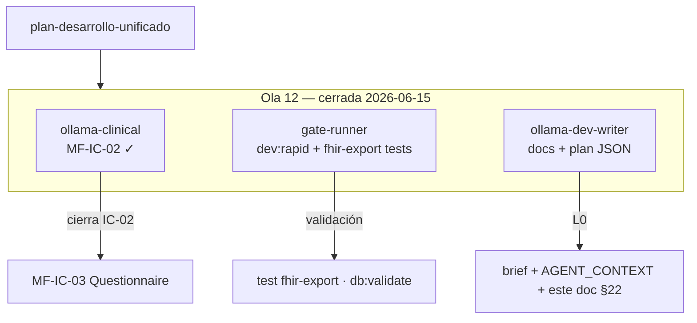

---

### Track 1 — `ollama-clinical` → MF-IC-02 SNRE staging MedicationRequest

| Campo | Valor |
|-------|-------|
| **MF** | MF-IC-02 — SNRE staging MedicationRequest |
| **Subprograma** | PROG-INTEROP-CHILE |
| **Estado** | ✓ **DONE** |
| **Objetivo** | Draft `prescription` → `MedicationRequest` JSON staging; test round-trip schema SNRE; extender `fhir-export` / MF-CHILE-RX-01 sin envío SNRE real |
| **Allowlist** | `packages/fhir-export/**`, `apps/api/src/routes/clinical/**`, `packages/clinical-forms/src/blueprints/prescription*` |
| **Gate cierre** | `npm run test packages/fhir-export` · `npm run db:validate` |
| **Iteración** | `npm run dev:rapid` |
| **Prompt** | [`dev-agent-prompt-ollama-clinical.md`](./dev-agent-prompt-ollama-clinical.md) |
| **Reporte cierre** | `reports/epis2-mf-ic-02-snre-staging.md` |

**Prerrequisitos:** MF-IC-01 ✓ · MF-CHILE-RX-01 (mapper base en `fhir-export`) · `npm run stack:dev`.

**Evidencia requerida:** draft prescription demo → MedicationRequest staging JSON · test round-trip schema · sin envío SNRE/MINSAL real · alinear [`EPIS2_CHILE_CLINICAL_MODEL.md`](../docs/product/EPIS2_CHILE_CLINICAL_MODEL.md) § D6 / MF-CHILE-RX-01

**Prohibido:** envío SNRE/MINSAL real, FHIR server externo, migraciones sin MF explícita, tocar CDS hooks (CU-02/CU-03) o API `/cds/cards`, mezclar MF-IC-03 en misma sesión.

---

### Track 2 — `gate-runner` → fast gates + fhir-export

| Campo | Valor |
|-------|-------|
| **MF** | Validación transversal (no implementa features) |
| **Estado** | ✓ **DONE** |
| **Objetivo** | `dev:rapid` + subset `fhir-export` + `db:validate` sobre working tree acumulado |
| **Allowlist** | lectura global · escritura solo en `reports/dev-agent-audit-diff-latest.json` |
| **Gates** | `npm run dev:rapid` · `npm run quality:ficha-first-gate` · `npm run quality:fast` · `npm run test packages/fhir-export` · `npm run db:validate` |
| **Cierre sesión (si humano pide pre-PR)** | `npm run check` · `npm run test` · `npm run db:validate` |
| **Iteración** | `npm run dev:rapid` |
| **Prompt** | [`dev-agent-prompt-gate-runner.md`](./dev-agent-prompt-gate-runner.md) |

**Rol:** validar FICHA-FIRST + arquitectura + tests SNRE staging mientras IC-02 toca `fhir-export`, `clinical-forms` y rutas clínicas API.

---

### Track 3 — `ollama-dev-writer` → documentación orquestación (este entregable)

| Campo | Valor |
|-------|-------|
| **MF** | MF-RAPID-03 / L0 dev-write |
| **Estado** | ✓ **DONE** |
| **Objetivo** | Sync brief, plan JSON, AGENT_CONTEXT, TABLERO y sección Ola 12 |
| **Allowlist** | `reports/**`, `docs/AGENT_CONTEXT_MINIMAL.md`, `docs/product/EPIS2_TABLERO.md` |
| **Prohibido** | `apps/**`, `services/**`, `e2e/**`, `packages/**` clínicos (escritura) |
| **Gate cierre** | `npm run dev:rapid -- --skip-audit` |
| **Iteración** | `npm run dev:rapid` |
| **Prompt** | [`dev-agent-prompt-ollama-dev-writer.md`](./dev-agent-prompt-ollama-dev-writer.md) |

---

### Matriz Ola 12 (3 tracks)

| Zona | Track dueño | Prohibido para otros |
|------|-------------|---------------------|
| `packages/fhir-export/**` | ollama-clinical | dev-writer, gate-runner (escritura) |
| `apps/api/src/routes/clinical/**` | ollama-clinical | dev-writer |
| `packages/clinical-forms/src/blueprints/prescription*` | ollama-clinical | dev-writer |
| `reports/**`, `docs/AGENT_CONTEXT_MINIMAL.md`, `docs/product/EPIS2_TABLERO.md` | ollama-dev-writer | ollama-clinical |
| `packages/clinical-domain/src/chile/minsalProfiles.ts` | — | **todos** (alcance IC-01 cerrado; solo lectura) |
| `apps/api/src/routes/cds/**` | — | **todos** (alcance CU-04 cerrado) |
| `database/migrations/**` | — | **todos** |

**Comando iteración unificado (todos los tracks):** `npm run dev:rapid`

### Arranque Ola 13 (siguiente)

```text
1. Humano: npm run stack:dev && npm run dev:velocity
2. Cursor: @reports/dev-agent-brief.md + dev-agent-prompt-ollama-clinical.md
3. Paralelo (3 ventanas):
   ├─ ollama-clinical    → MF-IC-03 Questionnaire export piloto
   ├─ gate-runner        → dev:rapid + test fhir-export + db:validate
   └─ ollama-dev-writer  → docs Ola 13
4. Humano reconcilia working tree antes de commit (solo si lo pide)
5. Tras IC-03: MF-IC-04 (sesión dedicada · PROG-INTEROP-CHILE)
```

*Actualizado 2026-06-15 · Ola 12 ✓ cerrada · MF-IC-02 ✓ · STRENGTHEN 21/23 · siguiente MF-IC-03 · HEAD `bb9a9e3` · requiresHumanReview: false (L0 docs)*

---

## 23. Ola 13 — MF-IC-03 Questionnaire export piloto (operational stub)

**Versión ola:** 13.0 · **Modo:** fast dev (`npm run dev:rapid`) · **Tracks:** 3 en paralelo · **Estado ola:** **BLOCKED** (stub operativo)  
**Plan maestro:** [`epis2-plan-desarrollo-unificado-2026-06-14.md`](./epis2-plan-desarrollo-unificado-2026-06-14.md)

> Tras cierre de Ola 12 (MF-IC-02 ✓ · **STRENGTHEN 21/23**), la Ola 13 implementará **MF-IC-03** (Questionnaire export piloto desde demo). Sin envío MINSAL/SNRE real. Al cierre: **STRENGTHEN 22/23** · siguiente **MF-IC-04**.

### Pendientes cerrados (Ola 1–12)

| Item | Evidencia |
|------|-----------|
| **MF-IC-01…02** | IC-01 [`epis2-mf-ic-01-minsal-export.md`](./epis2-mf-ic-01-minsal-export.md) · IC-02 [`epis2-mf-ic-02-snre-staging.md`](./epis2-mf-ic-02-snre-staging.md) |
| **PROG-CDS-UX** | MF-CU-01…04 ✓ |
| **PROG-IA-MODERNIZE** | MF-IM-01…09 ✓ |
| **PROG-FICHA-FIRST wave1** | [`epis2-prog-ficha-first-wave1-close-2026-06-14.md`](./epis2-prog-ficha-first-wave1-close-2026-06-14.md) |

### Pendientes abiertos (Ola 13 — BLOCKED)

| Item | Estado | Notas |
|------|--------|-------|
| **MF-IC-03** Questionnaire export piloto | **BLOCKED** | Track `ollama-clinical` · activación humana |
| **Commit tree / push** | **HUMANO** | ~22 commits ahead of `origin/master` |
| **MF-IC-04** Interop Chile cierre | **BLOCKED** | Tras cierre IC-03 · sesión dedicada |

**STRENGTHEN:** **21/23** (pre-Ola 13) → **22/23** al cierre MF-IC-03 · ledger: [`strengthen-ledger.json`](../docs/quality/strengthen-ledger.json)

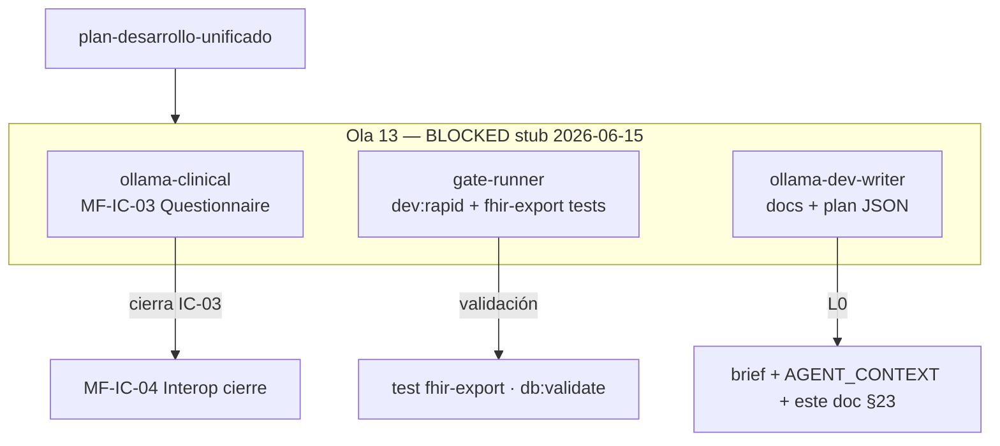

---

### Track 1 — `ollama-clinical` → MF-IC-03 Questionnaire export piloto

| Campo | Valor |
|-------|-------|
| **MF** | MF-IC-03 — Questionnaire export piloto |
| **Subprograma** | PROG-INTEROP-CHILE |
| **Estado** | **BLOCKED** (deps ✓ · activación humana) |
| **Objetivo** | Export FHIR Questionnaire desde formularios demo; test round-trip schema Chile; extender `fhir-export` sin envío MINSAL real |
| **Allowlist** | `packages/fhir-export/**`, `packages/clinical-domain/src/chile/**` |
| **Gate cierre** | `npm run test packages/fhir-export` · `npm run db:validate` |
| **Iteración** | `npm run dev:rapid` |
| **Prompt** | [`dev-agent-prompt-ollama-clinical.md`](./dev-agent-prompt-ollama-clinical.md) |
| **Reporte cierre** | `reports/epis2-mf-ic-03-questionnaire-export.md` |

**Prerrequisitos:** MF-IC-02 ✓ · `npm run stack:dev`.

**Prohibido:** envío SNRE/MINSAL real, FHIR server externo, migraciones sin MF explícita, mezclar MF-IC-04 en misma sesión.

---

### Track 2 — `gate-runner` → fast gates + fhir-export

| Campo | Valor |
|-------|-------|
| **MF** | Validación transversal (no implementa features) |
| **Estado** | **BLOCKED** |
| **Objetivo** | `dev:rapid` + subset `fhir-export` + `db:validate` sobre working tree acumulado |
| **Allowlist** | lectura global · escritura solo en `reports/dev-agent-audit-diff-latest.json` |
| **Gates** | `npm run dev:rapid` · `npm run quality:ficha-first-gate` · `npm run quality:fast` · `npm run test packages/fhir-export` · `npm run db:validate` |
| **Iteración** | `npm run dev:rapid` |
| **Prompt** | [`dev-agent-prompt-gate-runner.md`](./dev-agent-prompt-gate-runner.md) |

---

### Track 3 — `ollama-dev-writer` → documentación orquestación (este entregable)

| Campo | Valor |
|-------|-------|
| **MF** | MF-RAPID-03 / L0 dev-write |
| **Estado** | ✓ **DONE** (stub §23 + plan JSON wave13) |
| **Objetivo** | Sync brief, plan JSON, AGENT_CONTEXT, TABLERO y sección Ola 13 |
| **Allowlist** | `reports/**`, `docs/AGENT_CONTEXT_MINIMAL.md`, `docs/product/EPIS2_TABLERO.md` |
| **Gate cierre** | `npm run dev:rapid -- --skip-audit` |
| **Prompt** | [`dev-agent-prompt-ollama-dev-writer.md`](./dev-agent-prompt-ollama-dev-writer.md) |

### Arranque Ola 13

```text
1. Humano: npm run stack:dev && npm run dev:velocity
2. Humano: activar MF-IC-03 en ledger (BLOCKED → READY) si aplica
3. Cursor: @reports/dev-agent-brief.md + dev-agent-prompt-ollama-clinical.md
4. Paralelo (3 ventanas):
   ├─ ollama-clinical    → MF-IC-03 Questionnaire export piloto
   ├─ gate-runner        → dev:rapid + test fhir-export + db:validate
   └─ ollama-dev-writer  → docs Ola 13 (stub ✓)
5. Humano reconcilia working tree antes de commit (solo si lo pide)
6. Tras IC-03: MF-IC-04 (sesión dedicada · PROG-INTEROP-CHILE)
```

*Actualizado 2026-06-15 · Ola 13 BLOCKED stub · MF-IC-03 siguiente · STRENGTHEN 21/23 → 22/23 al cierre · requiresHumanReview: false (L0 docs)*
