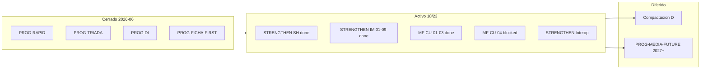

# EPIS2 — Plan de desarrollo unificado (modo rápido)

**Versión:** 1.2 · **Fecha:** 2026-06-15  
**Supersede (parcial):** `epis2-plan-maestro-desarrollo-por-partes-2026-06-11.md` · `epis2-plan-fases-desarrollo-2026-06-13.md` · bloques A–C de `epis2-plan-correcciones-prioritarias-2026-06-14.md`

> **Norte único:** un programa activo por sesión · gates por alcance · ledgers como verdad de microfases · tablero como índice humano.

---

## 1. Estado consolidado (2026-06-15)

| Programa | Estado | Evidencia / gate |
|----------|--------|------------------|
| **PROG-RAPID** | ✓ CERRADO | `quality:rapid-gate` · `dev:rapid` |
| **PROG-CONCILIACION-TRIADA** | ✓ CERRADO | F0–F7 · tríada Evolab/MedRepo |
| **PROG-DI** (inteligencia determinística) | ✓ CERRADO | 10/10 MF · `di-ledger.json` |
| **PROG-FICHA-FIRST** | ✓ wave1 CERRADO | MF-FF-01…06 · `quality:ficha-first-gate` · wave2 MF-FF-00 READY |
| **PROG-STRENGTHEN** | ACTIVO **18/23** | MF-SH-01…06 ✓ · MF-IM-01…09 ✓ · **MF-CU-01…03 ✓** · **siguiente MF-CU-04** |
| **PROG-COMPACTACION** (bloque D correcciones) | DIFERIDO | Tras STRENGTHEN CU-03…04 o cierre parcial CDS |

**Home canónica (unificada):** `/espacio/buscar-paciente` · barra transversal · `/comando` = redirect compat.

---

## 2. Modelo de ejecución simplificado

```text
Sesión
  ├─ Arranque     npm run dev:velocity  (brief + subagente)
  ├─ Alcance      declarar MF-* + archivos allowlist
  ├─ Iteración    npm run dev:rapid     (quality:fast + audit-diff)
  ├─ Cierre MF    gate del ledger
  └─ Cierre día   npm run dev:agent:close + reporte reports/
```

### Gates por alcance (no correr `npm test` completo tras cada archivo)

| Alcance | Gate |
|---------|------|
| Docs, reportes, scripts quality | `npm run quality:fast` |
| Web/API/packages clínicos, microfase | `npm run quality:clinical` |
| Pre-PR, signoff, cierre tramo | `npm run quality:full` |

### Ledgers (registro automático)

| Ledger | Comando next |
|--------|--------------|
| STRENGTHEN | `npm run quality:strengthen-next` |
| FICHA-FIRST | ✓ wave1 cerrado — wave2 MF-FF-00 READY — `ficha-first-ledger.json` |
| DI | ✓ cerrado — `di-ledger.json` |
| Microfases históricas | `npm run quality:microphase-next` |

---

## 3. Hoja de ruta única (orden recomendado)

### Fase A — Producto clínico + IA (ahora)

| # | MF | Objetivo | Gate | Estado |
|---|-----|----------|------|--------|
| A1 | **MF-IM-03** | RAG incremental (retrieval secuencial) | `quality:rag-retrieval-gate` | ✓ |
| A2 | **MF-IM-04** | Assist con citas documentales | `quality:rag-retrieval-gate` + `ai:evals:live` | ✓ |
| A3 | **MF-IM-05…07** | Provenance interno + export FHIR + model card | `quality:ai-provenance-gate` | ✓ |
| A4 | **MF-IM-08** | Anti feedback-loop (policy assist) | `ai:evals:feedback-loop` | ✓ |
| A4b | **MF-IM-09** | OTel spans pipeline IA | `quality:ai-otel-gate` | ✓ |
| A5 | **MF-CU-01…02** | CDS UX patient-view hook | `quality:cds-hooks-gate` | ✓ |
| A5b | **MF-CU-03** | order-select hook | `quality:cds-hooks-gate` | ✓ |
| A5c | **MF-CU-04** | API `/cds/cards` | `quality:cds-hooks-gate` | **siguiente** (BLOCKED) |
| A6 | **MF-IC-01…04** | Interop Chile (FHIR, SNRE staging) | `db:validate` + tests export | BLOCKED |

**Regla:** un MF-SH/IM/CU/IC por sesión · no auto-iniciar MF READY sin petición explícita.

### Fase B — Higiene E2E residual (paralelo ligero)

Specs que aún usan `epis2-power-bar` en `/comando` (no bloqueantes para A1):

- `golden-v2-admission-discharge`, `golden-command-evolution`, `m3-visual-signoff*`, `ola1c-results-journey`, etc.
- Patrón: migrar a `getTransversalCommandBar` (`e2e/helpers/demoPatient.ts`).

**Gate:** subset E2E en `quality:clinical` o job CI existente.

### Fase C — Compactación monorepo (bloque D)

Solo tras A1–A2 estables o pausa explícita STRENGTHEN:

| ID | Entrega |
|----|---------|
| D1 | `quality:ui` + fronteras imports warn-first |
| D2 | CI `ci-fast.yml` · `build:core` / `build:intel` |
| D3 | `agent:doctor` · `safety-preflight` |
| D4 | Banners HISTÓRICO en reports viejos · `AGENT_CONTEXT_MINIMAL` v2 |

---

## 4. Mapa de programas → un solo tablero



---

## 5. Decisiones registradas (no reabrir)

1. **Censo-first** reemplaza pantalla `/comando` como home; concepto “Centro de Comando” = barra transversal, no página.
2. **Dual chart ON** por default (`VITE_ENABLE_DUAL_CHART_MODES=false` opt-out).
3. **PROG-DI** cerrado — no reintroducir ledger paralelo de inteligencia determinística.
4. **Multimedia / ASR / OCR** — PROG-MEDIA-FUTURE, no 2026 (`strengthen-ledger.json`).
5. **Commits** — solo cuando el usuario lo pida; sesión cierra con reporte + gates.

---

## 6. Próxima sesión recomendada

```text
Programa: PROG-STRENGTHEN · PROG-CDS-UX
MF:       MF-CU-04 API /cds/cards interno
Allowlist: apps/api/src/routes/cds/**, packages/contracts/src/cds*.ts
Gate:     npm run quality:cds-hooks-gate
Arranque: npm run dev:velocity
Iteración: npm run dev:rapid
```

Alternativa: **MF-CU-04** API `/cds/cards` interno · **FICHA-FIRST wave2** MF-FF-00 canon · **Fase B** E2E residual.

---

## 7. Referencias vivas

| Doc | Rol |
|-----|-----|
| [`EPIS2_TABLERO.md`](../product/EPIS2_TABLERO.md) | Índice humano |
| [`AGENT_CONTEXT_MINIMAL.md`](../AGENT_CONTEXT_MINIMAL.md) | Contexto Cursor |
| [`strengthen-ledger.json`](../quality/strengthen-ledger.json) | MF activa STRENGTHEN |
| [`ficha-first-ledger.json`](../quality/ficha-first-ledger.json) | Cerrado |
| [`EPIS2_DEV_VELOCITY.md`](../dev/EPIS2_DEV_VELOCITY.md) | Gates por rol |

---

## 8. Criterio de cierre PROG-STRENGTHEN (macro)

- MF-IC-04 ✓ + gates closure en `strengthen-ledger.json`
- `npm run check` · `npm run test` · `db:validate` · `ai:evals:live`
- Reporte `reports/epis2-prog-strengthen-close-2026.md`
